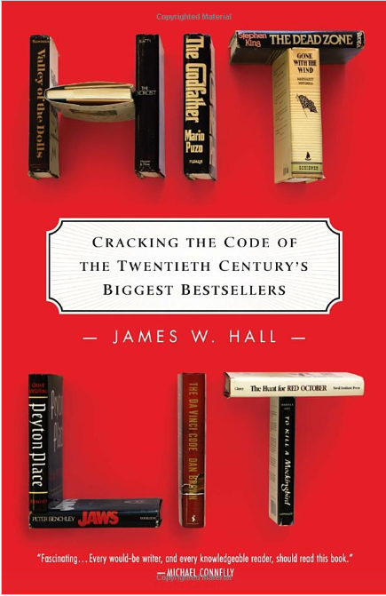

# Comment écrire un best-seller

Si vous croyez qu’il n’existe aucune recette pour connaître le succès, alors vous vous trompez ! Dans [*Hit Lit*](http://www.amazon.fr/Hit-Lit-Twentieth-Bestsellers-ebook/dp/B005DXOQJU), l’auteur de thrillers et professeur de littérature [James W. Hall](http://www.jameswhall.com/) déniche quelques conditions nécessaires.

Il aboutit à cette conclusion après une analyse de type structuraliste des douze plus grands hits américains des cent dernières années. Il relève dans chacun d’eux les mêmes procédés, certains assez évidents, d’autres plus surprenants.

Tout d’abord les douze livres étudiés :

1. [*Gone with the Wind*](http://fr.wikipedia.org/wiki/Autant_en_emporte_le_vent), Margaret Mitchell, 1936.
2. [*Peyton Place*](http://en.wikipedia.org/wiki/Peyton_Place_(novel)), Grace Metalious, 1956.
3. [*To Kill a Mockingbird*](http://fr.wikipedia.org/wiki/To_Kill_a_Mockingbird), Harper Lee, 1960.
4. [*Valley of the Dolls*](http://en.wikipedia.org/wiki/Valley_of_the_Dolls), Jacqueline Susann, 1966.
5. [*The Godfather*](http://en.wikipedia.org/wiki/The_Godfather_(novel)), Mario Puzo, 1969.
6. [*The Exorcist*](http://en.wikipedia.org/wiki/The_Exorcist), William Peter Blatty, 1971.
7. [*Jaws*](http://en.wikipedia.org/wiki/Jaws_(novel)), Peter Benchley, 1974.
8. [*The Dead Zone*](http://fr.wikipedia.org/wiki/Dead_Zone_(roman)), Stephen King, 1979.
9. [*The Hunt for Red October*](http://en.wikipedia.org/wiki/The_Hunt_for_Red_October), Tom Clancy, 1984.
10. [*The Firm*](http://en.wikipedia.org/wiki/The_Firm_(novel)), John Grisham, 1991.
11. [*The Bridges of Madison County*](http://en.wikipedia.org/wiki/The_Bridges_of_Madison_County), Robert James Waller, 1992.
12. [*The Da Vinci Code*](http://fr.wikipedia.org/wiki/Da_Vinci_Code), Dan Brown, 2003.

James va passer son temps à montrer que chacun des procédés qu’il a identifié se retrouvent dans les douze romans, parfois au prix de quelques contorsions. Plutôt que de résumer systématiquement son propos, je vais m’amuser à voir si ces procédés s’appliquent à deux de mes textes, *[La quatrième théorie](../../page/la-quatrieme-theorie)*, mon thriller écrit grâce à Twitter et que je retravaille en ce moment pour Fayard, et *[Ératosthène](../../page/eratosthene-new)*, dont j’ai repris à zéro la rédaction (au moins pour la dixième fois en douze ans).

### High-concept

Résumé marketing en une phrase du sujet du roman, d’environ 25 mots. Cette phrase doit en elle-même immédiatement attirer l’attention du lecteur et aussi faciliter le bouche-à-oreille. L’existence de cette phrase est la condition nécessaire à la viralité. On sait que les lecteurs font le succès des livres !

J’avoue que j’ai rarement écrit avec une *base line* en tête, mais plutôt avec l’envie d’aller quelque part d’assez indéfini, de partir en voyage vers l’inconnu. Mais j’imagine que tenir un résumé dès le début peut aider à donner de la cohérence et de l’efficacité à un texte (si elle est une préoccupation).

> [La quatrième théorie] De nos jours, une famille se heurte à des organisations gouvernementales, religieuses et capitalistes qui, avec leurs technologies de pointe, cherchent à réduire l’humanité en esclavage.

> [Ératosthène] Au IIIe siècle avant Jésus-Christ, sur les bords de la Méditerranée, en un temps de crise politique, économique et spirituelle, un jeune homme décide de changer le monde.

### Préambule

Les héros doivent immédiatement être arrachés à leur ancienne vie et lancés dans l’histoire, et cela d’une façon simple. La situation doit être suffisamment stressante pour que les lecteurs éprouvent une sympathie immédiate.

> [La quatrième théorie] Un mobile abandonné, il sonne et tout bascule.

> [Ératosthène] Il quitte sa province pour Athènes où il croit que l’histoire se joue.

### De question en question

Dès les premières pages, disons le plus vite possible, le high-concept doit être reformulé en question.

> [La quatrième théorie] Dans quelle abominable chasse à l’homme Id et Mitch se trouvent-ils mêlés ?

> [Ératosthène] Réussira-t-il à changer le monde ?

Cette question doit alors se transformer de chapitre en chapitre, en même temps que des difficultés se présentent. Les questions provoquent l’attente, c’est-elles qui sous-tendent le suspens.

> [La quatrième théorie] Id retrouvera-t-il Jos ? Mitch sauvera-t-elle ses enfants ? Qui sont les Freemen ? Qui sont les Croisés ?

> [Ératosthène] Changera-t-il le monde en prenant les armes ? Accompagnera-t-il Sosibe à Sparte ? Résistera-t-il à l’endoctrinement des Stoïciens ?

Au fil du récit, un danger se fait de plus en plus pressant. Les héros subissent un stress croissant.

### Motivation universelle

Le lecteur doit se retrouver dans la quête des héros. Elle doit être proche de ses préoccupations pour qu’il se l’approprie. Elle doit donc le concerner d’une manière ou d’une autre, le ramener à ce qu’il vit lui-même, à une forme d’actualité (qui peut être une constante humaine).

> [La quatrième théorie] Des puissances coercitives – étatiques, religieuses et capitalistes – menacent nos libertés fondamentales ! En même temps qu’Id et Mitch découvrent leurs exactions, ils ne peuvent les laisser faire en toute impunité.

> [Ératosthène] Le monde est décadent, injuste, dangereux, insupportable, c’est pour cette raison qu’Ératosthène rêve de le changer (et nous aussi).

### Hot-button

Aspect social sur lequel le roman s’appuie. Quel interdit combat-il ? Quelles conventions ? Quels préjugés ?

> [La quatrième théorie] Des libertés durement gagnées au cours des siècles se retrouvent de plus en plus souvent mises en question.

> [Ératosthène] Le monde se meurt et les puissants refusent de le réformer préférant jouir de privilèges dont ils sont les derniers bénéficiaires.

### Tempo

Les héros n’ont pas le temps de s’alanguir. Les évènements viennent sans cesse les bousculer.

> [La quatrième théorie] Les Croisés surgissent toujours.

> [Ératosthène] Les guerres, les prises de pouvoirs, les passions contrent sans cesse la volonté d’Ératosthène.

### Les héros

On se fiche de leur passé, on les prend directement tels quels au moment où ils plongent dans l’histoire. On sait comment ils sont habillés, comment ils bougent, comment ils s’expriment, on les entend parler, mais ils pratiquent peu le débat intérieur et surtout ils ne sont pas en conflit avec eux-mêmes.

Ils sont dans l’action, en réaction aux évènements. Leurs émotions, plutôt primitives et faciles à capter, leur dictent leur décision, plus que de savants calculs (je vais avoir du mal avec Ératosthène). C’est leur côté exceptionnel qui captive, pas leur psychologie (ça tombe bien pour moi). On les découvre comme si on les voyait dans un film.

### Filmographique

Justement. Le visuel domine sur l’intériorité. Je suis mal parti avec Ératosthène : philosophe, mathématicien, géographe… Les douze best-sellers sont par nature portables au cinéma. Ils sont en eux-mêmes un film (et ils ont connu un immense succès sous leur adaptation).

### Fresque

L’histoire se déroule avec en arrière-plan un vaste panorama historique.

> [La quatrième théorie] La volonté du capitalisme de perdurer quitte à saccager la planète. La déraison des puissants qui nous précipitent dans des crises de plus en plus dures. Leur volonté de réduire nos libertés, notamment numériques. Les hactivistes qui se retrouvent plus recherchés que les terroristes les plus meurtriers.

> [Ératosthène] Le IIIe siècle avant Jésus-Christ alors que le monde des Grecs entre en décadence et que Rome monte en puissance. La bibliothèque d’Alexandrie. L’âge d’or de la science grecque. La Renaissance qui manque survenir avec un millénaire et demi d’avance.

### Golden country

Tous les romans évoquent à un moment ou à un autre, souvent assez tôt, souvent de manière brève, un monde idéal, naturel, sauvage, sexuellement chargé. Il donne son assise aux héros. Au cours de l’histoire, quand ils pensent à cet Éden, ils recouvrent leur force et leur motivation… et se battent dans l’idée d’y retourner (d’autant qu’il a souvent été détruit violemment ou tenu à distance par des puissances supérieures).

> [La quatrième théorie] Le temps où Id et Mitch vivaient heureux en famille.

> [Ératosthène] La Cyrène de son enfance quand il courrait dans les montagnes Vertes ou les champs de fenouil de la plaine littorale.

### Factuel

Le roman doit déborder de faits. Le lecteur doit apprendre quelque chose tout en dévorant l’aventure. Il doit se familiariser avec un univers qui lui est étranger, a priori inaccessible. L’auteur ne doit pas avoir peur des dérives explicatives, du moment que l’action les sous-tient.

> [La quatrième théorie] Description des forces qui s’organisent grâce au Net, de sa puissance politique et des réactions qui en résultent. Origine dans les textes religieux de l’idéologie prédatrice des capitalistes et de leur refus de l’écologie. Perspectives sur la nouvelle société que façonnent dans l’anonymat les hommes et les femmes libres. Initiation à la théorie de la complexité.

> [Ératosthène] Histoire du IIIe siècle avant Jésus-Christ avec une mise en perspective sur les siècles ultérieurs jusqu’à nous. Initiations aux grandes philosophies de l’antiquité. Origine de la pensée scientifique contemporaine. Invention du livre, de la géographie, de l’histoire… Découverte de personnages historiques extraordinaires, parfois par leur perversité.

### Société secrète

C’est l’aspect qui m’a le plus surpris. Les douze romans mettent en œuvre des sociétés secrètes, une façon de justifier pourquoi le lecteur n’est pas lui-même le héros. Il existe des communautés auxquelles il n’a pas accès et qui seules mènent au pouvoir.

> [La quatrième théorie] Freemen. Croisés.

> [Ératosthène] Les stoïciens.

### Dieu

Les douze best-sellers questionnent le rôle de la religion.

> [La quatrième théorie] Les religions du livre n’aspirent qu’à la destruction du monde pour précipiter le jugement dernier.

> [Ératosthène] Les stoïciens posent les bases des religions du livre et nous installent dans le fatalisme.

### Périple initiatique

Les héros vont de la campagne à la ville ou inversement. De l’anonymat au succès ou du succès à la déchéance. C’est le rêve américain ou son contraire.

> [La quatrième théorie] Mitch et Id quittent la société bourgeoise pour venir vivre à la campagne, loin du monde des institutions et des entreprises.

> [Ératosthène] Fils d’un propriétaire terrien d’une ville de province, Ératosthène devient le directeur de la bibliothèque d’Alexandrie.

### Famille éclatée

Les héros n’appartiennent jamais à des familles parfaites (comme si elles existaient). Ils ont connu divorces et tromperies, secrets… Ils sont souvent orphelins. Ils vont seuls affronter le monde.

> [La quatrième théorie] Mitch a été élevée par ses grands-parents après le décès de ses parents. Id semble venu de nulle part.

> [Ératosthène] On ne connaît que son père comme si sa mère n’avait jamais existé (les sources antiques parlent peu souvent des mères).

### Sexualité

La passion amoureuse joue un rôle charnière dans le récit.

> [La quatrième théorie] La relation entre Mitch et Jos.

> [Ératosthène] La rencontre avec Sosibe et Bérénice.

### Écriture directe

Le texte dit ce qui doit être compris et rien d’autre. Pas de second degré, pas d’ironie, pas de métaphore. Une écriture journalistique, directe, transparente, sans fioritures esthétisantes.

### À la frontière des genres

Tout en n’ayant aucune visée littéraire révolutionnaire, les douze romans ouvrent un genre par le mix de genres antérieurs. Ils ne sont pas classables dans des catégories existantes. C’est peut-être le critère le plus difficile à déployer.

> [La quatrième théorie] Techno-thriller-politique écrit en mode twittérature

> [Ératosthène] Récit initiatique biographique et romancé tout en étant connecté avec le présent

### So what ?

J’ai lu *Hit Lit* avec plaisir, mais faut-il le lire ? Je pense que vous en savez maintenant autant que moi. James W. Hall ne s’intéresse qu’aux textes américains, toujours avec un point de vue américain qui frise l’ethnocentrisme. Ses règles ne me semblent guère coller avec de nombreux succès franchouillards, je pense par exemple à la *Délicatesse* qui excelle dans le vide intersidéral et qui ne répond à aucun des critères listés, à part la transparence du style.

D’un autre côté, j’ai réussi à appliquer la grille de *Hit Lit* à *La quatrième théorie* dont j’ai bouclé la première version il y a deux ans. Avec un peu d’imagination, on doit pouvoir s’amuser à y glisser de nombreux romans. Peut-être tous ceux des auteurs qui ont la même préoccupation que W. Hall, lui-même auteur de best-sellers :

> I began to place a greater value on the nonfiction aspects of fiction writing.

L’exercice m’a amusé. Je pense qu’il peut aussi amuser les éditeurs. Même les étudiants. C’est une façon de parler des romans sans trahir leur contenu. Un bon entraînement pour un auteur avant d’affronter les médias et les lecteurs.

Mais un véritable projet d’écriture ne serait-il pas de prendre à contre-pied les critères de James W. Hall ?

Au travail…

#best-sellers #eratosthene #litterature #netlitterature #twiller #dialogue #y2012 #2012-4-30-15h32
