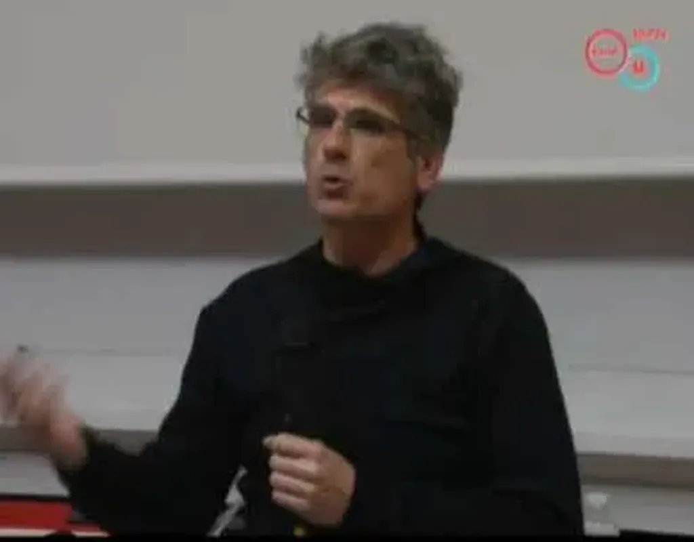

# Déconnexion, politique et esthétique

Le 14 mars, j’étais à [Nancy pour parler déconnexion](http://www.lesdebats.fr/event/internet-nous-vampirise-t-il/). On a vite débordé pour parler de notre époque de transition. La déconnexion est une façon de mieux connecter avec notre temps. Et qui dit déconnexion, implique d’avoir été connecté. Certains l’oublient.

#conf #jai_debranche #netculture #podcasts #y2012 #2012-4-5-15h42
