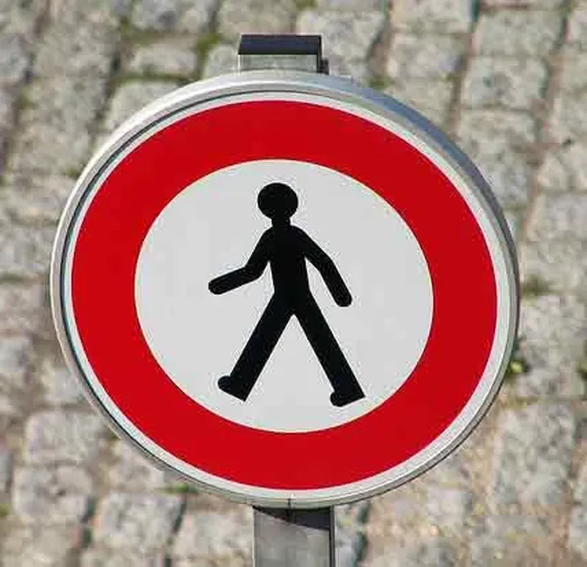

# L’État de non-droit numérique

Je dois être un de ces grincheux qui regrettent le bon vieux temps, mais de plus en plus de choses ont pour moi un goût amer sur le Net.

J’ai créé en 1998, [bonweb.fr](http://bonweb.fr), c’était déjà un livre électronique. Loin de me limiter à une [projection homothétique](../../2011/1/definir-livre-electronique.md) du *[Guide des meilleurs sites Web](../../page/bibliographie/vulgarisation-1997-2003)* que je publiais alors, j’avais développer un annuaire interactif qui a survécu jusqu’à aujourd’hui.

En 2007, [Google avait manqué nous faire fermer une première fois](#bonweb), cinq ans plus tard il y réussit. À ce stade, c’est sans grandes conséquences et voilà pourquoi l’affaire me paraît intéressante.

Nous avons reçu il y a quelques jours un message nous expliquant que nous étions exclus du programme AdSense, sous prétexte qu’un commentateur avait publié la photo d’une femme dénudée en regard d’une publicité. Plus d’AdSense implique la fin des revenus et donc d’un hébergement payant (et du serveur sur lequel se trouve ce blog et où je bidouille depuis des années).

Ce n’est pas trop la dérive puritaine et le politiquement correct qui m’inquiète, quoique, mais plutôt la nonchalance avec laquelle Google est capable de nous couper le robinet, et de nous licencier en quelque sorte.

Dans un État de droit, une même loi s’applique à tous les acteurs et un ensemble de pratiques plus ou moins légiférées s’installent pour faciliter le vivre ensemble. Une entreprise ne peut pas licencier sauvagement. Elle ne peut pas bouleverser du jour au lendemain les salaires. Nous sommes en train d’oublier ces interdits sur le Net.

[Il s’agit d’un territoire](#territoire) divisé en pays presque tous soumis à la dictature, surtout les deux immenses blocs que constituent Google et Facebook. Ils ne reconnaissent aucun droit de l’homme, ils imposent en potentat leurs règles à leurs citoyens.

Cette fois un compte AdSense fermé, demain un mail, un compte Facebook, un espace d’hébergement, l’indexation de votre site… Si vous n’obéissez pas à la règle fixée par la dictature, elle vous chasse de ses terres. Bien sûr, vous pouvez déménager, réinventer votre vie ailleurs. Vous êtes libres. Est-ce bien certain ?

C’est un peu comme si vous étiez un émigrant qui doit abandonner ses biens derrière lui et repartir pratiquement à zéro. C’est d’autant plus difficile quand les superpuissances occupent pratiquement la totalité de l’espace, ne vous laissant pour vous débattre que les marges encore en friche. « Si vous ne respectez pas NOS règles, dégagez. Vous n’êtes plus le bien venu dans NOTRE monde. » Voici comment le Net fonctionne désormais.

Il y a quelques années, avant l’apparition des superpuissances numériques, le Net était décentralisé. Nous étions des [nomades sur ce territoire](../../books/alternative-nomade.md). Nous nous promenions avec notre havresac sur le dos. Quand nous n’étions pas bien à un endroit, nous en changions. C’est beaucoup plus difficile aujourd’hui où une grande partie de notre vie se joue autour de lieux numériques en nombre restreint et où nous accumulons de plus en plus de biens, avec une tendance certaine, et sans doute néfaste, à la sédentarisation.

Cette prégnance du numérique donne de plus en plus de pouvoir aux opérateurs. Plus ils ont de pouvoir, plus ils empêchent leurs concurrents d’émerger. Et quand l’un y parvient, il est racheté. Ils aspirent les développeurs autant que les utilisateurs, laissant une marge vivante mais qui est condamnée de rester en marge, une marge à la traîne technologique.

Voilà pourquoi je pense qu’il faut [« nationaliser » les superpuissances numériques](../3/nationalisons-google-et-facebook.md). Elles sont en train d’imposer un espace de non-droit sur notre nouveau territoire. Elles y font régner la loi du plus fort. Elle ne s’occupe que de leur intérêt, ignorant que derrière les bits il existe des hommes et des femmes.

Nous devons nous réapproprier notre territoire plutôt que fuir sans cesse vers un ailleurs qui serait meilleur. N’abandonnons plus derrière nous nos œuvres pour que les vautours s’en emparent. Retournons-nous contre eux, non pas pour nous battre frontalement, mais en utilisant comme le judoka la force de notre ennemi. Je vais finir par placer des publicités AdSense dans ces pages… et sans doute que comme bien des blogueurs avant moi, je serai à mon tour exclus du programme AdSense.

Les dictateurs ne supportent jamais la critique. Il la laisse vivre en marge pour qu’elle attire au loin les esprits les plus contestataires.

#netculture #coup_de_gueule #y2012 #2012-4-16-13h26
