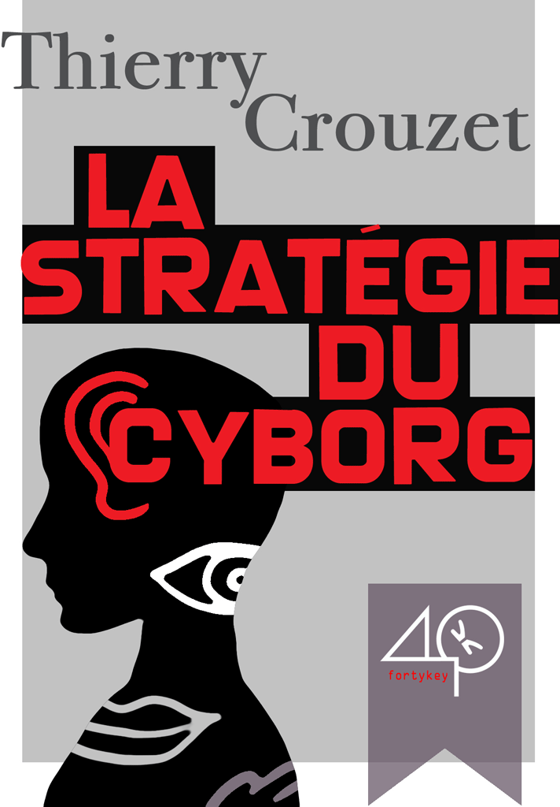

# La stratégie du cyborg - version gratuite

Je continue la libération des mes textes, sans pour autant les retirer des librairies. C’est au tour de *[La stratégie du Cyborg](../../page/la-strategie-du-cyborg)*, écrit en 2010 à la demande de [40K](http://www.40kbooks.com/). Cet essai a surtout circulé en Italie !

Je profite de la conférence que je donne [ce soir à Toulouse](http://empreintes.toulouse.fr/2012/la-strategie-du-cyborg/) sur le sujet pour replonger dans ces aphorismes et leur ajouter une préface et quelques extensions. Amusant de relire tout ça [après mon burn-out numérique](../../page/jai-debranche).

En fait, je diffuse gratuitement mes textes quand je les modifie. Quand on passe par un éditeur, lui demander de propager les corrections et addendum n’est pas simple (d’autant plus quand il existe des traductions). À cogiter pour la chaîne du livre numérique.

#buzz #y2012 #2012-4-26-12h46
