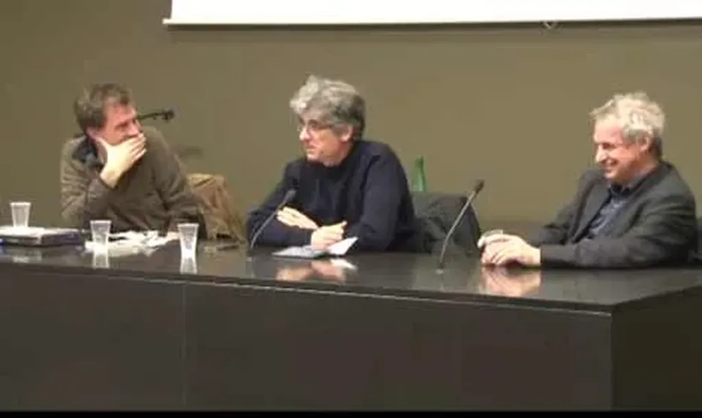

# Prenons de la hauteur sur nos usages d'internet

Le 16 avril, à l’invitation de [Christophe Batier](http://twitter.com/#!/batier) et à l’occasion du [off](http://off.www2012.org/conference-debat-usages-internet/) du [www12](http://www2012.org), je me suis retrouvé en conférence en compagnie de [Serge Soudoplatoff](http://blog.almatropie.org/) et de [Dominique Cardon](https://www.facebook.com/dominique.cardon).

#conf #jai_debranche #netculture #dialogue #podcasts #y2012 #2012-5-4-15h58
