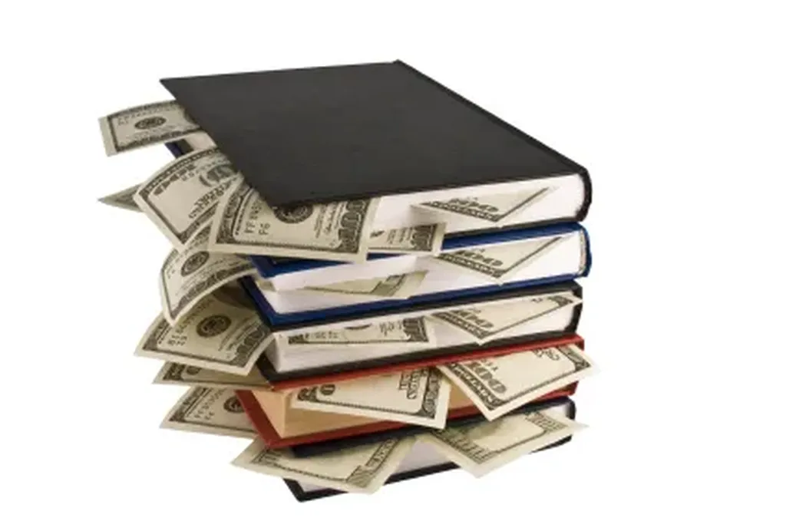

# Les auteurs sont-ils fainéants ?

Le SNE, la SGDL, Google, le gouvernement, les éditeurs bien sûr, tout le monde comploterait pour exploiter les malheureux auteurs qui n’ont d’autres recours que pleurer leurs larmes de récrimination.

OK. [Des lois et accords iniques ont été passés dans notre dos comme le souligne mon ami Yal.](http://www.actusf.com/spip/Interview-d-Ayerdhal.html) Je ne vais pas le contester, ni dire que c’est une bonne chose. On se fiche de nous, mais regardons les choses en face. Cette affaire, [ici clairement résumée](http://www.sivan-avocats.com/Accord-SNE-Google.html), fait perdre trop de temps à trop de monde (à moi aussi même si je ne suis pas intervenu jusqu’à aujourd’hui, j’ai déjà passé trop de temps à lire les articles et tweets qui circulent).

Le vieux monde tente de sauver sa peau, laissez sombrer le navire sans vous préoccuper de lui. Discutez avec ceux qui regardent en avant.

### Do It Yourself (ou avec le bon éditeur)

Si vous êtes l’auteur d’œuvres indisponibles, publiez-les immédiatement plutôt que de râler. Vous couperez l’herbe sous les pieds des ringards qui voudraient profiter de vous. Trois possibilités s’offrent à vous. Les voici, de la plus naturelle valable pour 90% des auteurs à la plus technique :

1. [Des dizaines d’éditeurs numériques](http://ple-consulting.blogspot.fr/2011/04/plus-de-30-editeurs-pure-players.html) seront heureux d’accueillir vos textes, tout en vous proposant des droits numériques de l’ordre de 50 % du prix de vente.

- Au titre d’auto-entrepreneur, récupérez des ISBN et ouvrez un compte chez [immateriel.fr](http://www.immateriel.fr/) pour diffuser automatiquement sur toutes les plateformes (Apple, Amazon, Fnac…) tout en disposant de statistiques de vente unifiées.

- [Publiez en direct sur les plateformes](../../2010/9/comment-publier-sur-apple-ibookstore.md) pour maximiser vos marges (vous pouvez même négocier avec Google Books). [Jean-Claude Dunyach propose des tutoriaux.](http://jean-claude.dunyach.pagesperso-orange.fr/Ebooks_files/Comment_vendre_ses_livres_numeriques.pdf)

### Do It pas toi-même

Si vous n’avez pas envie d’appliquer la stratégie précédente, demandez-vous pourquoi. Disposez-vous réellement d’œuvres indisponibles qui pourraient intéresser plus d’une poignée de lecteurs ? Parce que dans le cas contraire, autant laisser Google et Consort se charger de la numérisation qui ne leur rapportera rien, et aura plutôt tendance à augmenter votre visibilité.

Si en revanche vous pensez que vos œuvres peuvent connaître une seconde jeunesse en numérique, essayez vous-mêmes d’être jeune. Si vous refusez de faire circuler vos œuvres avec tous les moyens aujourd’hui mis à votre disposition, vous ne pouvez pas reprocher à des tiers de le faire pour vous. Pourquoi voulez-les vous qu’ils tapent à votre porte alors que rien ne vous empêche de les devancer ?

Vos œuvres ne vous appartiennent pas si vous refusez de vous en occuper.

Lorsque vous les avez écrites, vous avez bénéficié de l’infrastructure communautaire, de la sécurité sociale, souvent de bourses, du chômage, du salaire d’un conjoint compatissant… Une œuvre est par nature communautaire. Certes elle a exigé du travail, qui doit être rémunéré, mais il ne faut pas la considérer comme un placement financier hyper sécuritaire. Laissée à la banque, l’œuvre ne vous rapportera rien (en plus n’êtes-vous pas adversaire du capitalisme extrême ?).

La bande du SNE et de Google a compris ce détail. Ils ont vu un le trésor qui dort. Vous devriez les entendre et le réveiller vous-mêmes plutôt de vous plaindre de leur avidité.

Bien sûr les œuvres en tant que bien communautaire devraient être exploitées par la communauté, c’est-à-dire par l’État plutôt que par des tiers privés. Mais qui est l’État dans un monde ouvert, sinon vous-mêmes. En adoptant la stratégie DIY, vous participez à la diffusion de la culture et pouvez le faire dans les conditions qui vous conviennent, par exemple en choisissant des prix faibles, voire en offrant certains de vos textes.

Vous ne pouvez pas d’un côté critiquer le monde qui vous entoure, vous insurger contre nos adversaires, et d’un autre côté ne rien faire, sinon pleurer, ou pire attendre que ces adversaires se moralisent et viennent vous câliner.

Si les auteurs avaient saisi le train du numérique à son démarrage, ils n’auraient pas besoin aujourd’hui de tenter d’y embarquer alors qu’il est lancé à pleine vitesse. Ce train qui n’est pas qu’un nouveau canal de diffusion, qu’un nouveau moyen de gagner de l’argent, c’est avant tout un espace de création et de vie. Vous ne pouvez pas exiger de bénéficier de ce monde tout en refusant d’y embarquer, vraiment.

Alors battez-vous sur le nouveau terrain de bataille. Ne tirez plus vos missiles d’au-delà de la frontière. Ils n’ont aucune chance d’atteindre leurs cibles. Passez les fils barbelés. Escaladez la montagne. Vous découvrirez le monde sous une nouvelle perspective. Et vous éclaterez de rire chaque fois que le SNE, la SGDL et d’autres se livreront à leur pantomime.

Dorénavant, nous avons le pouvoir. Ne l’oubliez pas. Ne perdez plus de temps à discuter avec ceux qui ne l’ont plus (et qui vous font croire qu’ils l’ont encore).

*PS1 : Je suis fainéant en écrivant un tel billet parce que j’aurais mieux fait de travailler à mon prochain livre (ce qui exige plus d’efforts, je l’avoue).*
*PS2 : J’ai écrit ce texte du point de vue de l’auteur de textes mais je pense que les auteurs de BD et livres illustrés peuvent également faire la même chose. Il faut juste un peu plus de compétences pour créer les objets électroniques, mais rien d’insurmontable. Je lis tous les jours des BD au format CBZ/CBR sur mon iPad. [Commentaire ajouté suite au Tweet de Thomas Cadene.](https://twitter.com/ThomasCadene/status/216152563962220545)*
*PS3 : [indisponibles.fr, la suite de ce billet...](indisponibles-fr.md)*

#ebook #edition #coup_de_gueule #y2012 #2012-6-22-11h20
