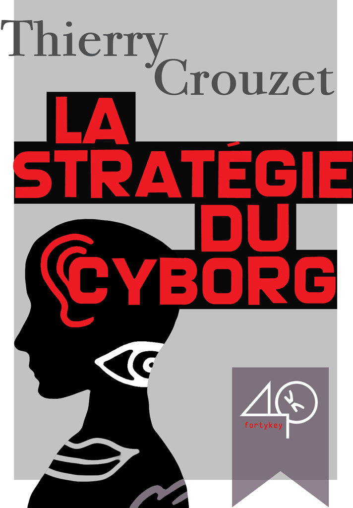

# Du bon usage de l’autoédition 

Comme ces dernières années, j’ai expérimenté [différents modes d’autoédition](#autopublication) ou d’[édition hybride](../../page/tune-caniveau), on m’écrit souvent pour me demander conseil. Plutôt qu’envoyer chaque fois un mail lapidaire, je publie un billet lapidaire.

Au cours de mes expériences, je n’étais pas dans la position de l’auteur qui ne trouve pas un éditeur. Je ne me suis donc pas autoédité faute de mieux mais pour des raisons esthétiques et politiques que j’ai explicitées dans *[La stratégie du Cyborg](../../page/la-strategie-du-cyborg)* et *[L’édition interdite](../../page/edition-interdite)*.

Face aux éditeurs, les auteurs doivent disposer d’un contre-pouvoir (éditorial, économique, éthique…). C’est à nous auteurs de décider ce qui doit être publié ou non, ce n’est qu’ensuite que se pose la question du mode de publication (et c’est aux lecteurs de choisir ce qui doit être lu). Je me suis donc autoédité pour m’entraîner à manier une arme, mais je n’ai pas l’intention d’en abuser et de tirer à vue sur tous les éditeurs.

Comme je l’ai déclaré à [*Livre Hebdo*](http://blog.tcrouzet.com/images_tc//2012/07/LH917-Ouverture-Contrat-Edition.pdf) :

> Soit tu vends beaucoup et tu embauches quelqu’un pour la gestion, soit tu passes par un éditeur et tu te simplifies la vie.

S’autoéditer reste un travail auquel l’auteur n’est pas nécessairement préparé. Aux États-Unis, la plupart des autoédités bestseller ont créé autour d’eux de petites structures avec illustrateurs, correcteurs, community managers… Ils sont tout simplement devenus éditeurs.

Écrire un livre dans son coin et le diffuser dans son coin revient presque au même que le garder dans son disque dur. Il faut en être conscient et ne pas placer des espoirs démesurés sur l’autoédition, pas plus que sur l’édition d’ailleurs, même s’il existe [quelques belles histoires](cinquante-nuances-de-grey.md).

Maintenant, quand je m’autopublie en numérique, ce qui est le cas pour mes livres papier dont je dispose des droits, *[Le peuple des connecteurs](../../page/le-peuple-des-connecteurs)* par exemple, je passe par [immateriel.fr](http://www.immateriel.fr/). Il suffit de disposer d’une structure avec numéro APE ou être auto-entrepreneur pour ouvrir un compte et diffuser ses contenus sur toutes les plateformes, tout en disposant de statistiques de vente unifiées.

Bien sûr, on peut [attaquer la plupart des plateformes en direct](../../2010/9/comment-publier-sur-apple-ibookstore.md), augmenter sa marge, mais l’effort nécessaire ne le mérite pas, surtout quand on réalise quelques centaines de ventes par an. Et au cas où les ventes exploseraient, on peut changer de stratégie. [immateriel.fr](http://www.immateriel.fr/) est un distributeur, pas un éditeur avec lequel on est lié indéfiniment.

Des auteurs ayant deviné que l’autoédition était périlleuse me disent parfois qu’il faudrait créer un portail pour faciliter l’autopublication. Je ne suis pas sûr que ce soit une bonne idée. Créer un tel portail reviendrait à reconstruire de zéro [immateriel.fr](http://www.immateriel.fr/) tout en ouvrant l’accès à tous, ce que fait au niveau mondial [Smashwords](http://www.smashwords.com/). Ce n’est pas le job des auteurs, mais plutôt des entrepreneurs (qui peuvent être auteurs par ailleurs, mais cette compétence est secondaire pour créer un service de publication).

Résumé :

1. Je suis auteur, j’écris.
2. Le plus souvent, je passe par un éditeur, pour me simplifier la vie, aussi parce que la collaboration est en général stimulante (et après des mois de travail solitaire, je finis par avoir envie de coopérer).

- Si aucun éditeur ne veut d’un texte auquel je tiens (parce qu’il est mauvais, politiquement incorrect, commercialement inclassable...), je l’autopublie via [immateriel.fr](http://www.immateriel.fr/).

- Si je suis sûr de tenir un best-seller, je l’autopublie aussi (et je négocie après avec un éditeur).

- Si je suis déçu de ne pas diffuser beaucoup de livres, c’est que je suis nul en probabilité.

- Mon meilleur coup en autoédition, c’est [*L’homme qui plantait des arbres*](#giono) de Giono, plus de 100 000 téléchargements chez Apple !

#autopublication #edition #dialogue #y2012 #2012-7-13-22h57
