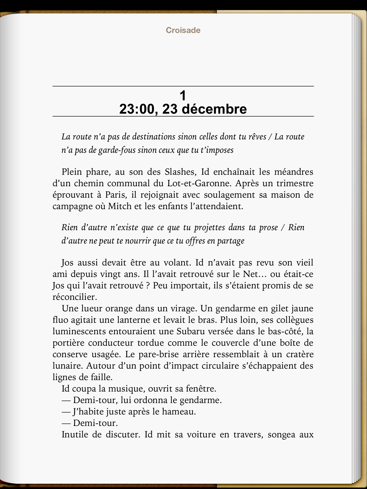

# Lisez-vous de la twittérature ?

Concours de circonstances ? Alors que mon [twiller](#twitterature/ ) *[La quatrième théorie](../../page/la-quatrieme-theorie)* est en relecture chez Fayard pour une publication définitive éventuelle, si ça se fait vous le saurez, j’ai l’impression que la twittérature refait parler d’elle.
[Articles dans *Marianne*, dans *L’Express*, dans les blogs…](../../page/la-quatrieme-theorie/la-quatrieme-theorie-chroniques) Peut-être parce que des auteurs populaires se hasardent à lâcher quelques tweets, peut-être aussi tout simplement parce que cette écriture mitraillée engendre un rythme, une forme, une musique… propre à notre époque.

Aujourd’hui, alors que les réseaux sociaux m’agacent de plus en plus, je suis nostalgique de 2008-2010 quand j’écrivais *La quatrième théorie* au jour le jour. Twitter a d’une certaine façon changé ma façon d’écrire. Cet outil ne m’a pas aidé à rencontrer des gens, à faire ma pub, à gérer ma communauté, mais il m’a montré que je pouvais écrire ailleurs que dans Word.

[David Hockney a déclaré au sujet de l’iPad](http://www.bbc.co.uk/news/technology-11666162) :

> Who wouldn’t want one? Picasso or Van Gogh would have snapped one up.

Les peintres ont toujours adopté les innovations technologiques : huile, aquarelle, photographie, acrylique… Ils n’ont jamais été à la traîne. Ils ont sans cesse fait évoluer leurs outils. Et chaque fois, surtout ces derniers siècles, ils ont témoigné de l’influence de ces technologies sur leur art, leur pratique, leur esthétique, leurs sujets…

Jusqu’à l’invention de la machine à écrire, les écrivains ont eu moins d’occasions d’expérimenter. Pour eux, les changements technologiques ont été mineurs, sauf pour quelques excentriques qui comme Rabelais ont écrit au cul des plaques de composition. Mais quand Nietzsche se met à écrire avec une Malling-Hansen Writing Ball, il reconnaît qu’il pense différemment et que son style change.

Nous revivons ce moment. Certains comme je l’ai fait avec *La quatrième théorie* écrivent dans Twitter, c’est-à-dire qu’ils composent leurs textes dans une fenêtre de saisie qui leur autorise 140 caractères à la fois. La page n’a plus de sens. La continuité de l’œuvre n’apparaît pas sous le regard, un peu comme si nous étions aveugles et nous contentions de dicter nos phrases. Évidemment, le style est influencé, ce qui est dit aussi.

[D’autres auteurs](http://www.enoughbook.com/about-writing-enough/) ont choisi des outils plain text minimalistes sur téléphone ou tablette. Ces logiciels ne gardent du traitement de texte que la fonction de saisie, en revenant à la machine à écrire, avec la portabilité en plus, la possibilité d’écrire dès qu’un instant se présente, dès qu’une idée passe, dans les endroits les plus incongrus, même les toilettes d’un train.

Au milieu, la grande majorité des auteurs utilisent encore un traitement de texte à la Word, majorité à laquelle je me joins le plus souvent.

À l’autre extrémité, loin des outils généralistes adaptés à toutes formes d’écriture, [des auteurs](http://www.literatureandlatte.com/testimonials.php) préfèrent des outils spécialisés dans la rédaction de romans, comme [Scrivener](http://www.literatureandlatte.com/index.php).

Tout cela serait simple si des outils hybrides n’apparaissaient pas, tel [Yarny](https://yarny.me/), qui font la jonction entre le plain text et Scrivener, avec sauvegarde des textes dans le cloud.

Nous disposons d’une nouvelle palette. Comme Hockney l’a déclaré pour Picasso et Van Gogh, je suis sûr que Rousseau et Flaubert l’auraient expérimenté s’ils en avaient eu le loisir.

Voir l’outil transformer ce que j’écris et pense m’a toujours fasciné. J’espère que je tenterai d’autres expériences. Le twiller m’a arraché à ce qui pourrait bien vite devenir une routine. Écrire avec divers outils, c’est simplement tenter de traduire son temps avec tous les sismographes disponibles.

### Notes

1. Je n’ai pas écrit *La quatrième théorie* pour le découper a posteriori en tweets comme de nombreux auteurs l’ont fait avec leurs textes à seule fin de faire leur pub.

- On ne peut pratiquer la twittérature juste pour attirer l’attention. Cette pratique nous transforme.

- Des auteurs se vantent d’écrire sur iPad ou iPhone aussi pour attirer l’attention, mais encore une fois ils n’en expérimentent pas moins, pour peu qu’ils ne trichent pas.

#croisade #netlitterature #twiller #twitterature #dialogue #y2012 #2012-7-19-23h32
