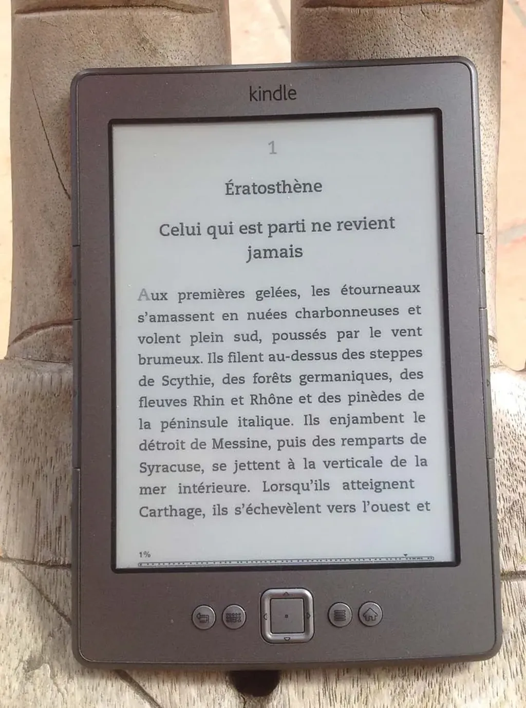

# De la lecture numérique

Je lis en numérique depuis assez longtemps pour commencer à parler de la lecture numérique. Jusqu’ici je m’étais intéressé avant tout à la publication, c’est-à-dire à l’aspect politique de notre petite révolution éditoriale.

Quelles sensations nous procurent nos nouveaux papiers électroniques ? Que changent-ils dans nos habitudes ? Comment réinventons-nous notre vie de lecteur ? J’entrevois des bribes de réponses.

J’ai commencé à lire sur écran avec mes premiers écrans, mais plus intensément quand je suis devenu journaliste au début des années 1990. J’ai mangé beaucoup de PDF/HTML, mais je ne suis réellement un lecteur numérique que depuis que j’ai acheté ma première liseuse Sony en 2008.

C’était un appareil terne, peu contrasté, à l’ergonomie épouvantable. J’en ai changé chaque année, et aujourd’hui je lis presque exclusivement en numérique, sauf quand je ne trouve que des éditions papier (ce qui se produit encore trop souvent).

Quand j’ai le choix entre le papier et le numérique, je choisis le numérique. Non par posture (« Puisque tu défends la publication numérique, lis en numérique. »), mais parce que j’y suis gagnant, même si tout n’est pas encore parfait.

### La peur du manque

J’ai chez moi plus de livres papier que la bibliothèque municipale de ma petite ville, j’ai plus d’ebooks qu’une grosse bibliothèque régionale, la plupart étant en anglais. Je télécharge tout ce que je trouve, comme si j’avais peur de manquer. C’est absurde car le Web reste à portée de la main, mais les ebooks n’y circulent pas encore librement, à cause d’un droit d’auteur inadapté. Donc, quand je pêche un gros poisson, je le stocke.

Je suppose que ce comportement monomaniaque est transitoire. Beaucoup l’ont connu avec la musique ou les films. Des collectionneurs de livres ont toujours existé, mais le numérique réveille chez moi une boulimie latente.

Je la justifie par le besoin d’immédiateté, aussi par les possibilités exploratoires qui se manifestent. Une simple recherche en plain text sur mon disque dur fait émerger des ressources inattendues, exactement comme sur le Web, mais dans les corps mêmes des livres, et encore pas dans tous les livres, mais uniquement ceux qui ont croisé ma route. J’oscille entre l’universel et le personnel, entre le général et le particulier. J’explore une dimension nouvelle de la bibliothèque, qui d’une certaine manière reste réduite tout en étant ouverte. C’est plutôt grisant, je ne dessoule pas.

> **Note pratique** J’ai un disque dur dédié aux livres connecté à ma freebox. J’utilise [Calibre](http://calibre-ebook.com/) pour synchroniser avec mon Kindle 4 (et malheureusement, je passe par iTune pour envoyer sur iPad ou iPhone – quand une interface Calibre ?).

### L’aspiration à la légèreté

Quand on lit en numérique, on perd très vite l’habitude du poids des livres. Proust devient léger. On peut lire plusieurs heures sans avoir de crampe, sans se battre avec une reliure trop étroite qui cherche à se refermer.

Un pourcentage minimaliste en bas de l’écran nous indique où nous en sommes (et mesure le poids en mots du texte). Je m’y suis vite habitué. Je le trouve maintenant plus intuitif qu’une pagination arbitraire qui dépend de critères que je ne maitrise pas (notamment la densité de texte par page papier).

J’ai découvert que la légèreté tant graphique que physique était un attribut fondamental des ebooks. Pour la littérature, j’ai besoin d’oublier ce qui soutient le texte, je ne veux plus qu’être avec lui, sans aucune interférence matérielle.

Pour moi, la dématérialisation de l’objet livre s’accompagne d’une dématérialisation de l’appareil de lecture. Cet allègement a un effet sur la lecture, qui moins fatigante peut se prolonger plus longtemps.

La légèreté stimule chez moi une autre habitude. J’ai toujours aimé zapper de texte en texte. Des dizaines de livres en cours de lecture encombraient le pied de mon lit. Ils ont disparu. Ma liseuse en tient ouverts des centaines.

> **Idée noire** À la mort d’un lecteur, on sait désormais exactement où il en était, on entre dans une intimité très secrète.

Où que je sois, je bascule d’un classique à un bestseller ou à un de mes propres textes en cours de réfection comme si je visitais un musée avec une infinité de salles d’exposition. J’expérimente, il me semble, une façon de lire que les contraintes matérielles rendaient quasi impossible par le passé. J’emporte partout avec moi mon cabinet de lecture. Je peux tout lire partout, ce qui encore était impossible il n’y a pas si longtemps. J’ai même pris l’habitude de goûter des dizaines de textes avant de plonger vraiment dans l’un d’eux. Encore un luxe que seul un libraire ou un bibliothécaire pouvait se payer.

> **Note pratique** Je lis sur Kindle 4 que je préfère au Kindle 4 Touch qui, avec son écran plus contrasté, son usage plus simple, dispose d’un boîtier plus lourd et plus encombrant. Je suis incapable de lire autre chose que de l’actualité sur un iPad parce qu’il est trop lourd (et devient vite brûlant). Ma prochaine liseuse devra être encore plus légère, jusqu’à peut-être n’être que de l’air ou des mots projetés sur ma rétine.

### Le bonheur des yeux

Les bestsellers sont souvent composés en corps 13 ou 14. C’est la taille de caractère dont j’ai besoin pour lire efficacement (je vieillis). Malheureusement, les essais sont souvent imprimés en corps inférieurs, ce qui ralentit ma lecture et me donne des maux de tête.

Avec ma liseuse, j’ai oublié ces problèmes. Je lis toujours dans les conditions pour moi idéales. Des conditions qui ne changent pas d’un texte à l’autre. Rien ne brouille visuellement mon rapport au texte.

Que les graphistes ne désespèrent pas, il leur reste des domaines où exercer leur art, par exemple en soignant les têtes de chapitre, ce qui peut donner une réelle originalité à un texte électronique, et contribuer à l’ambiance de la lecture (c’est comme projeter une lumière plus ou moins tamisée).

Autre champ de créativité graphique encore ouvert : les couvertures, mais je regrette que les liseuses ne leur donnent pas plus d’importance.

Quand on lit un livre papier, on voit sa couverture chaque fois qu’on le reprend en main, ou le tourne à l’envers pour le poser. Rien de tel avec une liseuse. La couverture s’efface une fois la lecture commencée. Quand j’ai pioché un ebook un peu au hasard sur mon disque dur et que je me laisse entraîner par le texte, parfois durant plusieurs jours, il m’arrive de ne plus savoir ce que je lis. C’est une sensation nouvelle. Encore un pas vers la dématérialisation.

Alors que tous les livres que j’ai lus sur papier sont associés dans ma mémoire à une couverture, surtout les romans de SF ou les polars, les ebooks flottent dans une espèce de vide. Ils sont paradoxalement moins multimédias que les livres papier, d’autant que leur mise en page est simplifiée. Je crois cette pente inévitable. Elle s’inscrit dans une longue histoire de simplification de la calligraphie elle-même, ce qui me fait douter de l’avenir des livres enrichis. Le texte seul a un pouvoir indéniable que les liseuses renforcent.

> **À Amazon** Quand le Kindle s’éteint, il affiche une image aléatoire. J’aimerais qu’il affiche la couverture du dernier livre ouvert, exactement comme si je venais de le refermer. Un détail à régler dans la prochaine mise à jour logicielle.

### La curiosité exacerbée

J’aime me promener dans les librairies, me laisser influencer par les empilements mis en avant par les chefs de rayon. Quand j’avance dans des zones inconnues, les couvertures ont autant de pouvoir attractif que les titres des ouvrages.

La déambulation visuelle m’est indispensable. J’ai ainsi découvert des livres que personne de mon entourage ne m’aurait jamais conseillés. *Dune* de Franck Herbert, découvert sur un tourniquet dans une maison de la presse alors que j’avais 12 ans, *A New Kind of Science* de Wolfram, repéré bien plus tard à Londres.

La couverture a un rôle de prescription. Toutes les librairies électroniques devraient afficher des pages de couvertures. J’aime particulièrement les blogs de lecteurs qui les affichent en grand format. En passant de billet en billet, sans nécessairement lire les critiques, je me promène de livre en livre, et laisse le hasard me guider.

> **À développer** Une petite application qui récupérerait toutes les couvertures des ePub présents sur un disque dur pour créer une librairie virtuelle en images. Une telle fonction pourrait être ajoutée à Calibre.

### La fascination pour mes contemporains

Avis aux psychologues en mal de sujet d’étude. Par le passé, les éditeurs avaient une fonction filtrante. Ils bloquaient les textes qu’ils jugeaient indignes de publication. Ils œuvraient pour notre bien (sic).

Peu à peu, ils sont devenus de plus en plus laxistes. Ils ont publié Musso, mais malgré Musso, ils ont continué à nous protéger du pire, auquel les ebooks nous exposent. Nous en avons la preuve. Maintenant que nous pouvons nous autopublier, tous les livres circulent. Et qu’est-ce qui a du succès ? De plus en plus souvent des livres que les éditeurs n’ont pas voulu. Des livres inimaginables.

Les ebooks nous apprennent que les lecteurs veulent des textes écrits par des gens comme eux, des textes aux antipodes de la littérature, des textes d’amateurs souvent caricaturaux, c’est assez effrayant. Je pense bien sûr au succès planétaire de [Fifty Shades of Grey](../7/cinquante-nuances-de-grey.md).

> **Prospective** Les textes risquent d’être d’abord autopubliés avant que les éditeurs ne se saisissent de ceux qui marchent pour tenter de les faire mieux marcher. Le couple créatif éditeur/auteur risque bientôt de manquer d’énergie. Ce serait dommage. Le travail d’équipe a quelques vertus.

#ebook #edition #y2012 #2012-8-19-18h32
