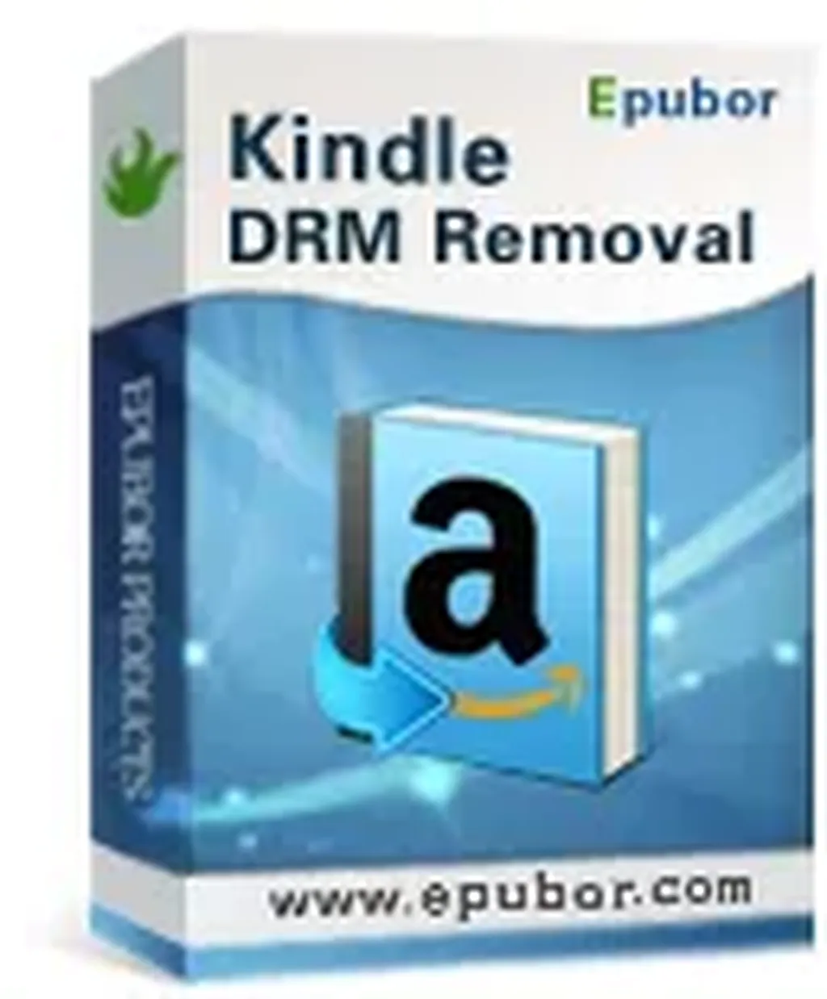

# ebooks : défends tes droits avec tes armes

La loi comme le répète depuis des années Étienne Chouard est écrite par les hommes de pouvoir afin de définir les conditions de leur bon exercice du pouvoir.

Oublier ce point, se soumettre aveuglément à la loi, c’est s’admettre esclave. Cela vaut notamment pour les lois de nature industrielle ou technologique promues par les grands opérateurs du marché.

Tout citoyen désireux de défendre ses libertés doit mettre en question les lois et vérifier leur validité. En cas de désaccord profond, il doit les combattre en révolutionnaire. Quand [Lionel Maurel](http://scinfolex.wordpress.com/) alias Calimaq se demande très justement [si les ebooks ne seraient pas des livres diminués](http://owni.fr/2012/09/13/ebooks-livres-augmentes-ou-livres-diminues/), il se place dans un cadre légaliste qui vole en éclat en cas de guerre ouverte entre les hommes et les femmes libres et ceux et celles qui veulent les asservir.

Nous n’avons pas à nous lamenter au sujet des DRM, des restrictions d’usages, de la non-transmissibilité des fichiers, de leur non-intégrité… Une fois mises en évidence, nous devons les combattre par tous les moyens.

N’oublions pas que les esclavagistes ont toujours profité de nous. Ils ne font que déplacer nos chaînes d’un anneau à l’autre. Nous disposons de deux armes en vente libre pour mener notre lutte pacifique.

### DRM removal

Quand j’achète un ebook avec DRM, je commence par les effacer avec un logiciel de type [DRM removal](http://www.epubor.com/kindle-drm-removal.html ). Ça me prend deux secondes. Je stocke alors le fichier sur mon disque dur dédié aux eBooks, puis je le synchronise avec [Calibre](http://calibre-ebook.com/) avec toutes mes liseuses, le donne à lire à ma femme ou à mes enfants, et pourquoi pas à mes amis comme je le faisais jadis avec un livre papier.

Ma liberté de lecteur augmente, elle ne diminue pas. Simplement je suis forcé à une petite gymnastique qui je l’espère deviendra inutile dans les années à venir. En attendant, je me défends.

Et je souris quand je vois que les développeurs de logiciels de déprotection commercialisent leurs créations. Bien sûr, d’autres développeurs propulsent des logiciels de déprotection déprotégés.

### OCR

Quand les éditeurs diffusent des œuvres incomplètes ou refusent d’en faire circuler d’autres qui appartiennent à notre patrimoine, nous pouvons les prendre de vitesse. Depuis des années, la [Team Alexandriz](http://www.teamalexandriz.org/) jette ainsi des pavés dans la marre de l’édition numérique. À tel point que je préfère souvent lire leurs ebooks que les mêmes versions commercialisées par les éditeurs (quand elles le sont, ce qui est loin d’être toujours le cas).

Qu’on arrête de nous raconter que publier en numérique c’est difficile, hors de prix. La Team nous démontre le contraire. Quand un livre existe en papier, rien ne peut nous empêcher de l’avoir en numérique, surtout pas une loi, car cette loi vise à nous acculturer au nom d’ayant-droits plus que souvent lésés.

En résumé, si quelque chose ne vous plait pas dans le monde des ebooks, changez-le. Lisons Callimaq, il désigne nos cibles, nos ennemis.

Mince, je me remets à bloguer. Pourquoi ? Parce que je sèche sur le chapitre 63 de mon Ératosthène. J’y retourne.

#ebook #edition #coup_de_gueule #y2012 #2012-9-16-11h35
