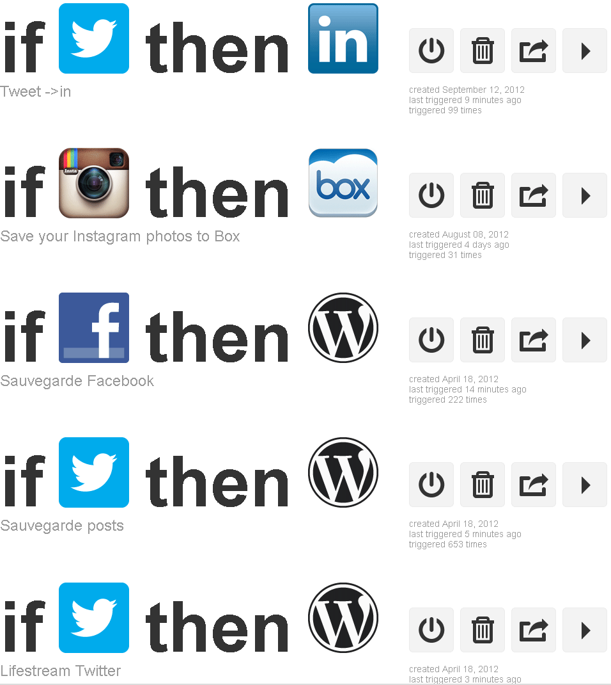

# Twitter en huit tweets

Pour [Cocorico Hebdo](http://cocorico-hebdo.tumblr.com/), Frédéric Bardeau a lancé une interview par tweets. Je m’y amuse.
*— Votre rencontre avec Twitter, c’est où, quand, comment et avec qui ?*

— Premier compte ouvert en 2007, mais tout commence réellement fin 2008 quand je me lance dans l’écriture de *Croisade* en direct live.

*— Qu’est ce que Twitter a changé dans votre vie aussi bien personnellement que professionnellement ?*

— Je suis devenu accro aux autres. Ne pas les entendre me répondre d’une heure était devenu une torture. Il était temps de couper.

*— Comment gérez-vous le flux, l’addiction et la ferveur que provoque Twitter ? Vous déconnectez ?*

— Je ne fais plus la course aux followers. C’est de la foutaise. Le Web des scores, c’est du foutage de gueule marketing.

*— Ce que vous préférez sur Twitter.*

— La contrainte des 140 caractères qui fait de l’outil un véritable laboratoire d’écriture.

*— Ce que vous détestez.*— Les tricheurs, les spammeurs, tous ceux qui se sentent obliger de dire « bonjour ».

*— Vos outils et services pour Twitter.*— [Hootsuite](http://hootsuite.com) avec [IFTTT](https://ifttt.com) (c’est en train de devenir de l’histoire ancienne avec les nouvelles restrictions d’usages de l’API Twitter).

*— Ce qui manque a Twitter.*

— Une architecture décentralisée dont nous serions propriétaires. J’en ai marre de dépendre d’entrepreneurs avides de fric.

*— Quelque chose que vous aimeriez dire concernant Twitter.*

— Twitter est un service animé par une entreprise qui ne nous veut pas du bien, mais juste nous attacher un peu plus à nos écrans.

#netculture #twitter #dialogue #y2012 #2012-9-24-19h44
