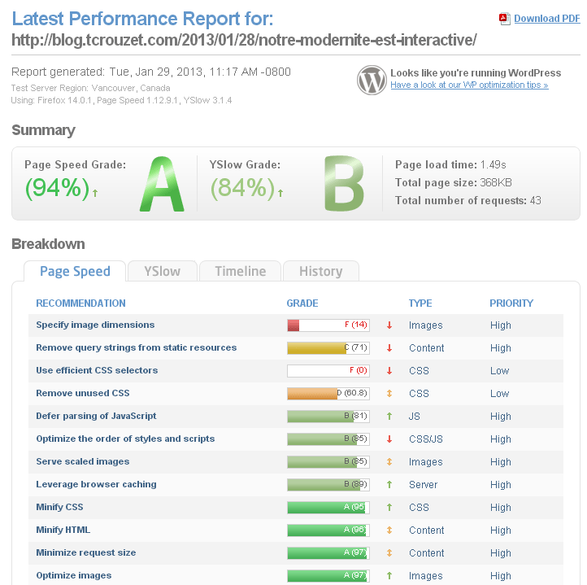
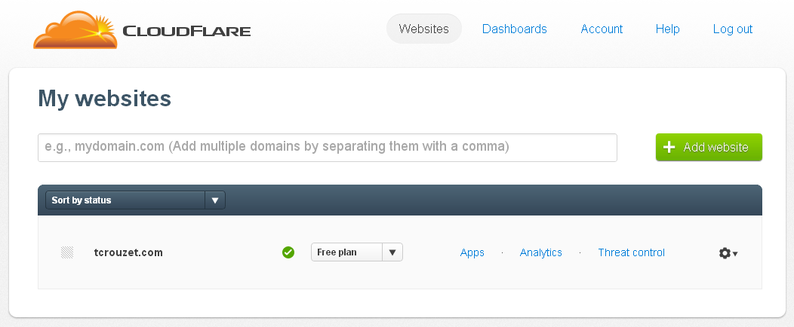

# Comment sécuriser et optimiser son blog

Quand je dis qu’[un blog n’a aucune pérennité](le-blog-une-pratique-depassee.md), c’est en connaissance de cause. Je viens de passer plus d’un mois à me battre avec le mien.

Changement de serveur dédié, lutte incessante contre les hackers qui veulent en prendre le contrôle, performance lamentable et temps de chargement prohibitif. Leçon : « Si tu ne suis pas l’évolution technologique, tu crèves. » Cela est d’autant plus vrai quand on se veut indépendant, donc forcé de maintenir soit même son architecture. Conséquence : « Un blog indépendant ne survit que tant que quelqu’un l’administre. À tout moment, sont contenu peut s’évanouir. Gênant pour un auteur qui considère son blog comme son œuvre. »

Quand je vois que le blog de Narvic a quitté la blogosphère je m’en attriste. Cette fois ce n’était pas par négligence, mais par une volonté de sa part, par son droit d’auteur, mais combien d’autres pépites s’effacent-elles peu à peu ? Voilà autant de raisons de me faire aimer le format epub et [mon plugin pour générer des ebooks à partir de mon blog](http://wordpress.org/extend/plugins/wp2epub/). N’empêche, je n’ai aucune envie d’abandonner mon vieux navire et j’ai bataillé pour le remettre sur pied. J’ai tiré quelques enseignements que je partage avec vous.

### Évaluation des performances

La bande passante augmente, mais la taille des pages augmente tout aussi vite avec la profusion des JavaScript et plugins. Un temps de chargement en dessous de 2 secondes reste la règle en ergonomie (je ne l’ai pas atteint, faute de sacrifier photos et plugins lourds en javaScript).

Avant de tout casser, regardez où vous en êtes avec [Yslow](http://developer.yahoo.com/yslow/), un plugin pour Firefox et Chrome, ou depuis le site [GTmetrix](http://gtmetrix.com). Objectif : un indice Yslow supérieur à 80. Les deux outils doivent être utilisés concurremment. Ils proposent tous les deux des conseils d’optimisation (j’avoue que je me suis arrêté en chemin).

Quand j’ai commencé mon travail, mon indice était à 40. Il est maintenant sur toutes mes pages au-dessus de 80. Ma page d’accueil est à 95.

### En finir avec les hackers et plus

Fatigué de configurer mon firewall sur Linux. De traquer les IP indésirables, de les bannir. J’ai fini par m’inscrire gratuitement sur [Cloudflare](www.cloudflare.com). Ce service est tout simplement **génial**, indispensable. Et je me demande pourquoi j’ai autant attendu avant de me simplifier la vie.

Cloudflare est en même temps…

1. Un firewall qui fait la police et que vous pouvez configurer dynamiquement.

- Un CDN (*Content Delivery Network*). Il stocke toutes vos données statiques dans son cache et peut vous maintenir en ligne même quand votre serveur tombe.

- Un optimisateur. Il compresse les fichiers, charge les Javascripts en asynchrone et offre d’autres options de fine tunning comme l’ajout automatique des tracking Google Analytics.

Cloudflare réussit ce tour de force en interceptant votre trafic. Comment ? Il remplace votre serveur DNS. Pour l’activer, il vous suffit chez votre hébergeur de domaine d’indiquer les DNS Cloudflare à la place des anciens. C’est terminé. En moins de 24 heures, votre blog se transforme en Ferrari.

### La recommandation sociale

J’ai fini par jeter tous les plug-ins qui ajoutent des boutons et par tout coder en dur en copiant-collant les script proposer par les réseaux. Je ne vois pas pourquoi on devrait supporter des usines à gaz.

### Le problème WordPress

Jusqu’à ce point, les conseils étaient valables pour toutes les plateformes. Je me suis ensuite attaqué à WordPress.

***Tester les plugins***
Certains mangent littéralement votre bande passante et la puissance de calcul du serveur. Pour les évaluer, il existe un autre plugin, [P3 - Plugin Performance Profiler](http://wordpress.org/extend/plugins/p3-profiler/). Quand j’ai commencé l’optimisation, rien que chargement des plugins exigeait près de 3 secondes. Je suis tombé à 0,5 seconde. J’ai tout simplement banni ceux qui étaient trop gourmands.

***Cache***

Inutile de recalculer les pages qui ne changent pas. Un cache s’impose. J’ai installé le plugin CloudFlare qui sert essentiellement en mode développement en conjonction avec [W3 Total Cache](http://wordpress.org/extend/plugins/w3-total-cache/). J’ai aussi testé le classique [WP Super Cache](http://wordpress.org/extend/plugins/wp-super-cache/) qui me donne les mêmes résultats. J’ai enfin ajouté [un minuscule plugin qui met en cache les gravatar](http://wordpress.org/extend/plugins/wp-gravatar-mini-cache/).

***Jetpack : le dilemme***
[C’est le plugin à tout faire](http://wordpress.org/extend/plugins/jetpack/), il est très lourd. Il ajoute pas moins de 100 Ko de script et de CSS. J’ai longtemps hésité à le virer, mais je l’ai gardé pour l’abonnement aux commentaires et deux ou trois autres fonctions, j’ai désactivé toutes les autres. J’attends de trouver mieux car 100 Ko c’est de la gabegie.

***Sécurité***
[Wordfence](http://wordpress.org/extend/plugins/wordfence/) est l’anti-virus de WordPress. La première fois que je l’ai lancé, il a découvert des dizaines de chevaux de Troie. Depuis il veille au grain et intercepte de nombreuses tentatives de connexion illicites.

### Bilan

Avec des pages souvent supérieure à 300 Ko, mon blog reste surchargé. Je n’ai pas voulu virer la photo du moment, ni pondre un bout de code pour l’optimiser… J’en ai fini avec cette expérience d’immersion dans le code. Je sens qu’elle réactive des rouages de mon cerveau qui sinon se rouilleraient trop vite. Je m’y applique une ou deux fois par an. C’est une sorte d’hygiène pour informaticien retraité. Bien sûr si vous avez d’autres tuyaux, je suis preneur.

*PS : J’ai nécessairement oublié des dizaines de détails, notamment tout ce qui concerne la configuration serveur, mais j’ai résumé l’essentiel.*

#blog #cuisine #dialogue #y2013 #2013-1-30-13h42
