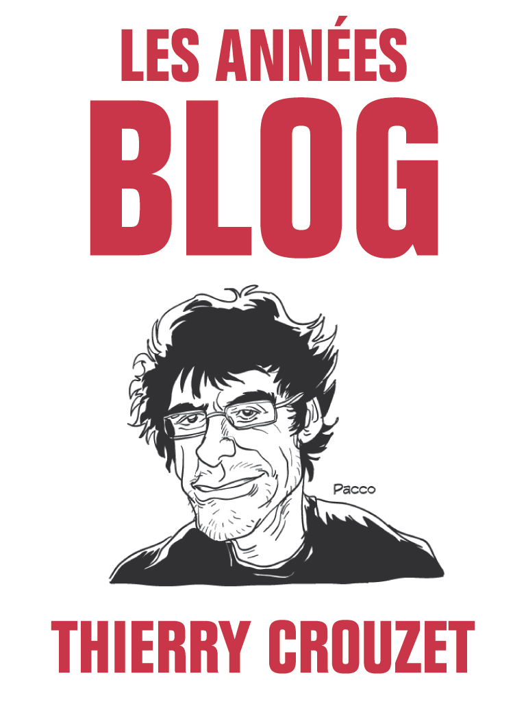

# Le blog, une pratique dépassée

Je ne vais rien dire de neuf, peut-être justifier pourquoi je blogue peu, pourquoi l’envie me manque, pourquoi je rêve d’autres formes.

Nous avons souvent utilisé la métaphore de la maison. Le blog est un salon aux portes grandes ouvertes, mais où le propriétaire reste chez lui, avec la capacité de bannir des importuns.

Cette métaphore s’ancre dans la vieille logique du territoire physique. Le désir de propriété. D’un endroit bien à soi où on est le maître. Autant de notions, certes pérennes, mais aussi archaïques et qu’il est peut-être temps de dépasser.

1. Parce que le modèle patriarcal bat de l’aile (et c’est une bonne chose).

- Parce que le désir de toute-puissance chez soi est tout aussi mégalo que le désir de toute-puissance tout court.

- Parce que le modèle hiérarchique est quelque peu limité dans un monde complexe (et parce que je dénonce ces limites depuis longtemps).

- Parce qu’un chez soi implique une adresse et tout ce qui va avec (démarchage commercial, espionnage, censure, pressions, attaques… autant de choses familières à beaucoup de blogueurs).

- Parce qu’un chez soi exige un entretien constant (mise à jour des logiciels, suivre les modes technologiques et esthétiques…).

- Parce qu’un chez soi exige du temps, et très vite des dépenses (serveur, domaine…).

- Parce qu’un chez soi encombre, attache, retient…

Toutes ces raisons me poussent à froncer des sourcils. Mon blog, hébergé sur mon serveur, est certes une sorte de caravane que je peux déplacer, mais il nécessite encore une grosse voiture pour le tracter. En comparaison, un blog hébergé sur une plate-forme est un appartement en location, dont les occupants peuvent être expulsés à l’approche du printemps (et dans ce cas, peu de temps pour faire ses bagages).

Le blog est donc au mieux une caravane. Il lui manque un moteur pour se déplacer tout seul. Capacité élémentaire de tous les animaux. Qui ont, entre autres, le don de faire des enfants, et pour les plus primitifs de se dupliquer eux-mêmes. Cette autre métaphore fait d’un blog un arbre stérile. Je préférerais le voir comme une amibe voyageuse et lubrique.

J’aime les livres parce que je peux les donner et les prêter, et parce qu’alors, même quand je les ai écrits, ils ne dépendent plus de moi. Ils se détachent peu à peu comme les enfants de leurs parents.

Donc ce n’est pas tant ce que nous publions sur nos blogs que la méthode de publication qui me chagrine, trop ancrée, trop matérialiste, trop fragile, trop compliquée…

Alors depuis des années, je développe [wp2epub](../../page/wp2epub), un plugin pour WordPress, qui transforme toute ou partie d’un blog en ebook. C’est-à-dire un fichier qu’il est possible de donner, de copier, de modifier et même de vendre.

Avec la dernière version du plugin, j’ai généré une nouvelle édition de *[Les années blog](../../books/les-annees-blog.md)* que j’ai placé sur les librairies en ligne via [immateriel.fr](http://www.immateriel.fr/). D’une certaine manière, mon blog est maintenant un enfant comme un autre. Qu’un hacker casse mon serveur ou que j’oublie de payer mon hébergeur, le blog continuera de vivre, par-devers moi. J’ai coupé le cordon ombilical qui le retenait encore au monde physique. Il est devenu une créature autonome dans le flux.

Et j’aimerais à l’avenir me contenter d’envoyer ainsi des bouteilles à la mer numérique. Mon blog n’est qu’un lieu de génération, qu’un atelier, qu’un point de départ… cela me donne envie de le déshabiller de tout le superflux… encore du travail en perspective… mais rien encore de réfléchi, juste un désir auquel je dois donner forme, avec la conscience que l’empilement ici de billets n’a aucun sens, aucune pérennité, aucune résilience.

Et puis c’est un peu comme si on ne pouvait lire un livre que dans l’atelier de l’imprimeur. Pourquoi, dans l’océan numérique, nous sommes-nous enfermés dans des prisons dorées ?

Je suis heureux de bientôt sortir *[La quatrième théorie](../../page/la-quatrieme-theorie)*. Un esquif qui pourra rejoindre la flotte. Faire des livres, quelle que soit leur forme, me paraît soudain plus moderne que tenir un blog, simple officine dans la rue des boutiques obscures. Ce qui compte, c’est publier, partager, pas d’être maître chez soi.

L’Epub me paraît le véhicule le plus actuel. Tu le produis, tu le vends ou l’offres. Tu laisses les lecteurs en juger et le propulser. Tu n’es plus là pour lui donner une importance qu’il n’a pas. Pour jouer au parent qui admire son enfant. C’est dans la cour de récréation que tout se passe, pas à la maison.

Bien sûr, il manque plein de choses aux Epub actuels. Les commentaires qui se propagent de fichier en fichier. Les corrections et ajouts dynamiques. Je rêve. Publier un texte, le distribuer et que les lecteurs le voient s’allonger. Mais pas en venant le lire à une dresse fixe comme sur un blog, en le lisant chez eux, à l’intérieur même d’un livre toujours renouvelé (non, je ne veux pas réinventer le RSS, plutôt une entité quasi autonome).

Et paradoxe, pour parler de ce rêve, je passe encore par le blog… J’aurais aussi bien pu me contenter d’un lien vers [le fichier Epub de ce billet](http://blog.tcrouzet.com/wp-content/epub?epub=30510) ou vers [la compilation des dix deniers](http://blog.tcrouzet.com/wp-content/epub/?epub=last10|-noepub,-Lifestream,-Photoblog). Reste à imaginer un projet d’écriture qui consisterait à envoyer une multitude de fichiers se promener.

On s’est trop focalisé ces dernières années sur l’accès. *L’âge de l’accès*. Je me fiche d’être personnellement accessible, trouvable, likable… Quand entrerons-nous dans l’âge de la liberté ? La liberté pour nous et nos productions. L’âge de l’accès, c’est le nouvel âge de l’emprisonnement. Nous devons vite le dépasser. Exister sans être accessible.

#epub #netculture #netlitterature #dialogue #y2013 #2013-1-21-12h6
