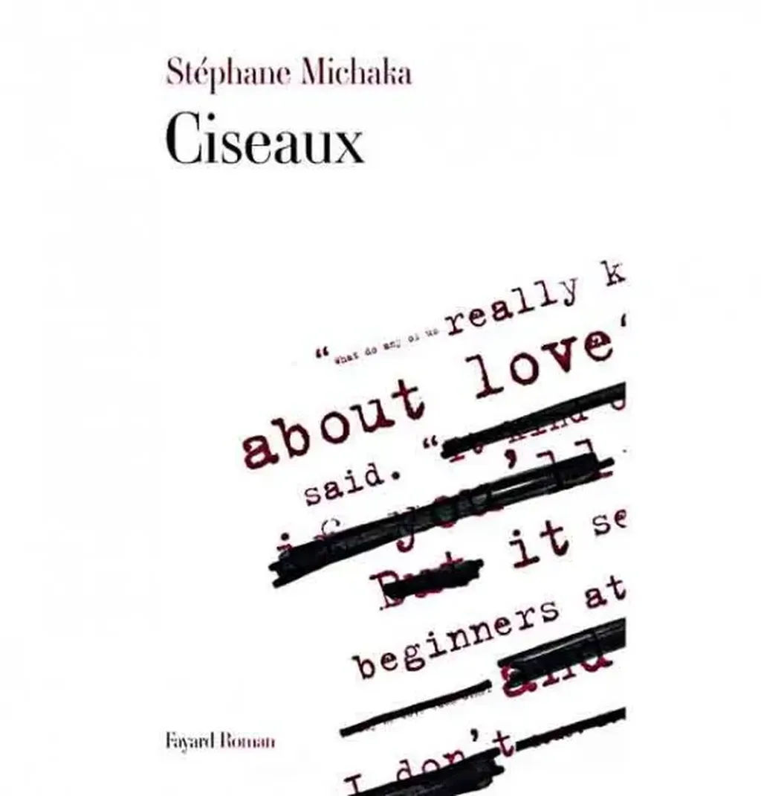

# Leçon d’humilité pour auteurs prétentieux

J’ai souvent croisé des auteurs qui ne supportent pas qu’on touche à leurs textes, et leur confèrent une immuabilité biblique. Je conseille à tous ceux qui auraient cette tentation de lire *Ciseaux* de Stéphane Michaka.

C’est l’histoire romancée de Raymond Carver, entre le goulot de la bouteille, ses femmes et son éditeur, qui joue du ciseau avec ses textes. Des nouvelles de quinze pages fondent jusqu’à trois. Et à la fin, on obtient le minimalisme de Carver. Carver qui voudrait bien dire « merde » mais qui se couche, aussi comprend, invente son mythe, son style inimitable à quatre mains.

Dans son roman, Stéphane nous démontre que toute œuvre est collective. Déjà parce qu’elle est le fruit d’une conscience, elle-même œuvre collective (les enfants loups ne deviennent jamais des hommes). Aussi parce que les proches de l’auteur écrivent d’une certaine manière avec lui, et que l’éditeur entre dans ce cercle. Il le doit à tout prix, et son absence est nocive.

Pour Flaubert, l’éditeur s’appelait [Louis Bouilhet](http://fr.wikipedia.org/wiki/Louis-Hyacinthe_Bouilhet), l’ami de toujours. Pour Carver, [Gordon Lish](http://en.wikipedia.org/wiki/Gordon_Lish). Pour les blogueurs, les commentateurs ou autres blogueurs (avec le danger que cette relation vire à la complaisance propre à tous les cénacles, et la difficulté de revenir sur un texte déjà publié).

C’est peut-être pour cette raison que j’ai toujours considéré mon blog comme un atelier (même si Isa se penche presque toujours au-dessus de mon clavier). On y voit le travail en train de se faire, pas le résultat du travail lui-même. D’une certaine manière j’aurais poussé à l’extrême cette démarche en écrivant *[La quatrième théorie](../../page/la-quatrieme-theorie)*, exposant les phrases les unes après les autres, avant de tout reprendre ces derniers mois.

Alors auteurs, tendance prétentieuse, croyant vos phrases immuables et d’une beauté pure, lisez *Ciseaux*. Peut-être accepterez-vous après de tout remettre à plat. Un texte est de la pâte à modeler. Il se termine avec une forme alors que mille autres auraient pu lui convenir. La première qui jaillit n’a rien de miraculeux. On peut l’encadrer dans un coin de disque dur, pour mémoire. Mais pourquoi refuser de l’altérer. Écrire, c’est sculpter.

PS : *Ciseaux* m’a d’autant plus marqué que je l’ai lu en même temps que je coupais et taillais dans *La quatrième théorie*, avec Lilas, Lilas l’éditrice chez Fayard de *Ciseaux*... boucle bouclée. 

#netlitterature #dialogue #y2013 #2013-1-11-16h20
