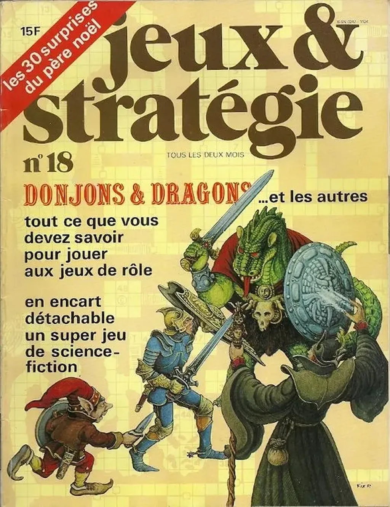

# Les saisons de la création

Une chose m’étonne toujours. Quand on chercher à franchir une frontière, ceux qui se sentent bien derrière se pressent de critiquer votre manque de curiosité.

Ce paradoxe n’en finira jamais de me surprendre. Je veux franchir le mur à cause de ma curiosité dévorante et on m’accuse de ne pas l’exercer en deçà. Je suppose que les résistants durant toutes les guerres subissent les mêmes critiques.

J’en reviens à [mon parallèle entre l’histoire du jeu de rôle et du blog](jeu-de-role-et-blog-deux-histoires-collectives.md). Pour essayer de mieux expliquer ma position à ceux qui ont été énervés. Je me mets à leur place. J’ai affirmé qu’ils vivaient quelque chose de dépassé, de moribond et que de mon temps c’était mieux (pour le blog ce temps n’est pas si lointain, trois-quatre ans). Il y a de quoi être furax.

Pour mémoire, j’ai toujours dit, et dès *[Le peuple des connecteurs](../../page/le-peuple-des-connecteurs)*, que le jeu de rôle était le plus important mouvement artistique de ces cinquante dernières années. Avec le blog désormais. C’est parce que j’attache une importance extrême à ces deux formes d’écriture que je réfléchis à leur sujet.

1. Pour moi, le blog, le jeu de rôle, l’écriture qui les sous-tendent ne sont pas un loisir, mais la vie même. Tout est jeu, mais un jeu à la vie à la mort. Je n’écris pas pour me divertir d’autre chose. Cette autre chose, c’est l’écriture. Je ne suis pas dans la dichotomie.

- J’ai quelques loisirs comme le kayak, le ski, le jardinage… Je me contente avec eux d’une forme de répétition que je refuse dans tout ce qui touche à l’écriture, donc au blog et au jeu de rôle en particulier.

- L’évolution contrairement à ce qu’avait cru Darwin n’est pas linéaire. Elle survient par sauts, par brusques poussées créatrices. Il en va de même pour les courants esthétiques et formels. L’eau s’accumule derrière un barrage jusqu’à ce qu’elle le submerge en un climax, un âge d’or.

- Ceux qui ont connu la déferlante ont par la suite du mal à se satisfaire de la lente accumulation qui survient après. Il cherche longtemps à revivre ce qu’ils ont connu, puis ils se détournent si la curiosité les anime encore.

- Ils savent néanmoins que la saison 1 peut être suivie de saisons ultérieures à plus ou moins longue échéance. L’histoire du roman nous le prouve depuis quelques siècles.

- La nouvelle accumulation finit par provoquer de nouvelles vagues, au même endroit ou ailleurs, parfois des anciens peuvent s’en apercevoir et la rejoindre. Mais c’est peu probable, leur exploration les a en général conduits dans d’autres directions.

- Alors, accuser quelqu’un qui a connu un climax de ne pas être conscient d’un autre climax en cours ne me paraît pas une position légitime. Un climax se partage. On n’attend pas que les autres viennent le découvrir, on va vers eux, surtout vers ceux qui passent leur vie à les traquer tels des chasseurs de tornades.

- Un climax a la particularité de faire des vagues qui rejaillissent partout dans la société. Nous l’avons connu avec les blogs. Nous l’avons connu avec le jeu de rôle. Et c’est parce que ces soubresauts me paraissent plus qu’atténués aujourd’hui que je pense que nous vivons à nouveau une période de lente accumulation. Déterminante, mais pas saillante.

- Cela n’empêche pas les expérimentations. Quand j’ai écrit *[La quatrième théorie](../../page/la-quatrieme-theorie)* sur Twitter, je l’ai revendiqué dès le début comme du jeu de rôle, je l’ai rappelé dans [l’histoire du roman](../../page/la-quatrieme-theorie/la-quatrieme-theorie-historique). J’ai réussi selon moi, surtout au début, à renouveler le jeu de rôle, mais d’une façon difficile à généraliser, à transformer en vague sociétale.

- Je suis donc certain que partout des chercheurs s’échinent à renouveler le blog et le jeu de rôle. Je n’attends qu’une chose qu’ils me fassent signe et que nous travaillons ensemble à la prochaine vague.

- Je termine une fois de plus avec Picasso. Période rose, bleu, cubisme… Il faut apprendre à vivre ses périodes et à passer à autre chose. Ceux qui restent immobiles m’inquiètent toujours. En politique, on les appelle les conservateurs. Notre monde croule à cause d’eux.

#blog #edition #dialogue #y2013 #jdr #2013-1-27-9h16
