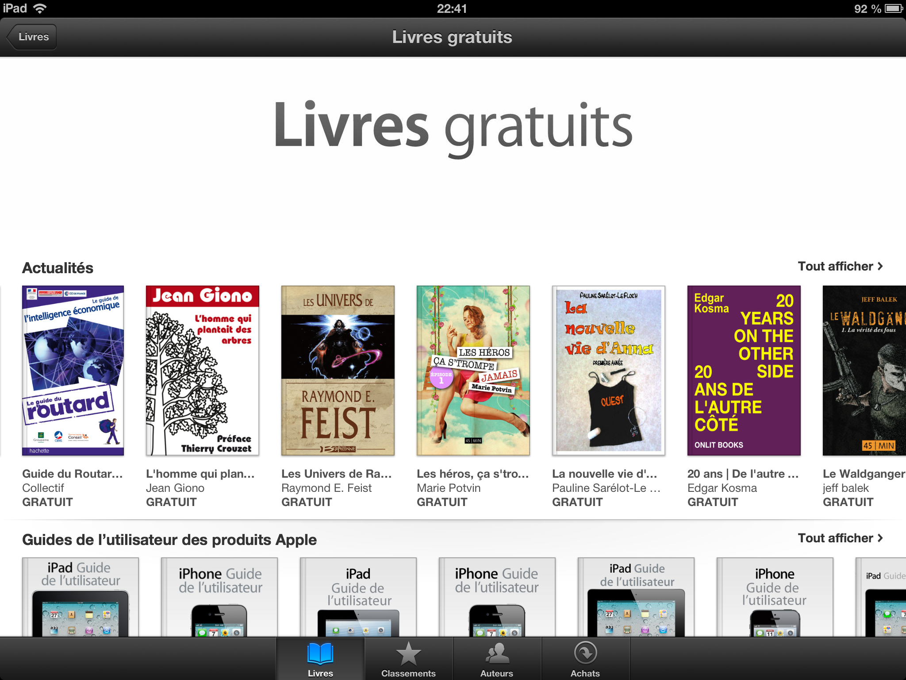

# Mon record : 150 000 ebooks téléchargés

Comment ça ? Vous avez raté mon best-seller ! Rassurez-vous, je ne suis que l’auteur de la préface. Le texte est de Giono.

Depuis que j’ai mis sur l’iBooks store d’Apple [*L’homme qui plantait des arbres*](https://itunes.apple.com/us/book/lhomme-qui-plantait-des-arbres/id384439603), il a été téléchargé au moins 150 000 fois. Je viens de découvrir par hasard qu’il est toujours classé dans le top des téléchargements gratuits.

Les commentaires m’amusent beaucoup. Super ce livre, il est génial, et surtout très court. Bon, ce n’est pas gagné pour les auteurs.

#buzz #y2013 #2013-1-21-14h24
