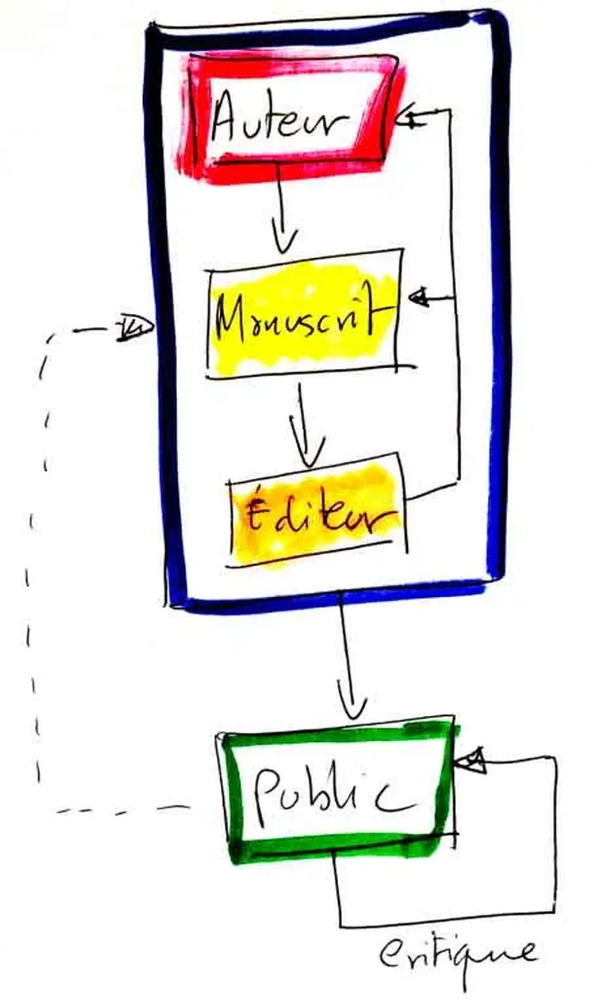
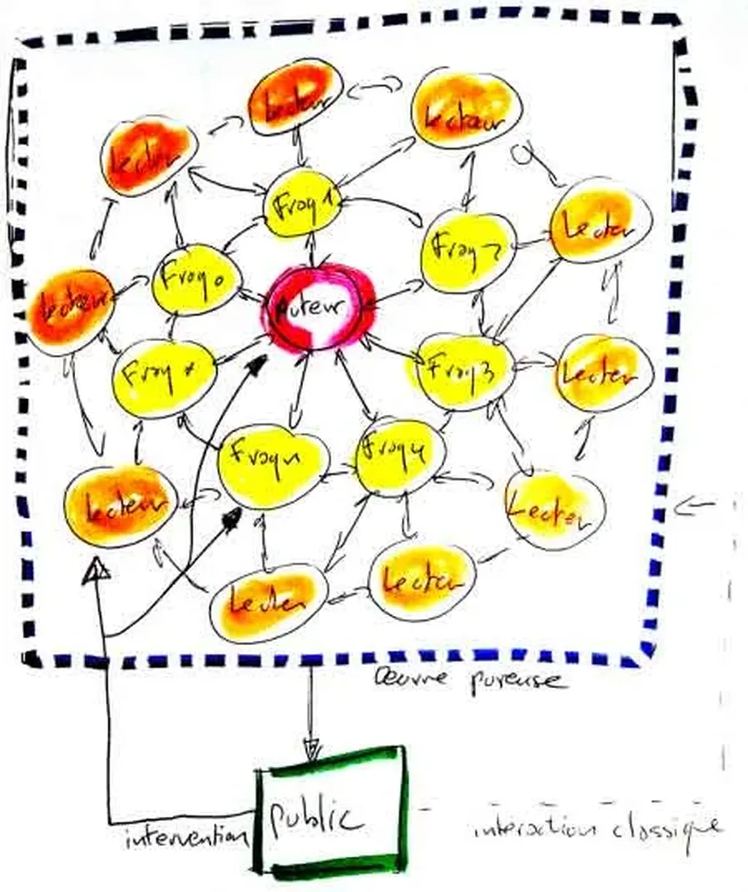

# Notre modernité est interactive

Tout a commencé durant les années 1950 avec le rêve de quelques musiciens, plasticiens, écrivains d’ouvrir leurs œuvres aux auditeurs, spectateurs, lecteurs…

Tout a été théorisé par Umberto Ecco dans *L’Œuvre ouverte* en 1962. 

Tout a véritablement commencé au milieu des années 1970 lorsque Gary Gygax et Dave Arneson ont inventé le jeu de rôle (évènement qui a échappé, il me semble, à Ecco et aux spécialistes de l’art).

Point encore de numérique dans ce mouvement esthétique et culturel. À cette époque, les informaticiens en sont encore à développer les premiers jeux vidéo et à inventer l’interaction homme-machine.

Au début, les artistes refusent de clôturer leurs œuvres. Ils veulent intégrer le spectateur au processus créatif. Ils souhaitent être débordés, surpris. Mais, il s’agit chez eux d’une aspiration, presque d’une prescience.

L’œuvre reste abandonnée au spectateur qui peut réordonner les chapitres d’un livre ou les mesures d’une composition, qui peut pivoter des formes, jouer avec des interrupteurs ou des pédales… L’œuvre n’en reste pas moins délaissée par son créateur. Nous en sommes à l’interactivité homme-œuvre.

Bien sûr, cette interactivité n’est pas nouvelle. Depuis toujours les œuvres ont provoqué rêves, interprétations, réponses. La volonté des années 1950 était de multiplier les feedbacks, de les intégrer à une boucle créative survitaminée. Peut-être parce que les créateurs se sentaient incapables d’atteindre leurs rêves d’absolu, ou plus sûrement parce que ces rêves les avaient quittés et qu’ils espéraient explorer tous les possibles, donc se doter d’une puissance imaginaire extérieure à eux-mêmes et puisée dans le public.

Tout cela devient possible avec le jeu de rôle. Le créateur n’abandonne plus son œuvre, son scénario, il le joue avec des joueurs qui transforment son projet avec lui, l’altère, le pousse à le réinventer sans cesse. La boucle de feedback se referme. L’œuvre au final n’est pas le scénario, mais la partie. Une œuvre éphémère qui parfois provoque autant d’émotions que les arts les plus sublimes du passé.

L’émotion fugitive de certains instants jeu de rôle est en elle-même modernité. On peut la mettre en regard des happenings et performances. L’art ne poursuit plus l’éternité, il se vit, disparaît. On aurait pu croire que tel était le destin des œuvres ouvertes jusqu’à l’avènement des blogs. Désormais ce qui partait en fumée au cours des parties-perfomances fait trace, reste. Le blogueur écrit un billet derrière lesquels s’enchaînent les commentaires, et les trackbacks des autres blogueurs à travers la blogosphère. Alors il écrit un autre billet. L’œuvre se construit peu à peu dans un dialogue permanent.

Et si je blogue moins, c’est parce que chez moi ce dialogue n’est plus aujourd’hui qu’un maigre ruisseau. Par ma faute, parce que je ne suis pas aimable et ce n’est pas le but, mais surtout parce que cette ouverture extrême pompe une énergie faramineuse, tant chez l’auteur que ses stimulateurs comme je les ai appelés dans *[La stratégie du Cyborg](../../page/la-strategie-du-cyborg)*.

Deux schémas pour résumer…

### Édition traditionnelle

### Édition contemporaine

Pour passer à ce que nous connaissons sur les blogs, remplacer sur le schéma l’éditeur par le groupe des stimulateurs me paraît insuffisant. Il faut aussi éclater le manuscrit en une multitude de fragments. Sans cette fragmentation, il ne peut exister d’interaction, de dynamique. Il faut livrer la pensée en mouvement pour qu’elle rencontre d’autres mouvements. On aboutit à un schéma plutôt circulaire, un réseau hautement distribué qui se métamorphose dans le temps en même temps que jaillissent de nouveaux fragments et que partent et arrivent de nouveaux stimulateurs.

Toute personne extérieure au cercle qui commence à critiquer s’y trouve ainsi intégrée, tant que le processus créatif est en cours. Ce n’est qu’après son terme qu’on retrouve éventuellement une œuvre à l’ancienne. Œuvre qui conserve toute sa légitimité puisqu’elle témoigne d’un moment créateur.

### Notes

1. J’en déduis, que nous devons encore appeler « livre » les livres électroniques qui sont abandonnés à leurs lecteurs, même si ceux-ci peuvent aujourd’hui les commenter collectivement avec les applications de lecture. Du moment que l’auteur renonce à la possibilité de retoucher, étendre, rependre, dialoguer dans l’œuvre même comme nous le faisons dans un blog, nous tenons un livre.
2. Publier en numérique, publier sur un blog, ne garantit pas qu’on s’arrache à l’objet livre. Beaucoup d’auteurs utilisent leurs blogs pour publier leurs textes comme ils l’auraient fait avec des revues papier. Ils cherchent à transmettre, pas à interagir. Dans le monde strictement littéraire, qui s’étiquette lui-même ainsi, l’interaction me semble faible. On esquive notre modernité encore au nom d’une éternité (et je succombe souvent à la même tentation).
3. Inutile de critiquer les auteurs traditionnels, ceux encore englués dans le seul papier, si on se contente de faire comme eux sur un autre support.
4. Bien-sûr le support influence ce qui peut être diffusé, donc écrit. Changer de support, c’est changer d’écriture. User d’un support neuf, c’est presque nécessairement produire du neuf. Mais entrer radicalement dans notre modernité implique de se saisir à bras le corps de l’interaction. L’objet diffusé sous forme de livre, comme le sera *[La quatrième théorie](../../page/la-quatrieme-theorie)*, est un témoignage, non pas l’œuvre elle-même (comme une vidéo peut témoigner d’une performance).
5. La mode des ateliers d’écriture naît d’un désir d’interaction, d’un désir de jeu de rôle. Je me demande pourquoi je m’en tiens à l’écart. Peut-être parce que je n’ai pas envie de faire écrire d’autres personnes, mais d’écrire avec elles, de faire équipe. Rien ne l’empêche, je repousse sans cesse. [Juliette Mézenc](http://motmaquis.net/) est pourtant ma voisine, on pourrait initier quelque chose, je résiste, je sais pas pourquoi (perche tendue).
6. La seule édition qui mérite le titre d’électronique est celle que nous effectuons sur nos blogs, pour peu que nous interagissions intensément, *in situ* ou à travers la blogosphère, et que cette interaction influence ce que nous écrivons.
7. Ce n’est peut-être pas un hasard si après avoir beaucoup joué durant les années 1980, j’ai lu *L’œuvre ouverte*, puis plus tard ouvert un blog.

#ebook #litterature #netculture #netlitterature #dialogue #y2013 #2013-1-28-10h9
