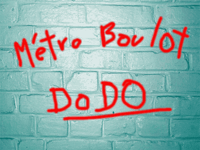

# Ce que le Net n'a pas changé

Avec plus de vingt ans d’histoire publique, le réseau est plus présent dans la vie de beaucoup de gens que la télé. Après le temps des promesses, c’est le temps des bilans (pour mieux tracer la route de tout ce qui nous reste à faire).

### Le Net n’a pas changé le travail

Ne serait-ce que parce que les villes toujours plus grandes, ce qui n’est pas un mal en soi, engendrent toujours plus de transport quotidien. Des millions d’heures sacrifiées, sans que le numérique n’enraille cette folie, sauf pour quelques privilégiés. La promesse pour tous du travail à distance reste toujours aussi lointaine, non plus à cause de limitations technologiques, mais d’une réticence endémique des systèmes hiérarchiques à lâcher du lest.

Alors les rythmes de vie ne changent guère, sinon à forcer les commerces à ouvrir plus tard pour satisfaire des horaires fous déconnectés des cycles naturels. Même le rendez-vous du vingt heures en pâtit malgré l’apathie. Priorité aux transports physiques qui, quand ils deviennent collectifs, se transforment en bureaux mobiles.

### Le Net n’a pas changé notre niveau de bonheur

Ne serait-ce que parce qu’il exige de nous toujours plus de présence. Bien sûr, la faute en revient à chacun de nous. Toujours quelqu’un en ligne, toujours quelqu’un disponible pour étancher notre soif de socialité, quitte à nous contenter d’une socialité à minima.

Nous nous gargarisons de likes et retweets. J’ai dû me sevrer quelques mois pour m’immuniser de cette surenchère et résister à l’envie de recevoir toujours plus de « je t’aime » ou « je te déteste ».

### Le Net n’a pas changé l’économie

Ne serait-ce que parce la nouvelle économie n’a été que l’ancienne en pire. Le Net a redoublé la spéculation, assoiffé les entrepreneurs de succès rapides. Ils ont même fini par s’habiller avec costard-cravate, renonçant à tout idéal contestataire. Et sous le règne du Net, les pauvres deviennent plus pauvres, les riches plus riches. Quelques statistiques qui disent le contraire n’altéreront pas ce sentiment, car en ce domaine le sentiment importe plus que les données comptables (et le Net renforce ce sentiment en projetant le ressenti de chacun à la face de tous).

### Le Net n’a pas changé la centralisation

Ne serait-ce que parce qu’il a engendré des entreprises toujours plus voraces et avides de pouvoir. En son sein naissent des trous noirs pour les liens hypertextes comme pour les revenus que leur traversée engendre. Avec le surplus de centralisation arrivent de multiples projets « Big Brother », doublés d’un désir de contrôler les masses par principe estimées abruties et dangereuses. Un calcul judicieux, car notre grégarisme nous pousse à renforcer cette terrible loi des réseaux : « The winner take all. »

### Le Net n’a pas changé la politique

Ne serait-ce que parce qu’aucune constitution des pays à son origine n’a été révisée depuis son avènement. Et dans les pays comme la Tunisie qui ont connu des processus constitutionnels, on ne peut pas dire que le cinquième pouvoir ait augmenté son influence. Tout juste a-t-il contribué à faire chuter quelques dictateurs. C’est déjà pas mal, mais on attend mieux. Paradoxalement, le Net ne responsabilise pas les citoyens. Il amplifie leur panurgisme, faute d’une réelle éducation à la technologie et à sa philosophie. Il célèbre le politicien avec plus de zèle que jadis la télé, en donnant l’illusion d’une proximité augmentée.

### Le Net n’a pas changé la monnaie

Ne serait-ce que parce que la crise de 2007-2008 n’a fait prendre conscience du mécanisme de l’argent-dette qu’à une minorité. Toutes les infos sont là, accessibles, renversantes. Nous avons la preuve que les banksters forment une nouvelle noblesse aux privilèges innombrables et dont nous constituons la piétaille, toujours prête à réélire les mêmes gouvernements inféodés.

### Le Net n’a pas changé la rubrique des chats écrasés

Ne serait-ce que parce que la décentralisation médiatique, notamment grâce aux blogs, n’a pas perturbé le paysage d’ensemble : de grands groupes distillent toujours les news en première source, manipulant, souvent inconsciemment, notre vision du monde. Et les pure-players du Net, nés dans l’ombre mais sous perfusion de cash d’origine douteuse (les banksters), ne rêvent que de succéder à leurs prédécesseurs. Ils ne renoncent à aucun de leurs coups bas. Plutôt que de penser le monde de demain, ils se complaisent dans la dénonciation de ce qui cloche dans le nôtre, dans le seul souci de gonfler leur audience. Pas mieux que les politiciens.

### Le Net n’a pas changé l’édition

Ne serait-ce que parce que les prix littéraires ne sont remis qu’aux textes avec éditions papier, des textes nécessairement peu avant-gardistes, car ils doivent répondre prioritairement à des contraintes commerciales. L’émergence des nouvelles formes narratives, à commencer par celle propre au blog, reste dédaignée par l’intelligentsia bien-pensante.

*PS : Cette liste pourrait s’allonger infiniment. Le Net n’a pas changé la bêtise ambiante, l’orgueil, la volonté de puissance, les discriminations… Il n’a pas changé l’homme, mais seulement quelques hommes. Dans ce sens plus positif, il me faudrait maintenant écrire « Ce que le Net a changé », un vaste programme qui m’occupe d’habitude. « Ce que le Net empire » aurait sans doute été un meilleur titre pour ce billet.*

#netculture #coup_de_gueule #y2013 #2013-10-11-9h35
