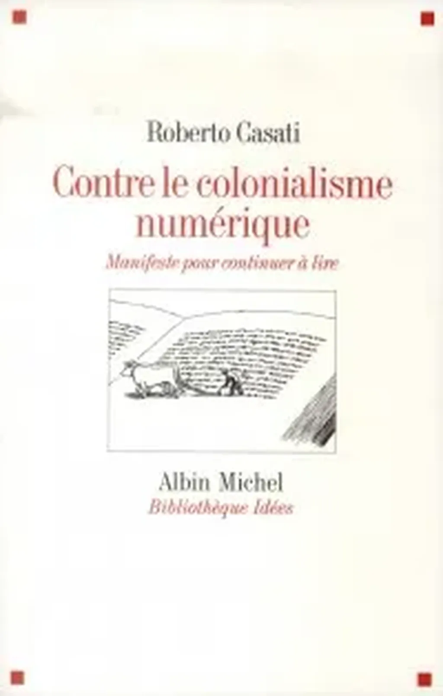

# Contre le colonialisme numérique

J’aime les titres à la con, juste fait pour provoquer. Roberto Casati vient d’en trouver un de très bon dans cette catégorie : [*Contre le colonialisme numérique ; manifeste pour continuer à lire*](http://www.librairie-sciencespo.fr/communication-et-medias/internet-numerique/livre/contre-le-colonialisme-numerique---manifeste-pour-continuer-a-lire/roberto-casati/9782226246271.html).

Vous imaginez que mon sang bouillonne. Je ne vais pas dépenser un centime pour m’attaquer à la critique de ce livre (qu’Albin Michel m’envoie un service presse), dont je ne conteste pas la prémisse « la colonisation numérique ».

Dans ce cadre, être critique, oui, être contre, non. Nous laissons derrière-nous un siècle rempli de noirceurs, ça vaut bien la penne d’essayer de nouvelles formes de colonisation, sans renoncer à la vigilance. Quant à l’idée sous-entendue que nous cesserions de lire, elle a déjà été évoquée en d’autres temps à l’arrivée de l’imprimerie, de la radio, du cinéma, de la TV… Je crois même que nous pouvons affirmer que nous n’avons collectivement jamais autant lu que depuis l’avènement du numérique (sans présupposés élitistes de ce qui est bon ou mauvaise lecture).

Je ne vais pas critiquer plus avant un texte dont je ne sais rien sinon qu’il réussit par son titre à m’interpeller. Il intéressera par son accroche les rétrogrades de tout bord. Sans pour autant amoindrir le colonialisme numérique auquel il participe. [La moindre des choses aurait été de ne pas publier ce texte en numérique](http://www.epagine.fr/9782226295408-contre-le-colonialisme-numerique-manifeste-pour-continuer-a-lire-roberto-casati/), ni d’en faire la publicité sur le réseau. Cette histoire m’en rappelle une autre en date de 1492 quand [Johannes Trithemius fit imprimer sa diatribe contre l’imprimerie.](../../2012/9/johannes-trithemius-ou-les-451-croulants.md) Après tout, être rétrograde permet aussi d’entrer dans l’Histoire.

Je peux même proposer un pari à Casati. Réussir à lire son livre en numérique et en faire une véritable critique.

#netlitterature #coup_de_gueule #y2013 #2013-10-11-19h45
