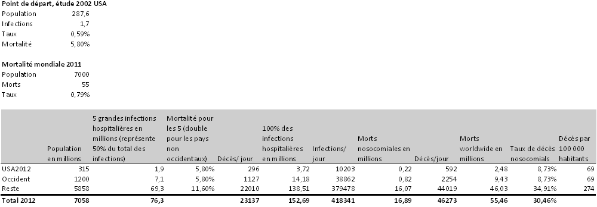
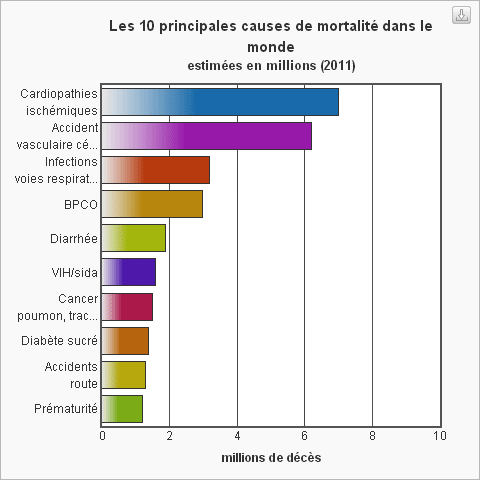
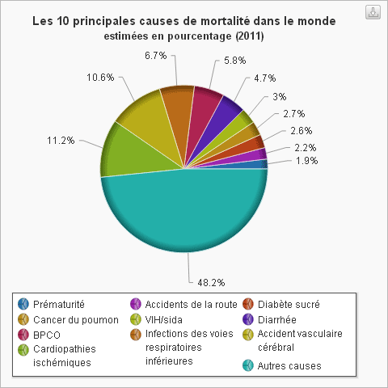

# De quoi allez-vous mourir ?

Je suis en train de finaliser *[L’homme qui lave les mains](../../page/homme-qui-lave-les-mains)*, notamment de vérifier tous les chiffres. Ils donnent froid dans le dos. J’ai besoin de les mettre à plat tout de suite, comme pour mieux prendre conscience de leur horreur (d’autant que mon livre ne sera pas l’endroit pour les discuter).

Selon Didier Pittet (c’est lui l’homme qui lave les mains), et comment ne pas lui faire confiance à ce sujet, la meilleure estimation des taux d’infection nosocomiaux et de la mortalité associée date [d’une étude américaine de 2002](http://www.ncbi.nlm.nih.gov/pmc/articles/PMC1820440/).

À cette époque, nous avons une population américaine de 287,6 millions. Les cinq principales causes d’infections (sang, urine, poumon, site opératoire et autres sites) touchent 1,7 million de patients, dont 5,8 % décèdent. Didier estime que ces cinq infections correspondent à la moitié des infections constatées dans les hôpitaux. Par ailleurs, il m’indique que les taux d’infections ainsi que la mortalité doivent au moins être multipliés par deux hors des pays occidentaux.

Quand on mixe ces chiffres, les étend au monde et à la population actuelle, on découvre que chaque jour plus de 400 000 personnes sont infectées dans les hôpitaux et que 46 000 décèdent. En occident, les maladies nosocomiales tuent près de 9 % des gens, 34 % hors de l’occident.

Quand on regarde les statistiques mondiales de l’OMS, on ne trouve aucune mention des maladies nosocomiales. Elles ne sont tout simplement pas comptabilisées (notamment parce qu’elles recouvrent d’autres causes de décès et que leur relevé systématique n’est pas évident). Mais le calcul est vite fait : les cardiopathies et les accidents vasculaires tuent chaque année 13,2 millions de personnes, les maladies nosocomiales 16 ! Elles constituent de loin la première cause de décès. Dans les pays riches, avec 69 morts pour 100 000 habitants, elles se classent devant les cancers du poumon à égalité avec les maladies vasculaires.

Pour enrayer cette tuerie, il ne vous reste qu’une chose à faire : vous laver les mains et inciter les médecins à vous imiter.

#le_geste_qui_sauve #dialogue #y2013 #2013-10-21-15h49
