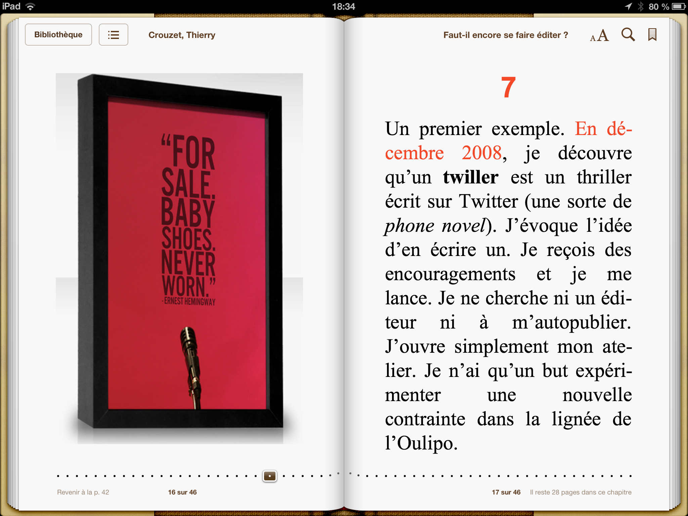

# Faut-il encore se faire éditer ?

Vaste question à laquelle j’ai tenté de répondre par un eBook mis en abîme dans un [Pecha Kucha](https://www.youtube.com/watch?v=TWGleX32Zn4). Je voulais en faire le sujet de mon intervention à la [ZAL 2013](HTTP://REVUESQUEEZE.COM/ACTUALITES/ZONE-DAUTONOMIE-LITTERAIRE-2013/) (avant débat), puis j’ai changé d’avis. Synchroniser les pages du livre et le texte à lire m’a pris tant de temps que j’ai fini par me dégoûter du propos.

[ePub gratuit](https://app.box.com/s/2f8nbasstayomvl8lzgo), [Kindle](http://www.amazon.fr/dp/B00GSXM966), [Apple](https://itunes.apple.com/fr/book/id761110143), [Kobo](http://store.kobobooks.com/fr-fr/Search?Query=9782919358427)…

### 1

Hier encore, quand on voulait publier un texte, on l’imprimait sur feuille A4 et l’envoyait aux éditeurs. Quand on recevait trop de lettres de refus, on pouvait choisir l’autoédition, faire imprimer une centaine d’exemplaires et les stocker dans des cartons jamais ouverts, à moins d’avoir l’âme d’un VRP (et subir la loi des 80/20 : [80 % du temps à faire la promo, 20 % à écrire](http://lafeuille.blog.lemonde.fr/2012/07/20/les-plateformes-dautopublication-sont-elles-lavenir-de-ledition-electronique/)).

### 2

Payer pour être édité n’est pas honteux. En 1913, Proust choisit cette formule pour *Du côté de chez Swan*. En 1922, T. S. Eliot fonde une [revue](http://en.wikipedia.org/wiki/The_Criterion) pour s’[autopublie](http://en.wikipedia.org/wiki/Fifty_Shades_of_Grey)r. En 1951, aucun éditeur américain ne veut du communiste Howard Fast. Il [autopublie](http://en.wikipedia.org/wiki/Fifty_Shades_of_Grey) *Spartacus*, bientôt porté au cinéma par Kubrick. [Des histoires semblables ne manquent pas.](http://bookmarket.com/selfpublish-f.htm)

### 3

[Mais quelque chose change.](http://en.wikipedia.org/wiki/Self-publishing) En 2011, E. L. James [autopublie](http://en.wikipedia.org/wiki/Fifty_Shades_of_Grey) *Fifty Shades of Grey*. Son succès donne des idées. En avril 2013, [cinq romans autopubliés](http://www.digitalbookworld.com/2013/self-published-titles-dominate-top-of-ebook-best-sellers-list/) trustent le top 10 des ebooks américains. Depuis ça ne s’arrête plus. Avons-nous désormais autant de chances d’être lus en nous autopubliant qu’en passant par un éditeur ? La réponse dépend de notre plus ou moins grande aversion pour la loi des 80/20.

### 4

Je me risque d’abord à formuler une autre loi (contre exemples possibles) : « Un livre autopublié en ebook qui ne trouve pas son public ne le trouvera pas plus si d’aventure un éditeur le signe. » Sur le Net, le public enterre les textes exigeants, surexpose les best-sellers potentiels. C’est comme ça, faut s’en accoutumer. C’est pire que la TV.

### 5

Les éditeurs tirent les conséquences de cette loi. Ils chassent les autopubliés. Au moindre frémissement des ventes (signal plus fiable que leur jugement de professionnel souvent mis en échec), ils proposent un chèque. Plus ils agissent vite, plus ils récupèrent de nouveaux auteurs à bon compte (exemple, Agnès Martin-Lugand pour *Les gens heureux lisent et boivent du café*).

### 6

Vous êtes auteur, vous vous dites alors que vous avec deux possibilités : vous faire éditer (peur de la loi des 80/20) ou vous autoéditer (même pas peur). Si c’est le cas, vous n’avez rien compris. À l’âge numérique, les textes cheminent d’eux-mêmes. Ils dévalent des montagnes, se perdent dans le désert ou forment des mares, des lacs, des océans. C’est le règne de l’expérimentation.

### 7

Un premier exemple. [En décembre 2008](http://www.wired.com/culture/culturereviews/magazine/16-12/st_jw), je découvre qu’un **twiller** est un thriller écrit sur Twitter (une sorte de *phone novel*). J’évoque l’idée d’en écrire un. Je reçois des encouragements et je me lance. Je ne cherche ni un éditeur ni à m’[autopublie](http://en.wikipedia.org/wiki/Fifty_Shades_of_Grey)r. J’ouvre simplement mon atelier. Je n’ai qu’un but expérimenter une nouvelle contrainte dans la lignée de l’Oulipo.

### 8

En janvier, *[Le Monde](http://www.lemonde.fr/technologies/article/2009/01/20/le-sms-cree-un-nouveau-genre-litteraire_1142423_651865.html)* publie un article sur ce roman dont je commence juste l’écriture. [D’autres médias et blogs](../../page/la-quatrieme-theorie/la-quatrieme-theorie-chroniques) parleront de l’expérience jusqu’à ce que je termine la rédaction en avril 2010, 5200 tweets plus tard. À ce moment, je me contente d’[autopublie](http://en.wikipedia.org/wiki/Fifty_Shades_of_Grey)r le texte (de fait déjà publié sur Twitter). Je vends une centaine d’exemplaires. C’est la fortune.

### 9

Durant l’été 2011, Isabelle Seguin lit le roman et me suggère de le retravailler pour qu’on le publie chez Fayard. [Il sort en mars 2013.](../../page/la-quatrieme-theorie/la-quatrieme-theorie-chroniques) Confirmation de ma loi : proportionnellement à la taille des marchés, le livre papier ne réussit pas mieux que l’ebook. Mais force du papier : on m’invite pour ce texte dans les salons (ce qui était impensable avant, comme si abattre des arbres faisait de nous des écrivains).

### 10

Un second exemple. [Le 20 avril 2010](../../2010/4/j%E2%80%99ai-eu-l%E2%80%99idee.md), je publie sur mon blog une collection d’idées. Exemple : « *[J’ai eu l’idée](../../page/id) de m’endormir tous les soirs dans les bras de la même femme.* » Commentaires chaleureux de mes lecteurs. François Bon veut le texte pour [publie.net](http://www.publie.net/). Encouragé, j’ajoute de nouvelles idées. [Le recueil sort en ebook le 1er mai 2010.](../../2010/5/295-idees-payantes.md) Du blog à l’édition, ça fonctionne aussi.

### 11

Je me prends à ce jeu d’écriture. « *[J’ai eu l’idée](../../page/id) de lui faire deux fils pour ne plus jamais dormir tranquille.* » Durant tout l’été, je gratte de nouvelles idées. En septembre 2010, je prépare une deuxième mouture. Mon ami [Pacco](http://pacco.fr/), le dessinateur de BD, [esquisse quatre couvertures](../../2010/9/choisissez-votre-couverture-preferee.md) que je publie aussitôt sur le blog. Collectivement avec les lecteurs, nous choisissons celle avec [le poisson rouge](../../2010/9/choisissez-une-couverture-ii.md).

### 12

En septembre 2012, François lance [Publie.papier](http://www.publiepapier.fr/). *[J’ai eu l’idée](../../page/id)*, révisé et augmenté, est finalement disponible en librairie. Nouvelle confirmation de ma loi. Mais, un an plus tard, surprise. [On retrouve la couverture du livre dans tout Paris.](http://www.tierslivre.net/spip/spip.php?article3668) Apple l’utilise pour illustrer une pub iPad. Du blog au 4x3, ça marche aussi (juré, je ne connais pas l’agence de pub d’Apple).

### 13

Si par le passé tous les livres suivaient la fameuse chaîne du livre : Auteur => Poste => Éditeur => Imprimeur => Diffuseur => Libraire => Lecteur, aujourd’hui ils percolent chacun à leur façon vers le public. Un texte qui n’a aucun succès peut atterrir sur tous les murs de Paris (et ne pas avoir de succès pour autant). Merde : il n’existe plus aucune formule magique.

### 14

L’influenceur capable de faire vendre un livre à lui seul n’existe plus (genre le 4x3). C’est le règne du bouche-à-oreille à travers les réseaux sociaux, numériques ou nom. Un blogueur a autant de poids qu’un journaliste, presque autant qu’un présentateur TV. Un livre ne se vend que si des lecteurs en deviennent les VRP (et évitent à l’auteur de consacrer 80 % de son temps à sa promo).

### 15

Les mécanismes viraux à l’œuvre ne garantissent le succès d’aucune forme, sinon la plus banalisée pour que la moindre voix puisse s’en faire le vecteur. Et parmi la foule innombrable des banalités, seules de rares élues seront tirées au sort. Dans ce monde dominé par l’incertitude, il nous reste qu’une chose à faire : écrire ce dont nous avons envie.

### 16

Aucune raison pour un auteur de se restreindre à la forme livre. Le blog, le réseau social, la scène… deviennent des lieux de texte potentiellement autant exposés que les rayonnages encombrés des librairies auxquels des chemins détournés mènent néanmoins. Dans le brouhaha médiatique, il ne subsiste plus que les mots (et l’anonymat).

### 17

Quid de la raison d’être des éditeurs. Quand ils adoubent un texte, ils en augmentent la visibilité. Ils transforment les succès autopubliés en best-sellers. Leur simple nom sur une couverture accroît la respectabilité de l’auteur qui, dès lors, se sent un devoir de travailler avec plus d’acharnement ses œuvres (c’est notre côté maso, nous aimons les coups de bâton).

### 18

Je continue donc de collaborer avec des éditeurs. En plus, ils me versent encore des à-valoir (un concept extravagant dans le monde numérique). Et puis, sans eux, je me sentirais un peu seul derrière mon clavier. Ils me donnent l’occasion de travailler en équipe, tout en me dégageant des tâches commerciales (je préfère passer 80 % de mon temps à écrire qu’à vendre).

### 19

Il arrive même que le désir d’un texte par l’éditeur précède l’envie de l’auteur. *Roland Barthes par Roland Barthes* naît ainsi de la rencontre d’un désir éditorial et d’une envie éveillée par lui (très amoureuse la relation éditeur-auteur). Mais en l’absence d’appel extérieur, l’auteur ne doit se fier qu’à lui-même. C’est à cette seule condition qu’il peut faire naître de nouveaux désirs.

### 20

Aucun éditeur n’estimait financièrement judicieux que j’écrive *[L’homme qui lave les mains](../../page/homme-qui-lave-les-mains)*. Je l’ai écrit tout de même parce que raconter l’invention d’un geste qui sauve des millions de vies me paraissait nécessaire. Je l’ai écrit parce qu’écrire ne demande que de la volonté (et pas vraiment d’argent). Je l’ai écrit parce qu’écrire change le monde (au moins mon petit monde).

*PS : Je sais que je ne sais pas lire. Si vous savez mieux que moi, [voici la vidéo vierge](https://dl.dropboxusercontent.com/u/16630632/pecha_crouzet.mp4). Amusez-vous.*

#netlitterature #noepub #zal #dialogue #y2013 #2013-11-21-15h1
