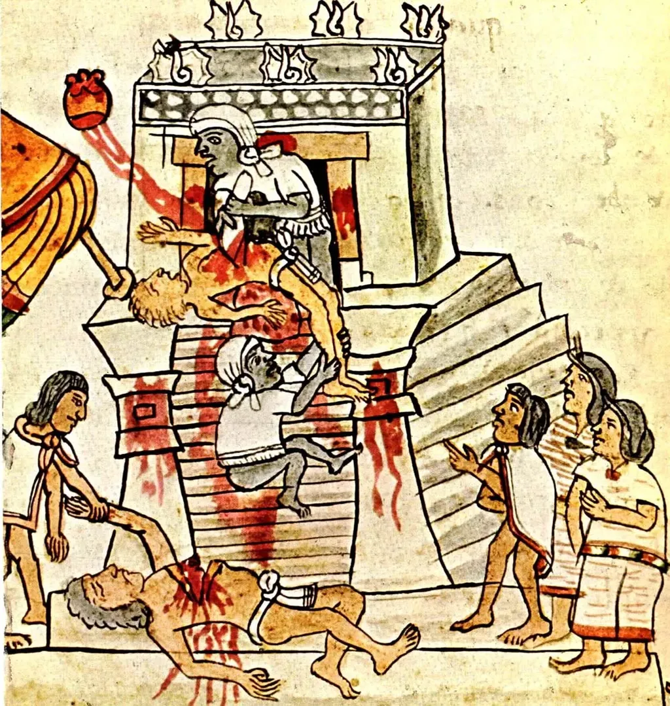

# Biens communs : le paradoxe de la mémoire eidétique

Le débat fait rage entre ceux qui voudraient légaliser les échanges non marchands sur le Net et ceux qui appellent ces échanges du piratage ou du vol. Et ça ne va pas se terminer. Dans le domaine, on en est un peu au moment de la controverse de Valladolid. [Les commonistes](#commonisme) veulent reconnaître les mêmes droits aux indigènes du Net qu’à ceux de l’ancien monde, les conquistadors refusent cette égalité.

Je ne vous cache pas que je suis commoniste. Pour une simple raison : les échanges non marchands ont toujours existé hors ligne. J’achète un livre, le lis, le passe à ma femme, elle le passe à ses amis qui lui en passent d’autres. Il serait tout simplement absurde, régressif, d’interdire les mêmes échanges du moment que le livre devient un ebook incarné par un fichier.

OK, le passage de l’objet matériel à l’objet immatériel soulève beaucoup de problèmes (on n’échange plus un livre, mais on le duplique à grande échelle), ce n’est pas une raison nous faire accepter une régression de nos droits. D’ailleurs, cette opposition matériel/immatériel est caduque.

Imaginez un être extraordinaire, doué d’une mémoire eidétique, Mozart l’avait pour la musique. Il entre dans une bibliothèque, où tous les livres sont en accès public, il lit un livre et le mémorise. Quand il s’en va, c’est avec une copie du texte, copie qu’il peut restituer à ses amis, voire reproduire par écrit. Il n’est jamais venu à l’idée de personne d’interdire l’accès aux bibliothèques à ces êtres extraordinaires. Et il se trouve qu’aujourd’hui, sur le Net, nous disposons tous d’une mémoire eidétique. Nous sommes tous extraordinaires, et cet extraordinaire terrifie les conquistadors. Ils ont peur de la magie des indigènes du nouveau monde. Ils aimeraient bien les exterminer plutôt que d’accepter leurs différences, différences qui impliquent de repenser le monde.

Le jour où nous avons mis un pied sur le Net, nous sommes devenus extraordinaires. Il faut que les défenseurs des DRM et autres protections le comprennent. Nous disposons d’une mémoire eidétique.

Scénario :

1. J’achète un ebook protégé par DRM.
2. Je le lis, c’est bien mon droit.
3. Pourquoi est-ce que je ne le mémoriserais pas ? Par exemple en photographiant les pages avec mes Google Glass en même temps que je tourne les pages.
4. Mon algo automatiquement OCRise le texte, le stocke, le reformate.
5. Je croise un ami, je lui parle du texte. Je peux lui dire de l’acheter, je peux aussi lui donner le texte.
6. Conclusion : on ne peut protéger un contenu destiné à la consommation du moment que nous disposons d’une mémoire eidétique.

Alors soit ont extermine les êtres extraordinaires, soit on invente de nouvelles formes de rémunération pour les créateurs : le don, le revenu de base, le mécénat global… Il faut choisit son camp, celui des indigènes, celui de ceux qui veulent les soumettre.

Un don qui n’était pas gênant tant qu’il était rare devient un problème de société quand il se généralise. Est-ce une raison pour revenir en arrière, pour tuer les mutants ? Il me semble que nous ferions mieux de nous féliciter des nouvelles possibilités qui s’offrent à nous. Plutôt que tuer l’Indien, devenons Indien.

[caption id="attachment\_33952" align="alignnone" width="630"] Codex Magliabechiano[/caption]

#commonisme #netculture #dialogue #y2013 #2013-12-17-11h43
