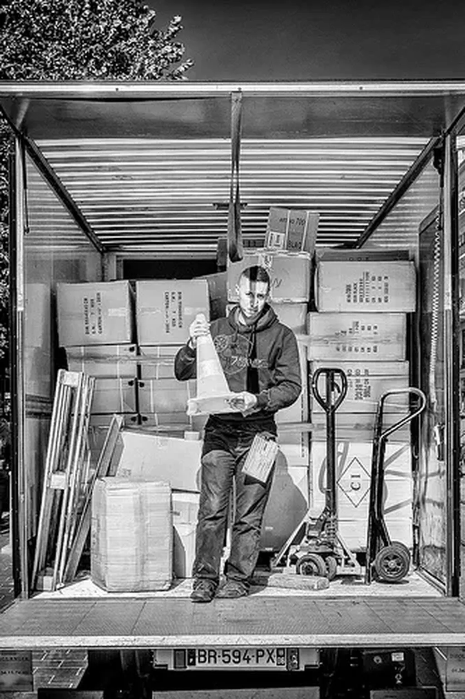

# Écrivain et blogueur

Durant des années, on m’a donné le titre de « Journaliste et informaticien », bien que je n’ai pratiqué ces deux professions que trois ans chacune. Dorénavant, on m’affuble du titre d’« Écrivain et blogueur. »

Entendez-vous dire d’un tel qu’il est « Écrivain et romancier » ou « Écrivain et essayiste » ou encore « Écrivain et poète » ? Non, parce que le pléonasme est évident, parce que parler de romancier, essayiste, poète suffit à ranger dans la catégorie écrivain, elle-même subdivisée en sous-catégories. Alors pourquoi accepter le pléonasme avec blogueur ? Je vois plusieurs raisons.

1. On peut être blogueur journaliste, blogueur culinaire, blogueur BD… Il faut lever cette confusion entre ceux qui écrivent et ceux qui dessinent, filment, photographient…
2. Si on précise écrivain à côté de blogueur, c’est pour mieux rabaisser la fonction blogueur, le pur blogueur n’étant pas reconnu comme écrivain contrairement au pur romancier.
3. Le blog est un outil de publication, un média. Bloguer, c’est utiliser ce média, peu importe ce que nous publions. Un écrivain et blogueur serait celui qui blogue de l’écrit avec la prétention de faire œuvre. On pourrait préciser en appelant « Écrivain blogueur » celui qui choisit exclusivement le média blog.

Il me paraît évident que nous autres blogueurs avons un problème de légitimité. Si le blog est un média et que celui qui utilise ce média est un blogueur, on devrait appeler celui qui utilise le média livre un livreur. Nous ne le faisons pas.

Pourquoi éprouvons-nous ce besoin de parler du média pour nous décrire ? Est-ce parce que nous recourons à la technologie ? Peut-être, l’autre art très technologique, le cinéma, a engendré le cinéaste, un mot nouveau pour décrire un art nouveau. Et donc, dans certaines circonstances, la pratique du blog engendre un art nouveau. Ça ne fait aucun doute.

Le terrain devient glissant car nous bloguons des mots, des images, des sons… que des choses anciennes. Nous avons un pied dans les formes passées, un pied dans leur interaction. Cette position à cheval exige une référence au média, même quand nous n’utilisons pratiquement que le texte. S’y glisse le lien, le commentaire, le *[Send](#send)*.

Un paradoxe surgit : on peut être « Écrivain blogueur » mais aussi un « Blogueur écrivain », même un « Blogueur romancier », n’utilisant le blog que pour publier ce qui aurait pu l’être sans aucun changement dans un livre. Et la plupart des blogueurs dits « littéraires » entrent dans cette catégorie. Ils utilisent peu les spécificités du blog, sinon sa capacité de mimer les anciens médias. Tout ça devient de plus en plus confus en même temps que j’avance dans ce billet. On peut faire du neuf avec du neuf et du vieux avec du neuf, ce n’est pas nouveau.

Une seule chose m’apparaît évidente : nous vivons le temps béni du blog. Chaque fois que je suis invité dans un salon du livre, je côtoie les anciennes chapelles littéraires et je ne m’y sens pas à ma place, tant les murs entre elles se dressent haut, tant des vigiles armés gardent les rares poternes d’interconnexion. Rien de semblable entre nous. Les genres du blog n’existent pas encore. Et du coup nous nous lâchons, en transgenre que nous sommes. Nous créons. Nous expérimentons. Là où les autres écrivains se conforment aux règles d’un marché moribond, nous déployons nos voiles. Il souffle dans nos contrées un vent vif et revigorant. Là-bas, dans les vieilles terres, j’ai souvent l’impression de mourir d’ennui. La pensée s’y est tue, l’art n’est plus qu’une imitation, l’exubérance qu’une façade alcoolisée, le tout écrabouillé par la prétention conférée par l’ancienne noblesse qui ne se sait pas décadente.

#blog #netlitterature #coup_de_gueule #y2013 #2013-12-8-11h22
