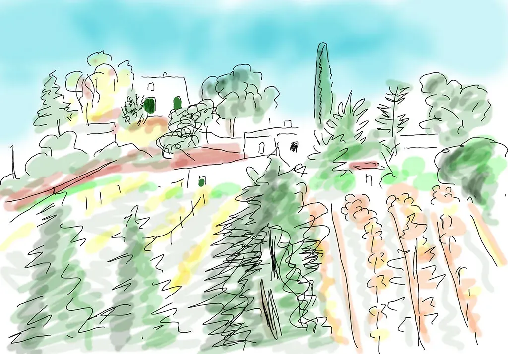
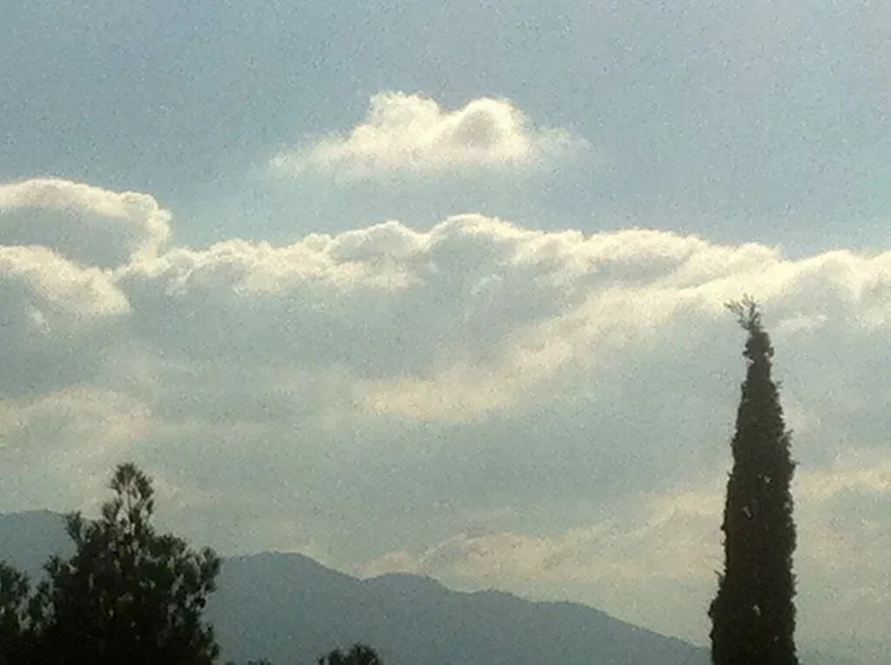
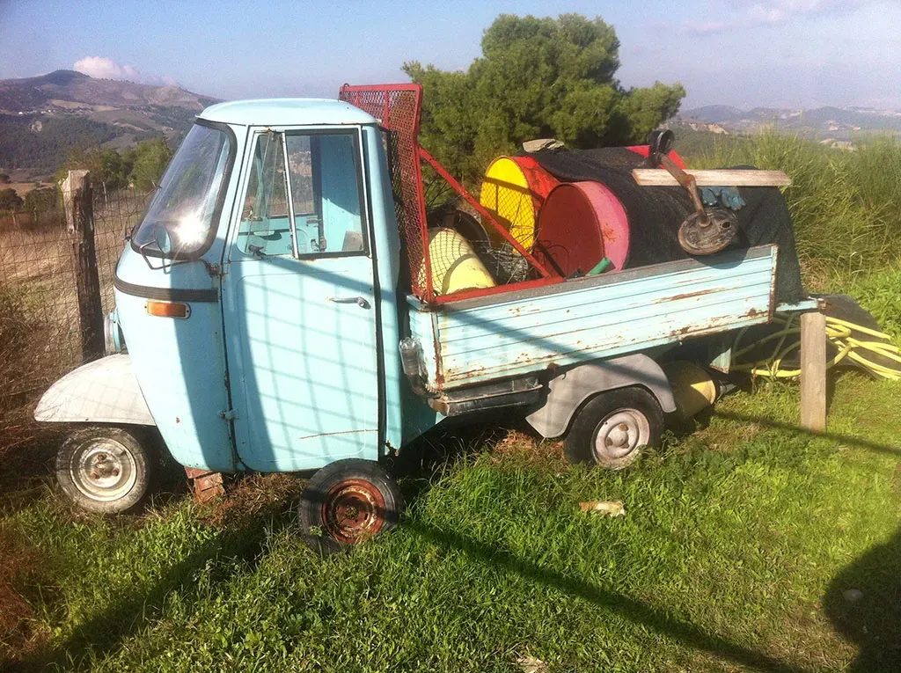
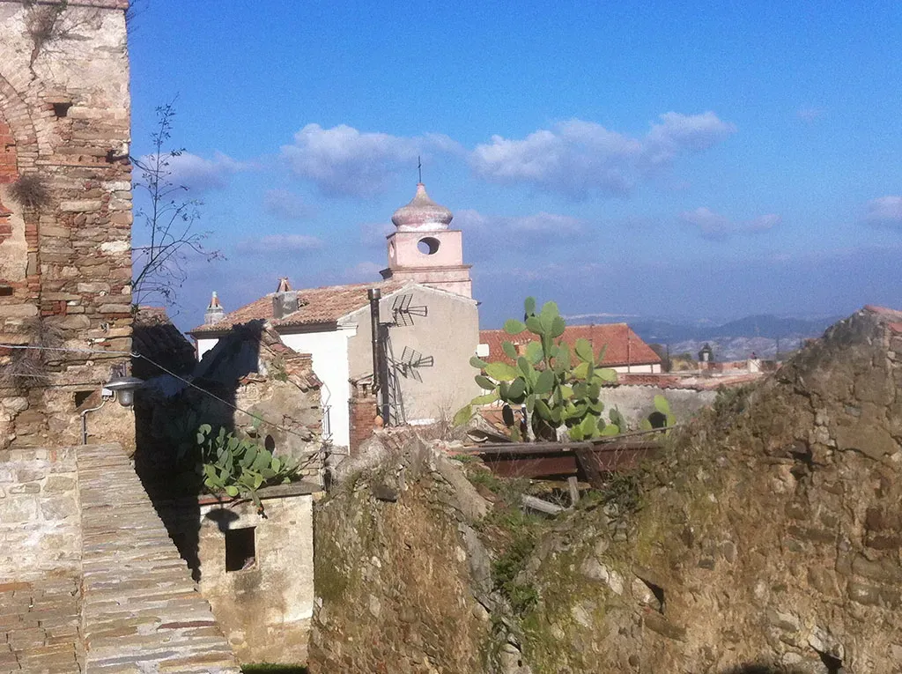
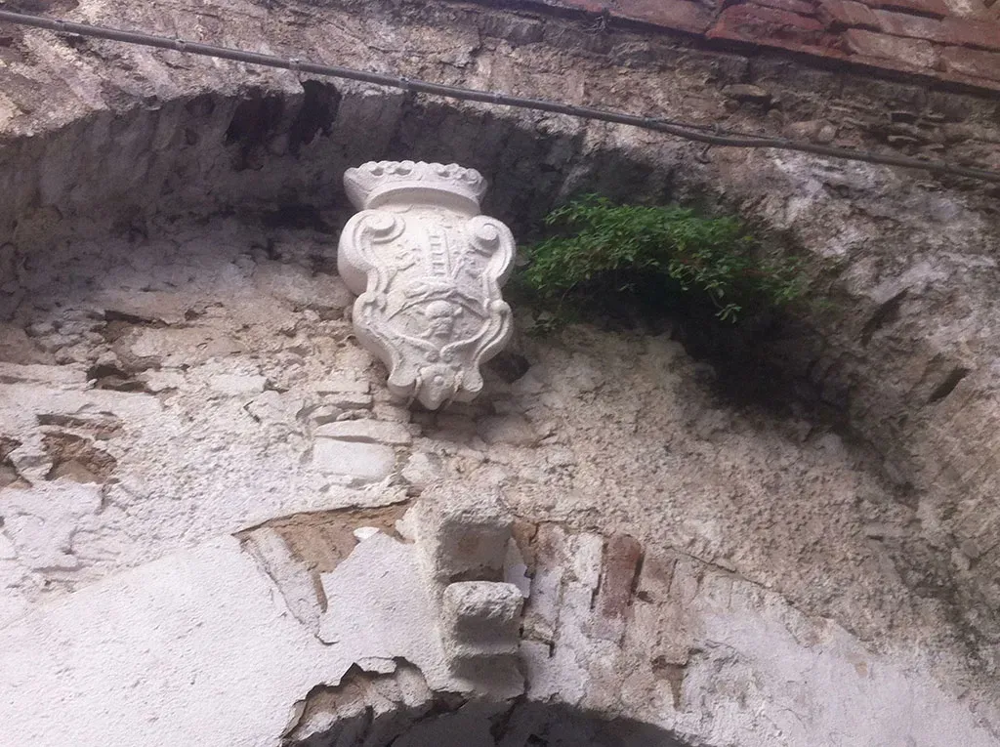
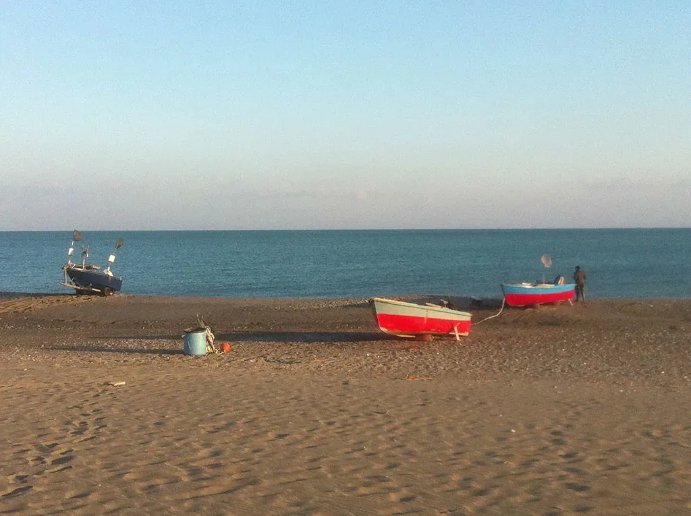
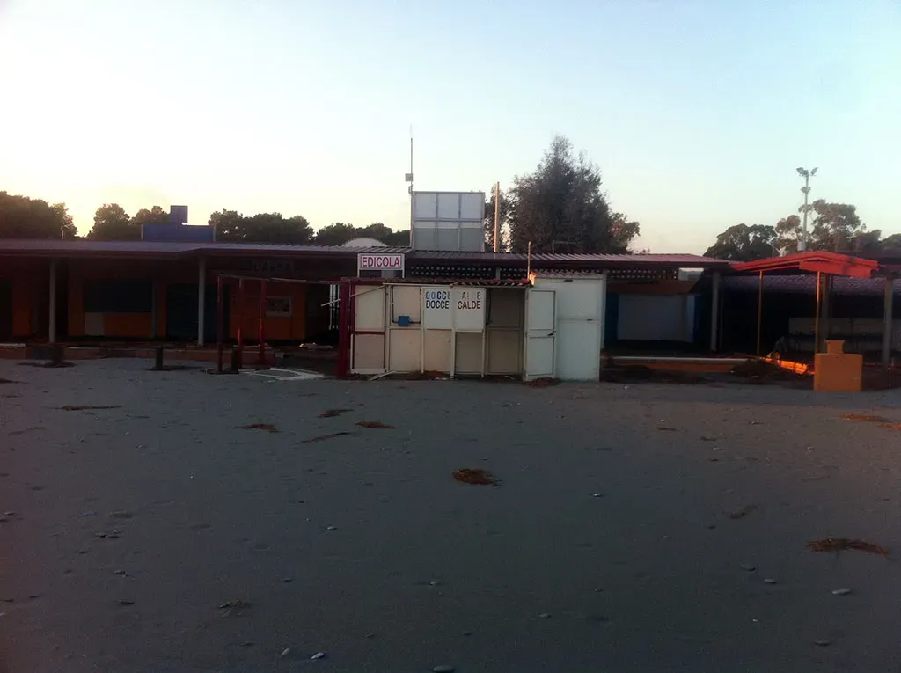

# En Basilicate : 2

Mes guides veulent me conduire dans les hauts lieux de leur patrimoine, je les arrête au bord des routes pour dessiner un verger, je fainéante devant le sanctuaire de Santa-Maria d’Anglona, je les force à explorer les ruelles en escalier de Tursi, une véritable ville monde comme dans les romans d’heroic fantasy. Si je m’étais abandonné à mon penchant, je me serais arrêté dans ses ruelles pour la semaine.

En même temps, je plie et déplie le [Yoga](#lenovo) dans tous les sens. Je retrouve le plaisir du dessin et de l’écriture mêlés. Dessin au trait avec OneNote, coloration avec Painter, j’imagine superposer les photos avec les dessins, superposer les couches, je ne le ferai pas car je ne dessine que pour saisir le lieu, que pour en suivre les contours comme je l’ai théorisé dans *[Turista](../../page/turista)*, à seule fin de stimuler les mots.

Pas plus de détails, voici quelques images…

#autobiographie #basilicate #dialogue #y2013 #2013-12-10-19h35
