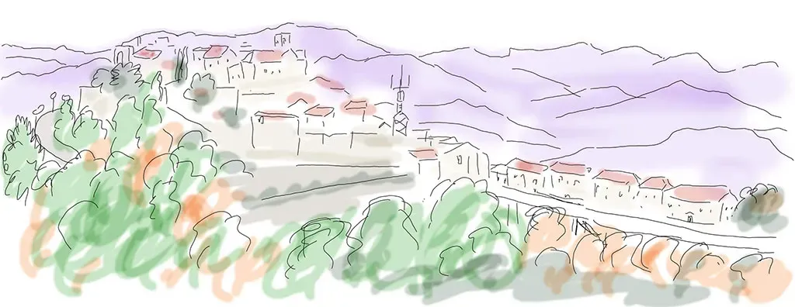
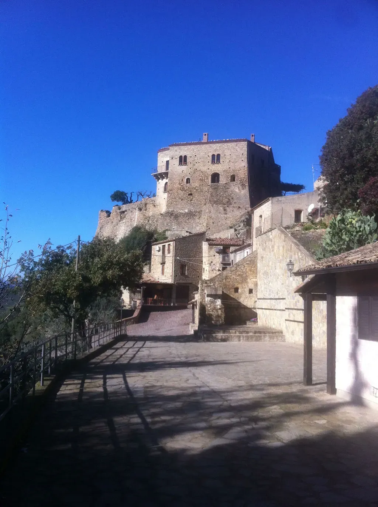
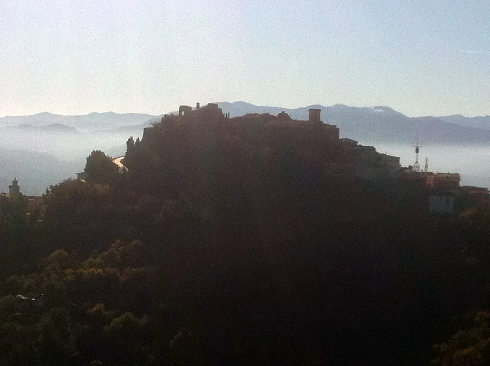
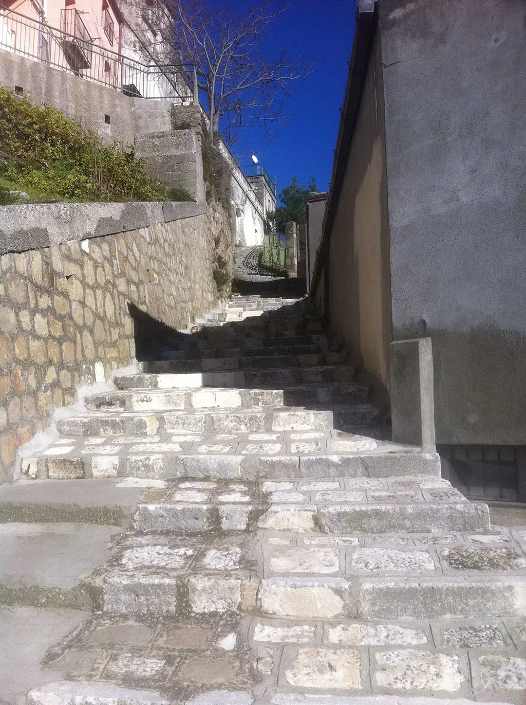
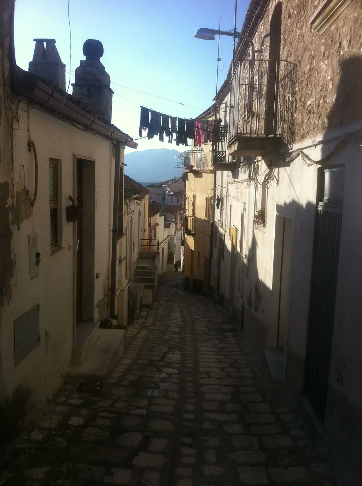

# En Basilicate : 4

Aujourd’hui je visite trois gros villages : [Valsinni](http://fr.wikipedia.org/wiki/Valsinni), [Rotondella](http://fr.wikipedia.org/wiki/Rotondella) et surtout l’inénarrable [Colobraro](http://fr.wikipedia.org/wiki/Colobraro) où la lumière m’a irrésistiblement attiré contre la volonté de ma guide. J’y ai connu un puissant hapax existentiel dont mon dessin et les photos ne rendront rien. J’espère que mes notes réussiront à le traduire sans trop de grandiloquence : l’extase a toujours quelque chose d’exagéré.

#autobiographie #basilicate #dialogue #y2013 #2013-12-12-19h26
