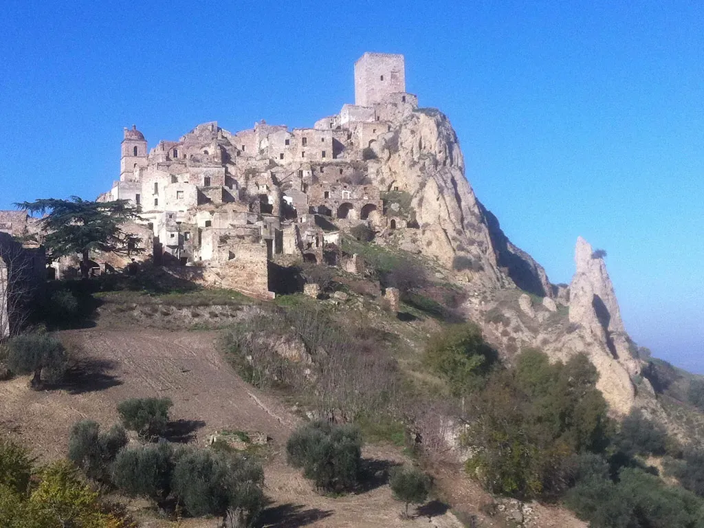
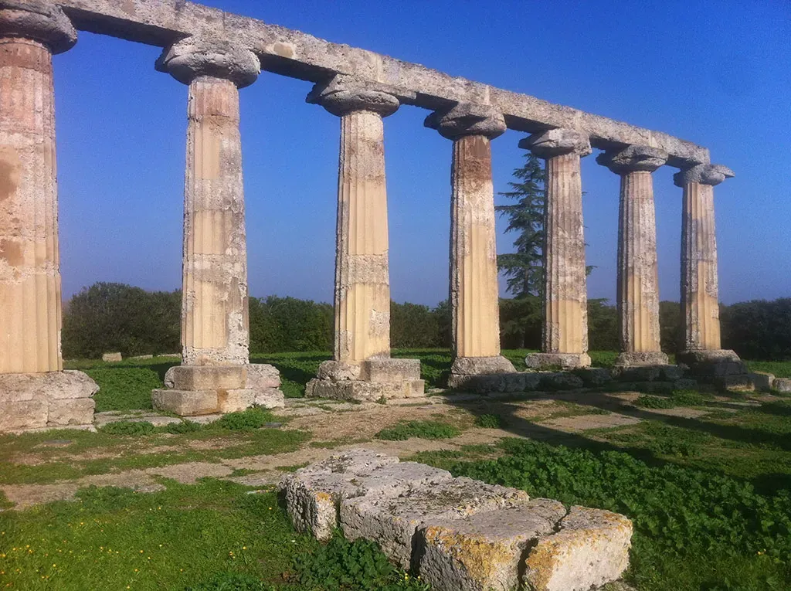
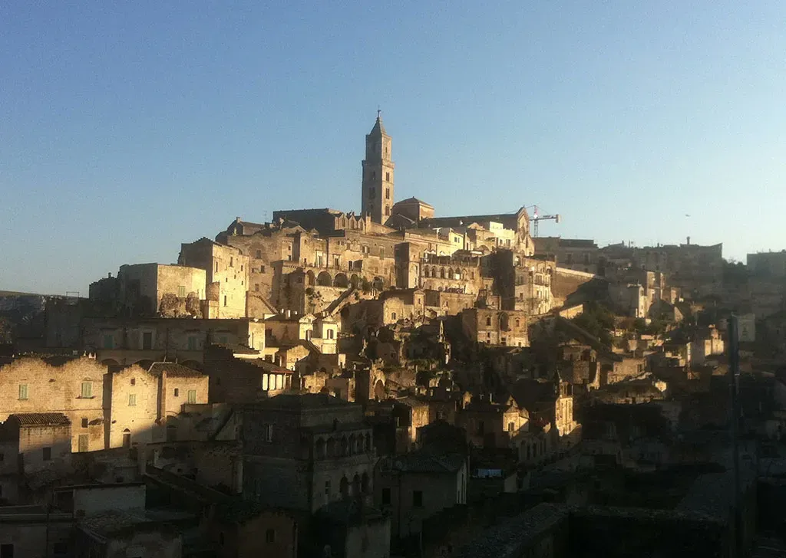
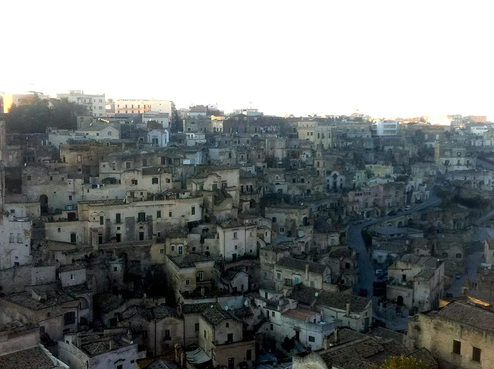

# En Basilicate : 5

Après la folie magique de la veille, je n’ai pas réussi à me refaire un shoot mystique. J’ai traîné devant [la ville fantôme de Craco](http://fr.wikipedia.org/wiki/Craco), dans ma tête les corbeaux s’étaient transformés en chauves-souris de Dracula. À cause des inondations des semaines précédentes, je n’ai pas pu visiter [Metaponto](http://fr.wikipedia.org/wiki/M%C3%A9taponte), la ville où se laissa mourir Pythagore. Seuls [les vestiges du temple grec d’Héra](http://it.wikipedia.org/wiki/Tavole_Palatine) étaient accessibles, mais gâchés par l’autoroute tonitruante en arrière-plan. J’ai fini à [Matera](http://fr.wikipedia.org/wiki/Matera), capitale de la région et ville troglodyte où Mel Gibson a tourné *La Passion du Christ*.

#autobiographie #basilicate #dialogue #y2013 #2013-12-13-19h8
