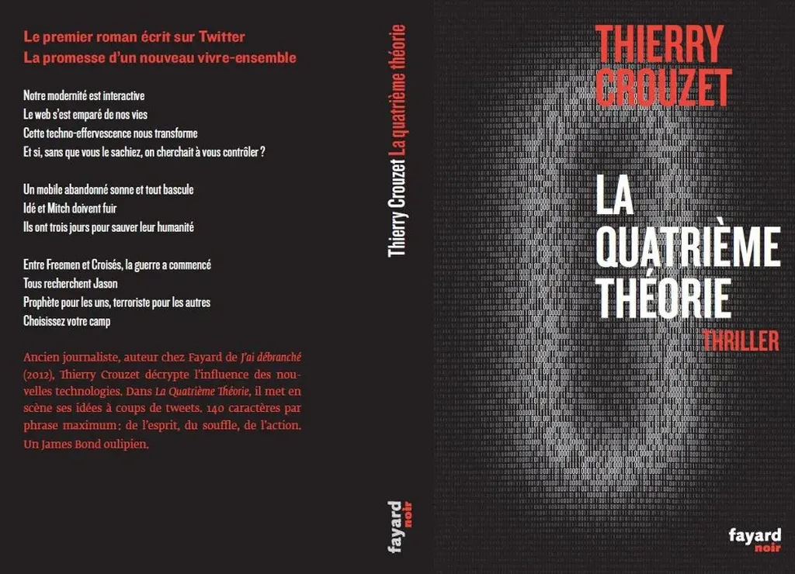

# BAT de La quatrième théorie, l'effet papier

Quand je publie un billet ou un ebook, je ne coupe jamais le cordon ombilical. J’ai toujours l’illusion de pouvoir y revenir, et je le fais souvent. Avec un livre imprimé, il subsiste une clôture irréversible auxquelles les nouvelles technologies nous ont déshabitués.

Le couperet final, exprimé par le fameux Bon à tirer, crée une échéance, une tension, me pousse à tout donner parce qu’après il sera trop tard. Je pourrai certes toujours modifier *[La quatrième théorie](../../page/la-quatrieme-theorie)*, mais désormais le texte vivra seul.

J’ai terminé une première fois ce roman en avril 2010 sur Twitter, je l’ai terminé une deuxième fois quand je l’ai compilé quelques mois plus tard sous forme d’un livre éphémère, je ne le termine réellement que cette fois, après l’avoir resserré, beaucoup réécrit, parfois densifié sur le plan politique, aussi sur le plan romanesque avec des personnages plus forts, j’espère.

Et c’est terminé. Dans le pur monde numérique, je n’ai jamais cette certitude, et parce que je ne l’ai jamais je ne vais peut-être pas jusqu’au bout, je laisse toujours la porte entre-ouverte.

Le numérique change mon rapport à l’idée d’œuvre achevée. L’ancien monde de l’imprimé m’influence plus que je ne veux souvent l’admettre. Sans lui, je ne fais pas certaines choses, sans savoir si ces choses sont bonnes ou non d’ailleurs. Pour *[La quatrième théorie](../../page/la-quatrieme-theorie)*, je n’hésite pas. Ce texte est né sur Twitter sous une forme très brouillonne. Sur Twitter, il a pompé une énergie faramineuse, un rythme, une écriture… mais tout cela n’en faisait encore qu’une expérience d’écriture. Maintenant, je pense qu’elle peut se transformer en expérience pour le lecteur.

Le BAT s’achève souvent avec la quatrième de couverture.

Et dans le même temps, je reçois un mail d’Amazon m’annonçant l’ouverture des précommandes papier.

#buzz #y2013 #2013-2-25-20h49
