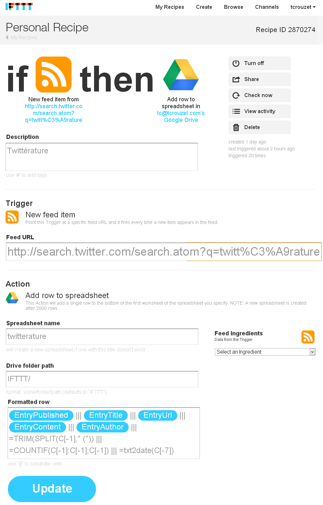
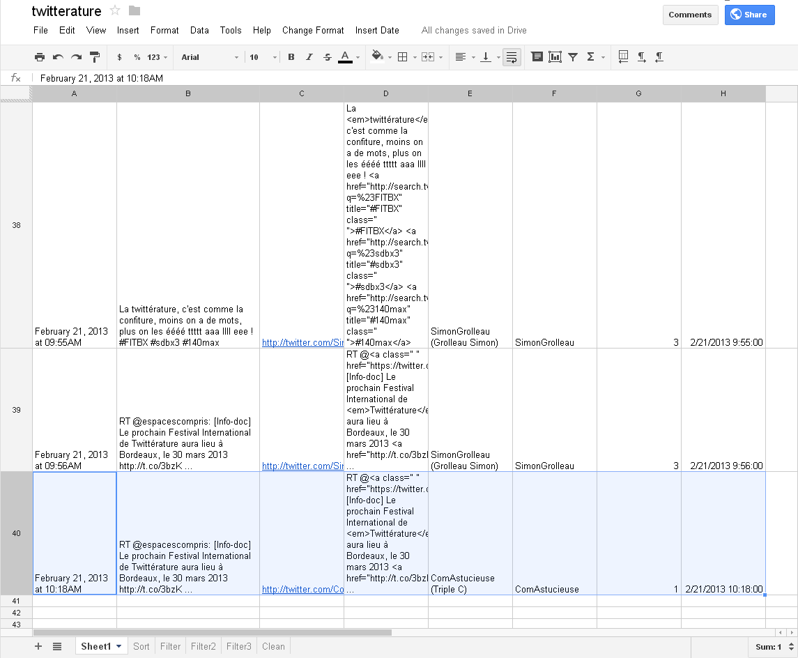
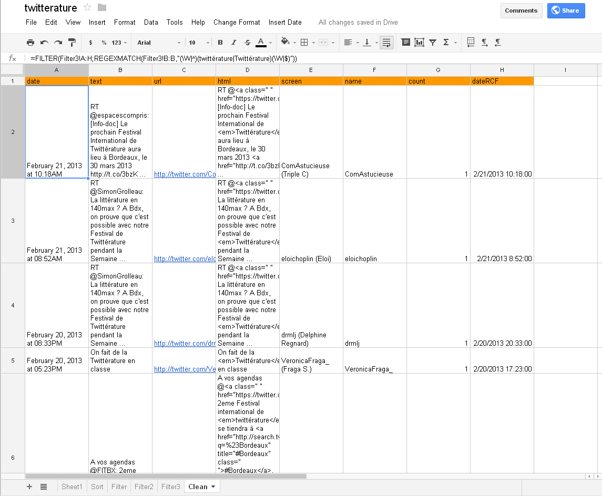
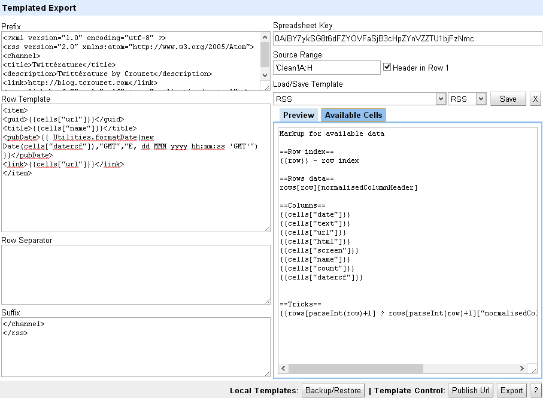
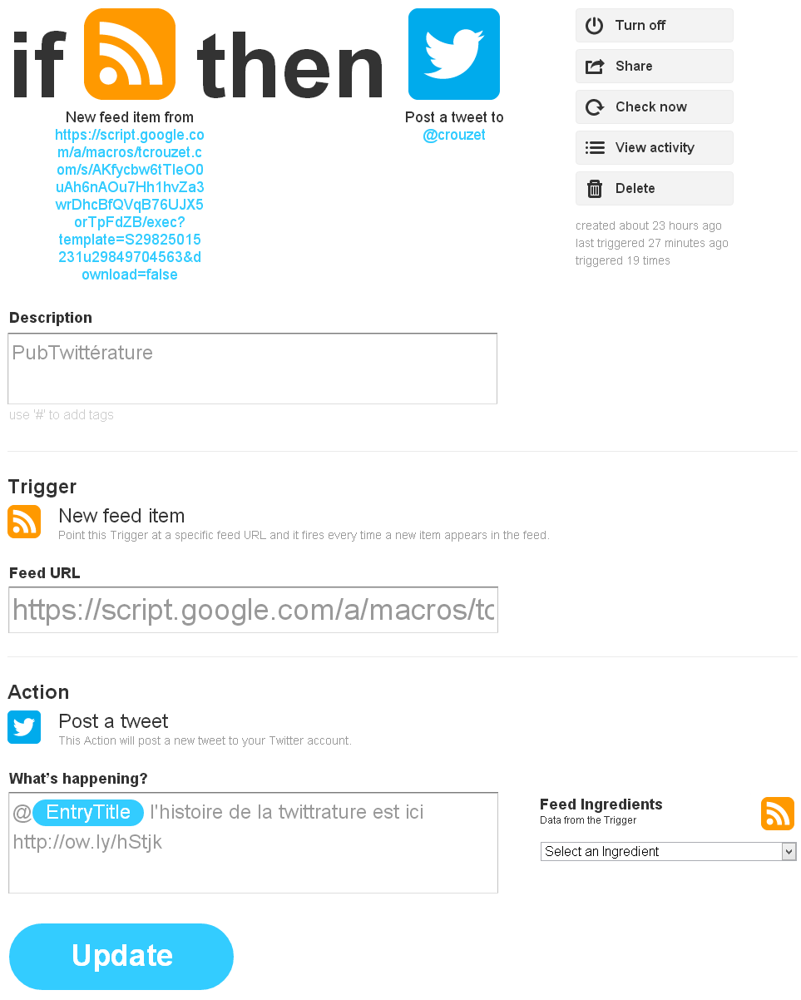

# Comment spammer Twitter

Je vois tant de comptes corrompus, tant de tricheries que, [encore une fois](../../2009/9/qui-a-la-plus-grosse-quequette-sur-twitter.md), j’ai envie de les dénoncer pour dénoncer tout un écosystème désormais vicié.

Et autant jouer avec, donner un exemple à une échelle modeste, et presque humanitaire. Montrer comment on peut promouvoir un livre. Le mien, bien sûr. *[La quatrième théorie](../../page/la-quatrieme-theorie)* qui sort le 27 mars chez Fayard.

La méthode ne nécessite aucune programmation.

1. Repérer en temps réel les cibles avec une requête de recherche.

- Envoyez aux cibles un message.

Des centaines d’agences de marketing usent et abusent de cette technique, qui pour de bonnes causes garde un certain intérêt.

### Qui spammer

Dans mon exemple, je vais donc rester modeste. Chaque fois que quelqu’un parlera de « twittérature », je lui indiquerai que j’ai écrit un article sur [l’histoire de la twittérature](../../page/la-quatrieme-theorie/la-quatrieme-theorie-liens).

Pour détecter mes cibles, une requête sur un hashtag ou un mot clé fera l’affaire. Pour un temps encore, Twitter nous fournit un URL très pratique :

> http://search.twitter.com/search.atom?q=mot\_clé

Cet URL ouvre un fil RSS avec les derniers résultats. Dans mon cas :

> <http://search.twitter.com/search.atom?q=twittérature+OR+tweet-nouvelle+lang:fr>

### Ne pas matraquer

Hors de question d’envoyer plus d’une fois un message à une cible potentielle. Il faut donc archiver le nom des cibles et éviter les doublons.

Cette opération qui jadis aurait demandé un peu de programmation s’effectue en quelques secondes grâce à [IFTTT](https://ifttt.com) et [Google Drive](https://drive.google.com/).

Sous IFTTT, je crée une règle qui chaque fois que le fil RSS s’actualise envoie les données dans un tableau créé sous Google Drive.

Les champs parlent d’eux-mêmes. Adresse du fil RSS, nom du tableau, dossier où il est rangé sous Google Drive. Toute l’intelligence se concentre sur le dernier champ. Dans chaque ligne du tableau, en plus des données qui proviennent du fil RSS, j’ajoute des formules. La première détermine le @ de la cible. La seconde compte le nom d’apparition du @ dans le tableau. La troisième fait appel à une fonction que j’ai bricolée et qui reformate la date.

Sous Google Drive, j’ai donc créé un tableau intitulé « twitterature » ([que vous pouvez ouvrir](https://docs.google.com/spreadsheet/ccc?key=0AiBY7ykSG8t6dFZYOVFaSjB3cHpZYnVZZTU1bjFzNmc&usp=sharing)). IFTTT envoie automatiquement les données dans la feuille « Sheet1 ».

Les autres feuilles m’aident à trier les données dans l’ordre antichronologique, à écarter les cibles en doublons, à vérifier que les messages contiennent bien le mot-clé recherché et ne pointent pas déjà vers moi.

Au final, j’obtiens un tableau avec les noms de mes cibles, la dernière en date en haut de la liste.

### Transformer l’archive en fil RSS

IFTTT ne sait pas encore utiliser des tableaux Google Drive pour déclencher des actions. Il faut transformer le tableau en fil RSS. Je n’ai pas trouvé comment créer un fil propre directement avec Google, j’ai utilisé une WebApp : [Templated Export for Google Spreadsheets](http://mashe.hawksey.info/2012/08/templated-export-for-google-spreadsheets/).

Dans l’application j’indique la clé du tableau (visible dans l’URL), la plage de cellules à exporter, puis je définis en-tête, corps et pieds de mon fil RSS (pour gagner du temps, [importez mon templateTemplatedExportBackup](http://blog.tcrouzet.com/images_tc/2013/02/TemplatedExportBackup.zip)).

Il ne reste qu’à publier l’URL, en veillant à le rendre public. [Vous obtenez un beau fil RSS qui liste les gens qui discutent de twittérature sur Twitter.](https://script.googleusercontent.com/a/macros/tcrouzet.com/echo?user_content_key=9Fk0aZtiJrx7JX25RI7xTKHNotApQWsPiTSugDPDBBgYXYzt6BrMIRX9JkX_Q27m6pjhS-4usPsZupWu27vELzsTJnCSb4xmOJmA1Yb3SEsKFZqtv3DaNYcMrmhZHmUMi80zadyHLKDuE4OM1Xou3CbWYcfMZpSH68n4RAo2RJyLoX8PfsiHKZ9sFnGLq3KJS8Lji8e3XvdzTgdPpJyKweAsE8hrKypHYAp_lQqK7-A6hKWAkHqsuc9yOkEvUYC_7BGWuhy35Hev6_VAgtvYnnX0za6dEiW5Ml0Z3HohRVhbv2QsER5KXw&lib=MGlh2xigtvLKmIg0Au-am1SLIwXiD5OKf)

### Utiliser le fil RSS comme déclencheur

De retour sur IFTTT, je crée une action qui à chaque nouvelle cible poste un message depuis mon compte. C’est terminé.

J’espère que mes cibles trouveront mon message intéressant et ne vont pas me bannir. Les tricheurs professionnels, eux, créent des comptes dédiés au spam, ça va de soi. Et ils ne crient pas sur tous les toits qu’ils spamment, même de manière intelligente. Que de détours pour vous dire de commander mon prochain livre. Ouf, c’est vraiment terminé cette fois.

#cuisine #twitter #coup_de_gueule #y2013 #2013-2-22-10h47
