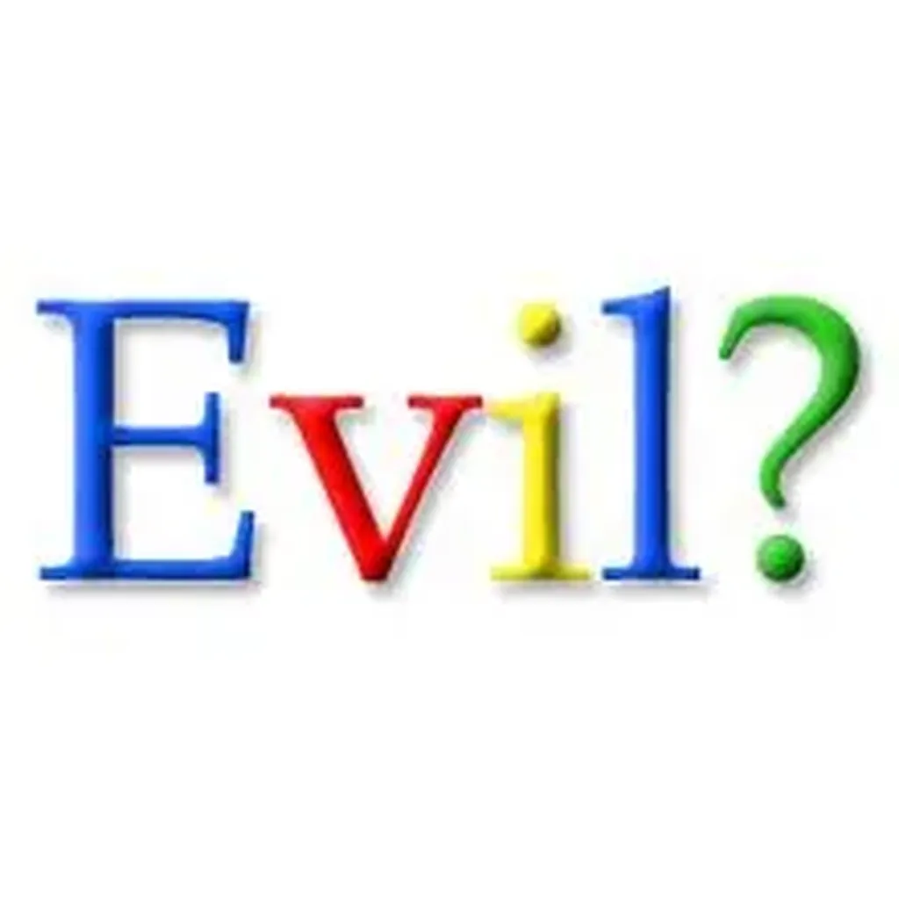

# Les médias se battent pour leurs fesses

On est bien loin de l’époque où le quatrième pouvoir montait sur les barricades. Aujoud’hui, enfermé dans son corporatisme, où l’État lui-même l’entretient, il ne songe qu’à sauver ses arrières, sans se préoccuper de celles du bas peuple qu’il est sensé informer.

Oui, ce peuple des petites gens anonymes qui par millions produisent aussi du contenu sur Internet et que Google pille impunément, sans que le gouvernement ne vienne à leur secours, et qui a même l’indécence de se féliciter d’une victoire contre l’ogre alors qu’il n’a arraché de ses dents que les lambeaux des plus nantis.

Qu’avons-nous foule innombrable des petits producteurs à gagner de Google ? Rien. Les adresses de nos créations peuvent circuler par mails, par forums, par réseaux sociaux… Nous nous moquons de recruter des nouveaux clients. Nous nous contentons d’un quorum raisonnable. Que Google cesse ses activités, notre vie ne change pas. Mais que nous cessions tous d’être complaisants, voire soumis comme des esclaves à qui on concède en pitance de maigres visiteurs, et Google tremblera. Nous pourrions dresser contre lui le cinquième pouvoir, le seul qui un jour le remettra à sa place.

En attentant, nous devrions tous exiger d’être rémunérés pour notre travail. Au même titre que les grands médias qui ont les moyens de remplir des dossiers, qui leur consacrent même à ces dossiers de subvention plus de temps qu’à produire des contenus qui touchent un public réel. Nous, humbles travailleurs, ne déméritons pas. Nous exigeons une égalité de traitement. Et que notre gouvernement socialiste, la chair de notre chair, nous trahisse est pour le moins scandaleux.

Une seule mesure s’impose, une seule mesure est acceptable pour nous tous, grands médias comme petits scribouillards, la rémunération systématique des contenus pillés par Google pour créer ses pages. Aucune autre approche ne sera équitable, ni juste. On emprisonne des jeunes gens pour copie illicite de films ou de musiques et Google est le géant planétaire du piratage. Un piratage qu’il a institué comme norme, bafouant toutes les législations. Un piratage qu’il a fini par rendre invisible.

Nous savons tous que nous ne vivons pas dans un monde juste. Que les méchants écrasent les petits. Ça commence dans la cour de récréation et ça ne s’arrête jamais, et pas aux frontières du cyberspace. Le crime contre le droit d’auteur y a été institué au plus profond, si bien que les ritournelles hadopiennes ne sont que des pantomimes pour effrayer les gueux.

Google a lâché quelques millions aux médias français pour acheter le silence de la meute. Google ne peut ignorer que nous ne nous laisserons pas exploiter indéfiniment. Le jour de la révolte approche. Et peut-être, à nouveau, virons-nous librement dans un internet libre, puisque qu’aucun acteur ne s’accaparera plus les richesses de tous les autres pour imposer sa dictature.

Je me prends à rêver.

#google #netculture #coup_de_gueule #y2013 #2013-2-2-18h38
