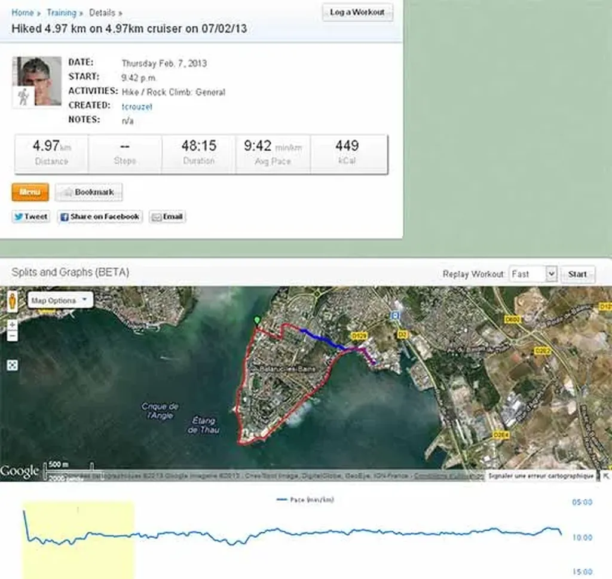
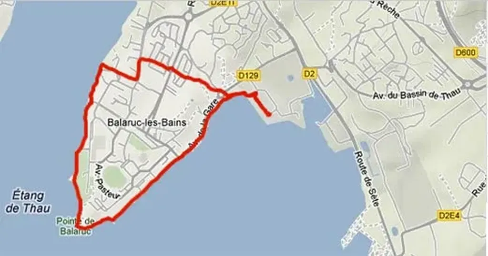

# Les tueurs de la société du partage

[Le Net est un territoire.](#territoire) On peut s’y exprimer, y performer, y construire des routes ou des petites maisons perdues dans les bois. On peut aussi y devenir mégalomane, épris de toujours plus de richesses, et même sans limite, puisque plus de frontières matérielles pour nous arrêter. Le Net est devenu le lieu de l’hypercapitalisme. Un hypercapitalisme qui se nourrit de notre envie de partage. Partage d’une pensée.

### Partage d’un moment

### Partage d’une promenade

### Mais un partage qui donne lieu à une monétisation sans partage.

#netculture #coup_de_gueule #y2013 #2013-2-8-9h11
