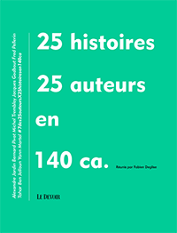

# Taxinomie littéraire à l'âge de Twitter

La sortie de *[La quatrième théorie](../../page/la-quatrieme-theorie)* approche et, en même temps que je boucle le dossier de présentation du thriller, je croise la route de la [twittérature](../../page/la-quatrieme-theorie/la-quatrieme-theorie-liens).

On attribue sa naissance tantôt aux Spartiates réputés laconiques, aux Japonais adeptes du haïku, aux *Nouvelles en trois lignes* de Félix Fénéon et plus sûrement à Hemingway pour une célèbre phrase :

> For sale, baby shoes, never worn.

J’ai longtemps cru qu’elle appartenait à un recueil de dix-huit nouvelles en six ou sept mots. [Il semblerait qu’il n’en soit rien et qu’Hemingway ne soit même pas l’auteur de cette micronouvelle.](http://quoteinvestigator.com/2013/01/28/baby-shoes/#return-note-5340-2) Elle lui a été attribué en 1991, trente ans après sa mort. C’est en fait une petite annonce dont on retrouve des variantes dans la presse américaine, dès 1906.

### Faire du court avec du court

Mais il ne fallait pas plus de cette légende littéraire pour lancer une mode narrative, et cela avant-même la naissance de Twitter. En novembre 2006, *Wired* demande à une quarantaine d’auteurs et d’artistes d’écrire une [Very Short Storie](http://www.wired.com/wired/archive/14.11/sixwords.html). L’idée rebondit et *Smith Magazine* propose à ses lecteurs d’envoyer des [mémoires en six mots](http://www.smithmag.net/sixwords/). Plusieurs recueils seront publiés et les textes continuent depuis d’affluer.

Des auteurs comme [Vincent Bastin](http://twittonouvelles.blogs.sudouest.fr/) ou [Jacques Fuentealba](http://fablimi.wordpress.com/category/latelier-de-jacques-fuentealba/) sont devenus adeptes du genre ultra-court. Et tout le monde les imite dorénavant sur Twitter sans même en prendre conscience. [*Le Devoir* vient d’ailleurs de publier une anthologie de tweets de commande.](http://www.ledevoir.com/culture/livres/369866/lire-tremblay-pivot-jardin-thuy-et-mavrikakis-en-140-caracteres)

Mais qui est capable de surpasser le pseudo Hemingway ? C’est sans doute dans les petites annonces qu’il faut chercher la forme la plus haute de la micronouvelle, dans les petites annonces d’un autre temps, à l’époque où on les payait au mot. La contrainte était alors réelle, profonde, et non simple jeu littéraire.

### Le jeu des perles de verre

Les micronouvelles, plutôt qu’entités isolées, s’enchaînent parfois en chapelet et construisent des ensembles cohérents. Perec nous a livré *Je me souviens*. Je m’en suis inspiré pour écrire *[J’ai eu l’idée](../../page/id)*. Vincent Bastin a tissé sa [version minimaliste de *La Guerre et la Paix*](http://fr.feedbooks.com/userbook/23278/morts-et-r%C3%A9surrections-du-sergent-grenadier-lazare). Chaque fragment tient pratiquement dans un tweet et l’ensemble déborde selon une technique connue des musiciens : l’échantillonnage, ou des peintres : le pointillisme.

On crée une œuvre avec des trous. On n’en dessine que l’architecture. Et le lecteur recolle les morceaux et édifie, en lui, une œuvre qui ne vaut que pour lui.

Cette pratique de la série, popularisée autour des années 1950, ne se limite pas à l’assemblage de brèves. On peut agréger des textes plus amples, mais jamais très longs, pour créer un corpus en perpétuelle évolution, et qui souvent ne s’achève que quand l’auteur manque de force et rêve d’autre chose.

C’est un geste fort de refus de la forme classique, achevée, clôturée. De nombreux blogs littéraires ou exploratoires appartiennent à cette veine. Les billets tracent les lignes de l’œuvre avec assez de vide entre eux pour que les lecteurs naviguent, et même interviennent.

### Faire du long avec du court

Un autre courant de la twittérature est né au Japon avec les [cell phone novels](http://en.wikipedia.org/wiki/Cell_phone_novel). Il s’agit de composer un texte ample de plusieurs centaines de pages en enchaînant des SMS/tweets.

Contrairement à l’écriture sérielle, on ne remet plus en cause la forme. Contrairement à la micronouvelle, on ne poursuit pas la virtuosité. On cherche plutôt à écrire à la vitesse de la lecture, comme si les lecteurs se penchaient au-dessus de notre épaule. C’est une écriture guère éloignée de celle du blog, mais plus tendue encore, puisque éclatée phrase après phrase. Où à chaque point, un évènement extérieur peut nous dérouter.

On m’a reproché quand j’ai ainsi twitté *[La quatrième théorie](../../page/la-quatrieme-theorie)* de me contenter d’adopter la forme du roman populaire.

1/ [J’aime ce genre](../../2010/8/pour-une-litterature-de-gare.md) et il me semble que la plupart des auteurs dit littéraires, contrairement à Gombrowicz, sont incapables de le pratiquer.

2/ Expérimenter cette écriture du temps réel me paraissait en soi un jeu littéraire, et assez neuf car nous disposons depuis peu des outils pour le mettre en œuvre à grande échelle et dans une durée ininterrompue de plusieurs mois.

J’ai vu mon style se transformer, se resserrer, même ma pensée prendre des détours inhabituels. J’éprouve depuis une grande nostalgie de cette expérience. Et je comprends pourquoi Gombrowicz a déclaré à la fin sa vie au sujet de ses *Envoûtés* :

> Je suis néanmoins porté à croire que cette idée de « mauvais roman » fut l’apogée de toute ma carrière littéraire – jamais, ni avant ni après, je n’ai conçu d’idée plus créatrice.

Je sens encore un potentiel immense dans ces œuvres lâchées par saccade. [François Bon vient ainsi de nous distiller son Proust.](http://www.tierslivre.net/spip/spip.php?rubrique113) C’est sans doute la forme reine de notre temps. En phase avec les outils, nos rythmes de vie, de pensée, de lecture… Et il s’en dégage quelque chose d’inédit, d’indiciblement contemporain. Les œuvres fermées, littérairement à la mode, me semblent en comparaison toujours désuètes, comme si elles avaient été écrites au siècle dernier.

#netlitterature #twiller #twitterature #dialogue #y2013 #2013-2-6-11h32
