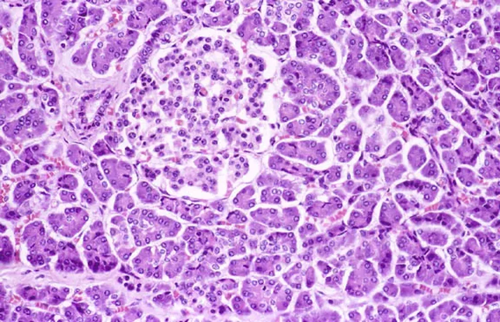

# Aux origines des domaines publics et privés

Pour certains extrémistes libéraux, la propriété privée doit s’étendre à tout, l’État doit s’effacer. Pour les ultracommunistes 2.0, elle doit disparaître, tout doit devenir public.

Ces deux positions sont absurdes. Dès qu’on s’interroge sur la notion même de vivant, bien avant l’apparition des premières consciences, on découvre la propriété privée. Une cellule se constitue en créant une membrane entre elle et l’extérieur, une peau qui la délimite, sépare ce qui lui appartient de ce qui est public.

Sans privatisation, pas de vie, pas d’autopoïèse. La vie peut même être vue comme la naissance de la privatisation. Nationalisez un être, il meurt par dissolution dans le milieu.

Mais si tout était privatisé, les agents ne pourraient plus se déplacer sans se heurter aux autres. L’espace serait saturé par le vivant qui s’étoufferait lui-même. La vie a besoin d’un domaine public pour se déployer. Reste à définir un équilibre entre public et privé. C’est une question politique.

Le privé doit-il se limiter au corps, en deçà duquel la vie est impossible, doit-il accepter l’habitation privée, l’entreprise privée, la culture privée, l’armée privée, la monnaie privée ? L’ultracapitalisme répond par l’affirmative à toutes ces questions. Il paraît toutefois évident que cela conduit à un étouffement de la société, étouffement que nous appelons plus communément : crise.

Au commencement, tout était public. Puis a débuté un long processus de privatisation qui semble vouloir se poursuivre aujourd’hui aveuglément. Pourtant, la vie désire vivre comme dirait Spinoza. Elle n’a aucune autre ambition. Et cette ambition se trouve contrariée par son succès même. Nous devons donc user de notre conscience pour changer le cours de l’Histoire. Nous devons maintenir un équilibre entre le privé et le public.

C’est alors qu’entre en jeu la technologie. Elle ne cesse de nous rendre de plus en plus indépendants du milieu. En quelque sorte comme si la peau de la cellule devenait de moins en moins utile. Nous avons commencé une nouvelle aventure. Celle où on peut voir reculer le privé au profit du public.

Dans un monde prospère, un monde où le revenu de base serait instauré, nos besoins primaires seraient satisfaits et nous offririons nos créations sans rêver d’un surplus de biens privés. Nous sommes déjà nombreux dans cette situation. Nous basculons peu à peu dans la société du partage.

Pas encore question de renoncer au corps, ni à son extension l’habitation, mais déjà la voiture est moins indispensable, et beaucoup d’autres objets, tels que livres et CD qui peuvent être dématérialisés… Nous avons entamé, au regard de la conquête du privé, une involution, d’autant plus nécessaire que la démultiplication du domaine public démultiplie nos possibilités existentielles, et donc notre bonheur.

Il me paraît évident que si les technologies le permettent nous irons plus loin. L’habitation aussi se dématérialisera, le corps aussi… et nous nous transformerons en consciences libres sur le réseau. L’extension du domaine public n’est qu’un prélude à de plus grands bouleversements. C’est une lutte pour l’espace vital.

#politique #dialogue #y2013 #2013-3-15-10h10
