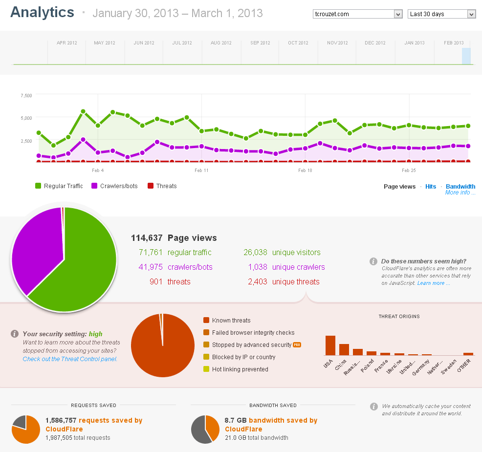
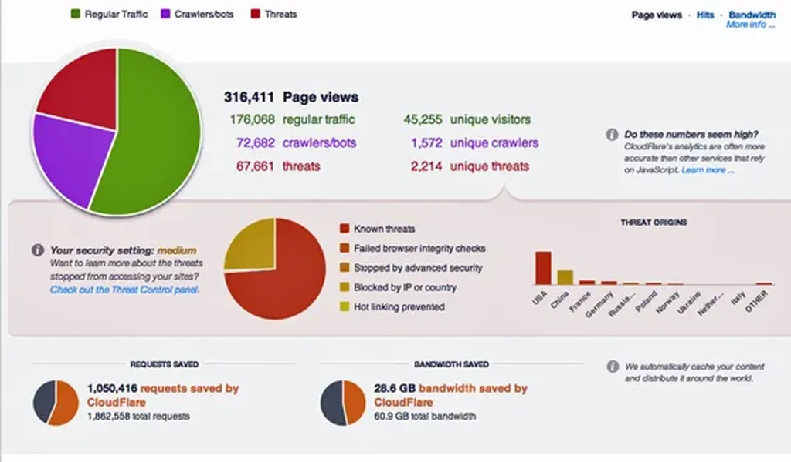
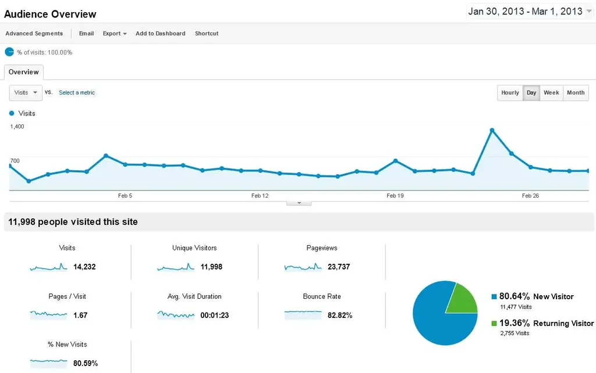

# Cloudflare change ma vie, et mes stats

En plus d’indiquer sous ses billets le nombre de lectures, François Bon publie [ses stats](http://www.tierslivre.net/spip/spip.php?article3426) tous les mois. Comme lui aussi est passé sous [Cloudflare](https://www.cloudflare.com), je m’amuse à me comparer à lui. Il faudrait que je blogue beaucoup plus pour rivaliser.

**Stats Cloudflare de Tiers livre**

**Stats Cloudflare de tcrouzet.com**

Cloudflare est un supercache. Il nous protège des pirates et sert la plupart de nos pages sans taper sur notre serveur. Il a par ailleurs un œil scrupuleux sur notre trafic réel.

**En comparaison, Google Analytics est beaucoup plus sévère. Chacun des pics dans la courbe signale mes billets.**
*PS : sous les titres de mes posts, j’indique les visites Google Analytics, relevées automatiquement toutes les heures. Je n’ai jamais compris ce qu’il en était des lectures via le flux RSS.*

#cuisine #breves #y2013 #2013-3-3-19h46
