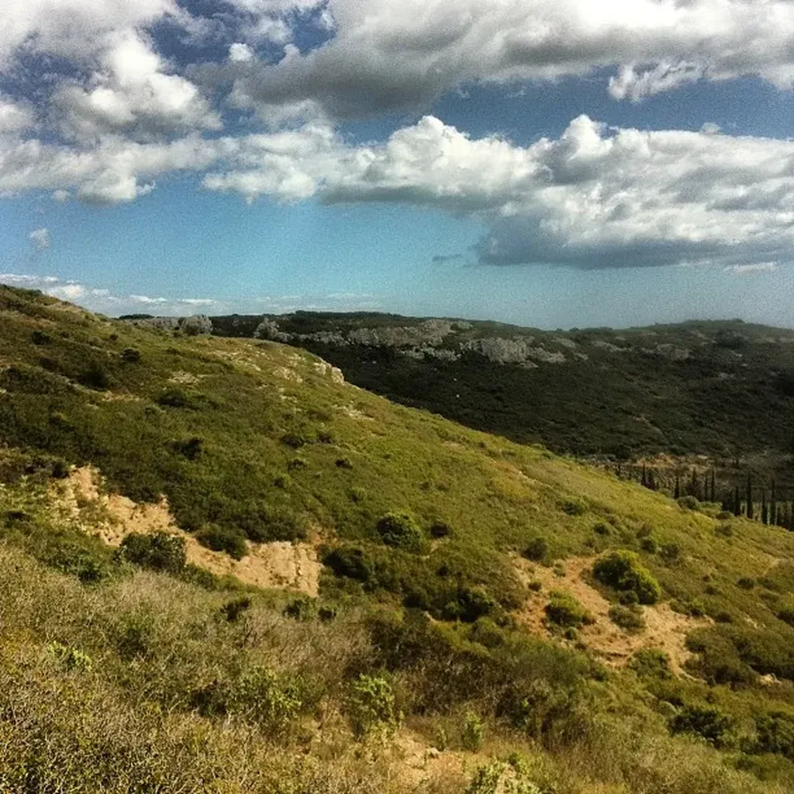

# Internet nous rend-t-il heureux ?

Quand on se place dans la perspective du temps long, toutes les technologies transforment le monde. La voiture a par exemple changé la forme des villes, en les étalant en vastes banlieues. Il est certain qu’Internet aura sur le long terme un effet transformateur, et plus qu’Internet le numérique dont il est une des nombreuses conséquences. Mais le long terme m’intéresse peu. Je veux vivre les transformations, je veux en bénéficier, je jeux en jouir, particulièrement dans l’espace social.

La voiture a rendu heureux nos grands-parents et nos parents. Je me souviens des expéditions dans l’arrière-pays. Les virés à l’improviste à la montagne ou sur la Côte d’Azur. Les poussées jusqu’en Espagne. Les routes en corniches. Les chemins de terre de l’Atlas marocain. Un souffle de liberté soufflait alors sur les automobilistes qu’aucune limitation de vitesse ne refrénait. La pollution nous a rattrapés, les embouteillages, la saturation du réseau toujours plus vaste, toujours plus destructeur des espaces naturels.

Comme la voiture pour nos devanciers, Internet grâce au Web a éveillé en nous une espérance extraordinaire. Par sa dimension sociale, il nous a fait croire que nous allions changer le monde, et le changer vite, dans la durée de nos vies, et même beaucoup plus rapidement pour que nous puissions nous rassasier de bonheur.

Et qu’est-ce que nous récoltons ? Des entreprises plus centralisées que jamais. Des systèmes de plus en plus fermés. Un écart entre les riches et les pauvres accru. Des politiciens de plus en plus stupides en même temps que leur impuissance augmente. Une planète qui étouffe. Une économie qui bafouille. Une spiritualité New Age qui a oublié toute rationalité. Des entrepreneurs qui pensent toujours autant au fric qu’avant. Pas de quoi être optimiste. Nous avons le moral dans les chaussettes.

Internet n’est peut-être pas la cause de tous ces maux, mais une chose est sûre, en vingt ans de Web, il ne nous a pas permis de les régler et d’inventer de nouveaux champs existentiels. Nous sommes englués dans une invariable misère matérialiste. Internet n’est pas une technologie de rupture. C’est une technologie comme une autre, qui nous approche peut-être un peu plus de la rupture. La pilule a plus changé la vie de la génération de mes parents qu’Internet la nôtre. C’est pour moi un constat amer, d’autant que je pense qu’Internet contient en lui-même une puissance infiniment supérieure à tout ce que nous avons connu auparavant.

Internet peut nous aider à changer le monde, vite, radicalement, mais nous ne le voulons pas. Et je trouve en moi-même les maux qui minent ce projet. Nous aspirons tous à la visibilité. Conséquence : nous parasitons le réseau d’un bruit assourdissant. Le vacarme est désormais supérieur à celui de n’importe quel périphérique. Nous habitons près d’une usine monstrueuse, le bruit nous empêche d’être nous-mêmes.

Il ne reste qu’à déménager vers une campagne plus paisible. Je me pose de plus en plus souvent cette question. Qu’est-ce que je dois garder du Net d’aujourd’hui ? Comment me protéger du tumulte ? Comment ralentir le temps ? J’ai quitté les capitales, elles m’ont rattrapées au bord de mon étang.

J’ai assisté la semaine dernière à une lecture de *Vert Paradis* de Max Rouquette. J’ai plongé dans le temps de mon enfance, un temps long que les technologies numériques nous dérobent si nous n’y prenons garde. J’ai besoin de revenir à la contemplation, de ralentir ma vie. Ça implique réduire les inputs médiatiques désordonnés, harmoniser les flux, les sensations, les sentiments… réapprendre à occuper l’instant, tout en étant plus proche physiquement de ceux avec qui j’interagis.

J’étais plus heureux lors de ma déconnexion que depuis que j’ai reconnecté. Il me reste à mettre en œuvre un projet de vie esthétique, où Internet sera l’intensificateur plutôt qu’un vulgaire média, où tout parasitage spirituel devra être banni, où la beauté sera le leur objectif, parce qu’elle a le pouvoir de changer la vie pour soi et ceux qui nous entourent, et même parfois au-delà dans le temps et l’espace.

Il est temps d’inventer le slow internet, la slow connexion... parce que la connexion reste indispensable, vitale, jouissive...

#netculture #slow_connexion #coup_de_gueule #y2013 #2013-3-27-8h18
