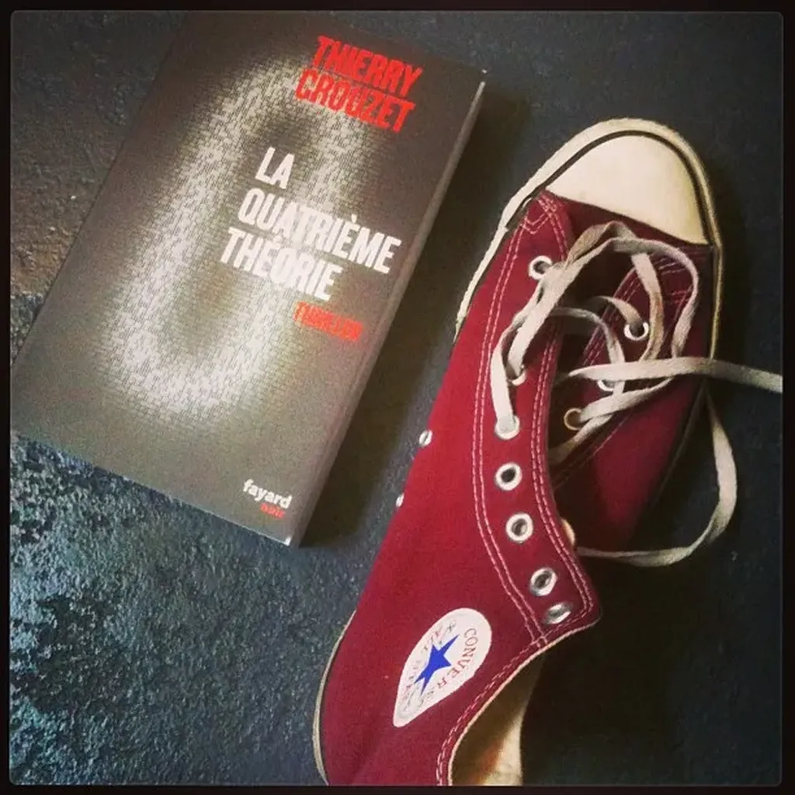

# Le livre augmenté est une impasse marketing

Je suis peut-être fermé, mais je n’ai jamais cru à cette idée du livre enrichi de vidéos et de musiques, à ce livre vaguement interactif pour tablette, dont on nous rebat les oreilles quand on évoque l’avenir du livre.

> À tout nouveau média correspond une nouvelle écriture.

Je ne pose pas ainsi un théorème, plutôt une intuition, généralisée à partir de quelques exemples. Le cinéma a engendré l’écriture cinématographique. Le numérique a engendré la programmation.

Les supports pour l’écriture ont toujours associé textes et images, avec des proportions variables, allant du 100 % texte au 100 % image, avec des genres hybrides comme la BD.

Le Web, clonage du print, s’est inscrit dans cette tradition. Nous ajoutons parfois du son ou de la vidéo pour illustrer, mais jamais, ou presque, nous n’aboutissons à une fusion organique. J’admets que quelques œuvres d’exception puissent émerger, comme il existe des livres pour enfants avec sensations olfactives, tactiles, auditives. Mais elles resteront marginales, parce que l’écriture propre au numérique est la programmation, parce que les œuvres programmées s’appellent les jeux vidéo (ne pas confondre avec les apps). Alors, oui, dans ce cas, on parle d’une nouvelle alchimie, d’une nouvelle écriture, d’une fusion entre des formes jusqu’alors séparées.

À mon sens, nous disposons aujourd’hui de quatre grandes écritures esthétiques, où le livre enrichi n’a pas de place :

1. **Graphique** (du texte à l’image sur tablette, parchemin, livre, photo, magazine, web, ebook…).

- **Auditive** (de bouches ou d’instruments à oreilles, sur disque, à la radio, sur le Net…).

- **Cinématique** (qui commence avec la sculpture et le théâtre, se joue à l’opéra, sur film, sur vidéo, sur le Net…).

- **Interactive** (jeux de rôle, numérique…).

Le livre enrichi tel qu’il est aujourd’hui imaginé n’est ni plus ni moins que du web, qui lui-même a succédé aux premières applications interactives et hypertextuelles sur CD-ROM. Parler de livre augmenté, c’est donc un truc marketing pour vendre ce qui jusque-là était diffusé gratuitement en ligne. À l’écriture graphique, on ajoute quelques add-ons des autres écritures, mais on n’invente pas une nouvelle écriture. Tirer plus loin le livre ce serait le pousser vers les jeux vidéo, le faire basculer dans un autre art.

Pas plus qu’au livre enrichi, je ne crois au livre interactif, à la lecture non linéaire. [J’ai expérimenté de ce côté](http://ihl.tcrouzet.com/), en prenant rapidement conscience que c’était tout simplement chiant par rapport à ce que nous connaissons dans les livres classiques ou les jeux vidéo. Le texte est par nature linéaire. On peut le picorer par fragment, sauter des passages, revenir en arrière, tout cela doit être laissé à la discrétion du lecteur.

Bien sûr, encore une fois, on peut s’amuser à construire des installations interactives, mais on ne rivalisera jamais ainsi avec les classiques de la littérature. Et puis, pour les programmeurs de jeux vidéo, ces livres dont vous êtes le héros 2.0 crient au grand jour la non-maîtrise de m’interactivité et une tentative maladroite de la singer.

Quand nous lisons un texte, surtout quand il commence à s’étendre sur plusieurs pages, quand sa musique nous envahit, notre cerveau réagit comme si nous vivions nous-mêmes ce que nous lisons. Cette puissance propre à l’écriture linéaire ne peut être battue que par des écritures concurrentes, qui elles aussi nous plongent en immersion totale.

Au contraire, le greffage d’add-ons casse l’immersion, sans réussir à nous projeter ailleurs. Ce n’est qu’un truc pour les amateurs d’art contemporain qui ont oublié que notre modernité est dans le code ou dans les formes plus anciennes qui se l’approprient comme sujet, méthode de production, de distribution…

Le code est central à notre temps.

Même quand nous produisons un texte linéaire, nous passons par le code.

Écrire des livres, composer des symphonies, réaliser des films, programmer des jeux vidéo, il faut choisir.

#ebook #edition #netlitterature #coup_de_gueule #y2013 #2013-3-23-12h11
