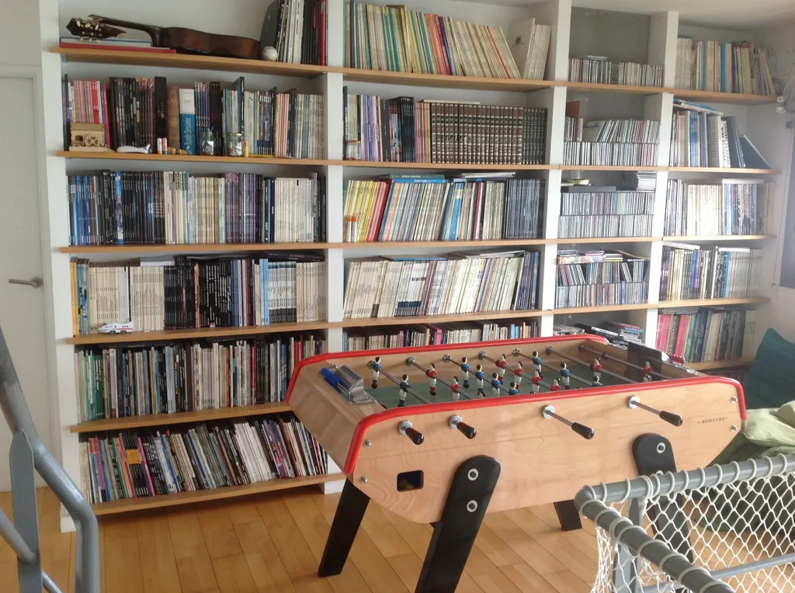

# De la difficulté de critiquer les réseaux sociaux

Le web contemporain passe par les Facebook, Twitter, Google+… Le trafic naturel des sites s’amenuise. Il dépend de la recommandation sociale, tout autant que de recherches plus ou moins aléatoires.

Alors critiquer les réseaux sociaux comme je le fais dans ma série [Slow connexion](#slow-connexion), c’est dresser devant les yeux mêmes des usagers de ces réseaux sociaux un miroir dans lequel ils n’ont pas envie de tourner leur regard.

Les premiers à me moquer sont ceux qui gagnent leur vie directement ou indirectement de ces réseaux sociaux. Ils dégainent l’insulte avec facilité. Si par hasard ma critique était justifiée, si par malheur la prise de conscience de l’imposture se généralisait, leurs plans de carrière s’écrouleraient. Je comprends leurs agacements, et leur existence même suffit à renforcer ma propre position. « Vous tuez notre rêve. » Et oui, j’ai le défaut d’avoir rêvé.

Les deuxièmes ceux qui ont trouvé sur ces réseaux un exutoire à l’ennui. Ils finiront par renoncer, mais dans l’intervalle ils sont aussi va-t-en guerre que les premiers.

Les troisièmes conservent l’espoir qui m’animait il y a encore quelques années. Ils pensent que les réseaux sociaux changent le monde. Pour me répondre et sans le savoir, ils me résument certaines de mes thèses déjà anciennes, oubliant que leur validité dépend d’un puissant mouvement de décentralisation, mouvement qui me semple inversé en ce moment.

Les quatrièmes, j’aimerais les rencontrer, seraient ceux que les réseaux sociaux rendent heureux. Ceux qui pourraient me guider, m’éveiller, me montrer où j’ai fait fausse route. J’ai envie de discuter avec eux, mais s’ils existent les réseaux sociaux ne les guident pas encore jusqu’à moi. Pourtant je ne demande qu’à être converti.

Sur le plan collectif, rien de ce que j’ai pu écrire dans *[Le cinquième pouvoir](../../page/le-cinquieme-pouvoir)* ne me paraît erroné, tout au moins sur une échelle de temps plus longue que celle que j’espérais initialement. Les réseaux sociaux décentralisés nous aideront à reconstruire les fondements politiques de nos sociétés.

Mais sur le temps bref de nos existences, au regard de notre bonheur, que peuvent-ils pour nous ? Attention, je ne suis pas en train de dire que je suis malheureux, mais que les outils dans lesquels je place un espoir social à grande échelle me rendent malheureux individuellement, si je ne m’en protège pas. C’est ça qui coince.

Si mon malaise s’avérait général, je ne vois pas comment des outils repoussants pourraient nous aider à reconstruire collectivement une société plus harmonieuse.

On a connu déjà de tels outils repoussants avec lesquels on a voulu reconstruire. Les armes, par exemple. Nous savons que nous n’allons pas loin avec cette méthode. Il me semble que l’outil collectif de révolte doit aussi être outil de développement personnel. Je suis en train de douter de la capacité des réseaux sociaux à lier ces deux dimensions, comme si le bonheur collectif ne pouvait pas passer par le bonheur individuel.

Ma naïveté et ma technophilie naturelle engendrent peut-être mes doutes. J’ai oublié que toute technologie peut être utilisée avec des objectifs opposés. Nous avons en ce moment même un bel exemple avec les imprimantes 3D.

Elles nous promettent de mettre à bas le modèle industriel centralisé, donc de nous conduire vers un néomarxisme où chacun de nous serait propriétaire de l’outil de production, de l’autre elles autorisent la construction d’armes de pointe qui pourront être retournées contre les néomarxistes, armes qu’eux-mêmes devront se saisir pour défendre la liberté. Alors une troisième faction surgit qui, pour éviter cette évolution, veut la tuer dans l’œuf, interdire simplement les imprimantes 3D, au nom de notre sécurité, mais avec le but évident d’empêcher l’avènement du néomarxisme.

Les réseaux sociaux entraînent des croisements d’intérêts semblables. Entre les dilettantes, les businessmen et les idéalistes. Chacun tire l’outil dans une direction antagoniste, tout cela dans une perspective historique des plus tendue. Je suis alors dans la position assez banale de celui qui ne voit pas sa direction l’emporter. Je suis colère, d’autant que les différents camps ne se dessinent pas distinctement, du fait même de la décentralisation de la société. Les hommes libres sont seuls, leurs ennemis restent organisés en armées structurées.

#netculture #slow_connexion #dialogue #y2013 #2013-4-20-19h15
