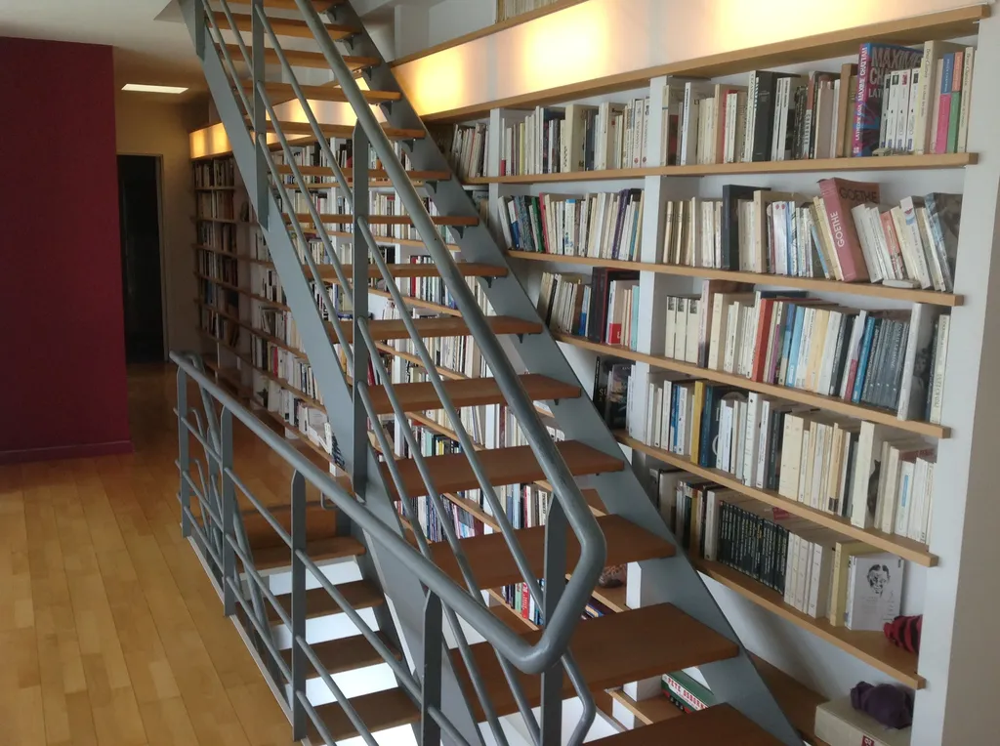
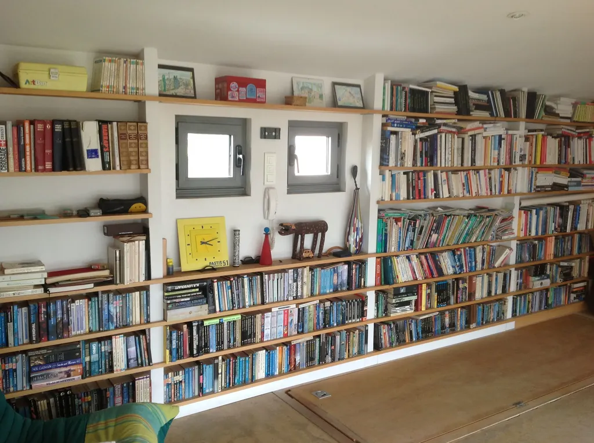

# J’aime toujours les libraires

[J’ai déclaré mon amour aux libraires](../3/jaime-mon-libraire.md), j’ai reçu en retour une volée de bois vert. Après avoir écouté [l’appel de Gérard Collard](http://www.lesdeblogueurs.tv/culture/livre-le-coup-de-gueule-de-gerard-collard/) et avant de participer le week-end prochain Au futur du livre à Chenôve en Bourgogne, je me suis dit qu’il était important d’aller de l’avant. Que pouvons-nous faire pour aider ?

### Les évidences

1. Le livre numérique représente autour de 1 % du marché du livre en France. Il ne peut donc être accusé de la crise que traversent les librairies, pas encore. En revanche, nous prenons tous l’habitude de lire en ligne, ce temps de lecture est pris au temps que nous consacrions jadis aux livres et à la presse papier, et même à la TV. Mais d’après [les chiffres du Motif](http://www.lemotif.fr/fr/etudes-et-donnees/chiffres-cles/marche-du-livre), l’érosion du marché global du livre reste lente. Nous continuons de lire (au moins d’acheter des livres).
2. En 2011, [450,5 millions de livres ont été vendus en France](http://www.lemotif.fr/fr/etudes-et-donnees/chiffres-cles/marche-du-livre), soit une moyenne autour de 7 livres [par Français](http://www.insee.fr/fr/themes/document.asp?ref_id=T11F031).
3. Amazon vendrait au moins 20 % des livres en France ([je n’ai pas de source sûre](http://www.actualitte.com/economie/temoignage-quitter-amazon-avant-d-etre-dependant-des-ventes-40538.htm), mais j’entends souvent des chiffres de cet ordre, et même supérieurs). Les Français achètent donc en moyenne un à deux livres par an sur Amazon. Vu autrement, c’est comme si 13 millions de Français achetaient en exclusivité en ligne.
4. Amazon est donc le concurrent direct de tous les libraires et il doit impérativement être soumis aux mêmes règles fiscales et juridiques. Globalisation oblige, c’est quasi impossible. Le gouvernement doit donc accorder aux libraires les avantages qu’Amazon s’est lui-même octroyés. Sinon la concurrence déloyale se poursuivra. Et elle sera d’autant plus déloyale si les distributeurs continuent à avantager Amazon par rapport aux libraires indépendants.
5. Même si le livre électronique ne pèse que 1 %, ce chiffre explosera comme il a déjà explosé dans de nombreux pays. C’est bientôt 20 % du marché qui sera numérique, et vite beaucoup plus. Ce fait ne peut être occulté, il faut s’y préparer. Dire que le livre n’est pas le disque n’est qu’un vœu pieux.

### Le problème immédiat

Potentiellement, 20 % des Français ne mettent plus les pieds en librairie (sans doute beaucoup plus : les gros lecteurs achètent des dizaines de livres par an, les petits lecteurs achètent souvent ailleurs qu’en librairie, beaucoup de livres sont dédiés à l’éducation nationale...). Il faut donc faire revenir les lecteurs dans les librairies, ou tout au moins éviter qu’ils les désertent davantage.

### Pourquoi des lecteurs achètent en ligne ?

1. Continuité du média. On découvre les critiques sur les blogs ou dans la presse, on clique directement. Un seul geste. Acheter en ligne est rapide, simple, pratique.
2. Les stocks des libraires en ligne sont gigantesques. Presque tous les livres sont immédiatement disponibles.
3. Le bouche-à-oreille a toujours été le meilleur vecteur promotionnel pour les livres. Les réseaux sociaux le démultiplient. Beaucoup de lecteurs ne s’informent pas autrement, ne l’estiment pas nécessaire. Du réseau social, ils passent à la librairie en ligne.
4. Les algorithmes de recommandation ont un effet addictif. Nous pousser à acheter ce que nos amis ont acheté, ça marche.
5. En ligne, nous bénéficions automatiquement d’une remise de 5 %.

### Pourquoi des lecteurs vont en librairie ?

1. Pour l’ambiance propre à chaque librairie.

- Pour discuter avec les libraires et les lecteurs.

- Pour recevoir des conseils de lecture incarnés.

- Pour découvrir des coups de cœur, être attiré par des titres au hasard des déambulations.

- Pour rencontrer des auteurs et refaire le monde avec eux.

- Pour oublier l’écran de l’ordinateur et se réapproprier le réel.

- Pour agrémenter une balade en ville.

### Mach pragmatisme / convivialité

Pour équilibrer le match, il faudrait commencer par en finir avec la remise des 5 %. Les prix doivent s’aligner, soit vers le haut, soit vers le bas. La loi sur le prix unique doit être durcie. Mais ces efforts d’alignement tant tarifaires que fiscaux ne feront guère de mal aux géants de la vente en ligne. Les lecteurs continueront à « courir » chez eux parce qu’ils y trouvent d’autres bénéfices.

Traiter ces lecteurs d’imbéciles comme certains libraires l’ont fait [dans le fil de commentaire de mon premier billet](../3/jaime-mon-libraire/#comments.md) ne résoudra aucun problème. Pas plus qu’avancer des arguments fallacieux comme prétendre que la fin des librairies sera la fin des éditeurs indépendants ou des productions moins grand public. La diversité éditoriale n’a jamais été aussi grande qu’aujourd’hui, justement grâce au numérique, qui autorise la vente directe tant des livres que des ebooks.

[J’ai suggéré aux libraires physiques de devenir numériques.](../3/jaime-mon-libraire.md) [Bernard Strainchamps a pointé vers le travail éditorial qu’il effectue en tant que libraire en ligne.](http://blog.feedbooks.com/fr/index.php/2012/09/05/le-roman-policier-nordique-a-lhonneur-sur-feedbooks/) Par ailleurs, des libraires commencent à se regrouper sur le Net pour peser face à Amazon : [Paris Librairies](http://www.parislibrairies.fr/), [Librest.com](http://www.librest.com/), [Lalibrairie.com](http://www.lalibrairie.com/), [Leslibraires.fr](http://www.leslibraires.fr/)… La prise de conscience s’installe, mais [contrairement à ce que j’ai pu laisser croire](../3/jaime-mon-libraire.md), concurrencer Amazon sur son terrain ne suffira pas. Il faut être là où il n’est pas.

Peut-être faut-il s’inspirer d’un autre géant du numérique. Pourquoi Apple ne se contente pas de vendre en ligne et ouvre partout des Apple Store ? Parce que nous avons besoin de chaleur humaine, de nous toucher, de nous sentir, de nous aimer… et ce n’est pas prêt de s’arrêter. Les disquaires ont disparu parce que les auditeurs retrouvaient les autres auditeurs et les musiciens en concert. Pour les auteurs, la meilleure salle de concert reste la librairie. Nous avons tous besoin d’un lieu de rencontre, d’une agora, bien plus que d’une simple boutique. Le libraire n’a jamais été un commerçant. C’est un connecteur, un faiseur de société.

Il doit privilégier le dialogue et rendre l’achat transparent, que le livre soit donné de la main à la main, envoyé à domicile ou par mail. Visiter une librairie doit redevenir une aventure où nous rencontrons d’autres lecteurs, des œuvres et leurs auteurs.

Un fan d’Apple a un jour déclaré qu’entrer dans un Apple Store, c’était comme entrer dans une église. J’ai toujours ressenti ça dans les librairies. Nous y communions un goût pour le temps long, pour la plonger dans la fiction, pour la prise de distance… Il existe bel et bien une mystique de la librairie. Et tant que nous écrirons, nous aurons besoin d’espace où les libraires seront nos grands prêtres.

On attend de vous quelque chose de fou, pas seulement de nous vendre des livres. On vient chercher chez vous plus que des objets. Vous nous offrez quelque chose d’immatériel et que paradoxalement le numérique ne véhicule encore que très mal. Travaillez ce bénéfice.

Au fait, j’aime aussi les livres papiers... C’est chez moi.

PS : *[La Quatrième Théorie](../../page/la-quatrieme-theorie)* s’achève par un éloge de l’artisanat contre les géants centralisateurs. Vous pouvez le lire comme un éloge de la librairie indépendante.

#edition #dialogue #y2013 #2013-4-8-15h13
