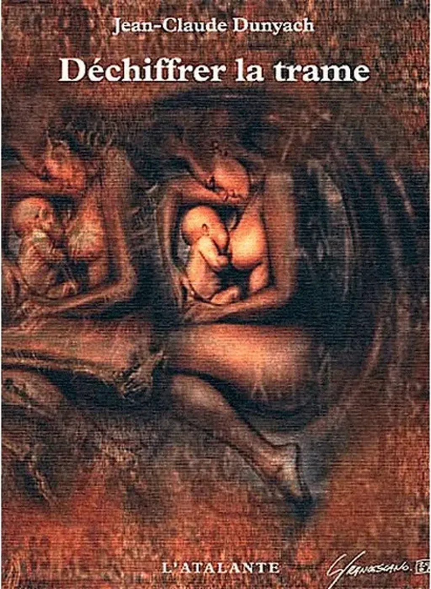

# Lecteurs au secours des auteurs

Quand j’ai vu l’annonce de lancement d’[Adopte un auteur](http://www.adopteunauteur.fr/thierry-crouzet/), j’ai ricané intérieurement : « Je n’ai besoin de personne, mes textes se défendront seuls. » Attitude idéaliste, de fait intenable.
[Jean-Claude Dunyach](http://www.dunyach.fr) m’a raconté qu’il s’était [inscrit sur Adopte un auteur](http://www.adopteunauteur.fr/jean-claude-dunyach/) et que trois lecteurs s’étaient immédiatement proposés pour l’aider. Dans le brouhaha médiatique, nous sommes tous en quête de visibilité. Nos textes ne peuvent être lus que si nous avons des VRP diligents. Les commerciaux de nos éditeurs, les libraires, les chroniqueurs ne suffisent pas la plupart du temps à nous hisser au-dessus du tumulte. Nous avons besoin de faire des signaux de fumée depuis nos blogs et nos réseaux sociaux, mais c’est insuffisant. Seuls, nous sommes impuissants.

Les lecteurs peuvent aider les auteurs qu’ils apprécient avec des gestes souvent simples :

1. Commentaires dans les librairies comme Amazon, surtout Amazon.

- Commentaires sur les sites de lecture sociale comme [Babelio](http://www.babelio.com/), [GoodReads](http://www.goodreads.com/), [Libfly](http://www.libfly.com/)…

- Installer une alerte Google sur leurs auteurs suivis, intervenir dans les forums, les blogs, les réseaux sociaux quand on parle d’eux.

- Like et share sur les réseaux sociaux.

- Sans nécessairement écrire de longs articles, publier [des critiques minimalistes](lecture-sociale-de-la-quatrieme-theorie.md) sur les réseaux sociaux.

- [Épingler les couvertures](http://pinterest.com/tcrouzet/books-worth-reading/).

On peut ainsi avec ces petits gestes numériques faire la différence, surtout lorsque ces gestes se cumulent et fédèrent différents points de vue. Je me suis donc inscrit sur [Adopte un auteur](http://www.adopteunauteur.fr/thierry-crouzet/). Je vous raconterai la suite, si suite il y a. [La société du partage commence avec ces petits riens.](les-traitres-a-la-cause.md) Les communautés naissent dans l’action, aussi élémentaire soit-elle. À un moment donné, il faut agir et cesser de discuter.

« I do, therefore I am. »

[Courez donc adopter Jean-Claude Dunyach.](http://www.adopteunauteur.fr/jean-claude-dunyach/) Si vous ne l’avez pas encore lu, découvrez [*Dieu, vu de l’intérieur*](http://www.angle-mort.fr/fiction/dieu-vu-de-l-interieur-jean-claude-dunyach/) dans le numéro 4 de la revue [*Angle Mort*](http://www.angle-mort.fr), vous y rencontrerez deux scientifiques pris d’un délire métaphysique à la veille de la naissance de leur premier enfant. Surtout, ne passez pas à côté de son chef-d’œuvre [*Déchiffrer la trame*](http://www.amazon.fr/D%C3%A9chiffrer-trame-Jean-Claude-Dunyach/dp/2841721728).

#edition #netlitterature #dialogue #y2013 #2013-4-19-10h23
