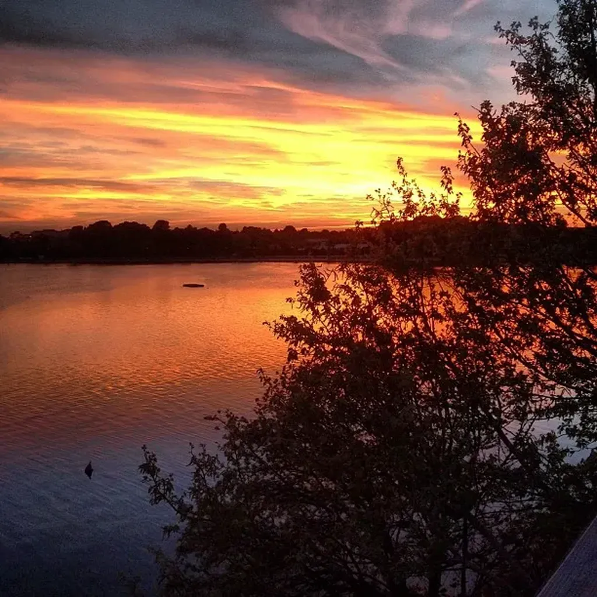

# Comment retrouver le bonheur sur le web

Pendant une bonne dizaine d’années, j’ai vécu avec beaucoup d’autres dans l’illusion que nous allions réussir à changer le monde politique, esthétique, littéraire grâce au web… De fait, nous avons beaucoup réfléchi, beaucoup écrit, beaucoup produit.

Mon bonheur individuel découlait d’un engagement collectif de vaste échelle. Il y avait quelque chose de propre aux grands jours de l’humanité. Une fois cette ferveur retombée, une fois constaté que notre agitation neuronale n’a pas eue de conséquences pratiques, ou trop peu à notre goût (démarrage des révolutions arabes, amorce du mouvement indigné, généralisation de la logique open source…), l’engagement ne comble plus, il laisse même un goût amer d’échec.

Aujourd’hui, je ne peux plus rester ébahi devant les changements qu’engendre la technologie. J’en découvre au moins autant de critiquables (allant vers l’hypercentralisation) que d’enthousiasmants (allant vers la décentralisation). Ce bilan étant au mieux neutre, il ne suffit pas à me stimuler.

Il faut donc rechercher le bonheur non plus dans le collectif pour le collectif mais dans des communautés plus réduites, plus intimes, plus prêtes à l’action, ne serait-ce que pour organiser des journées où nous nous retrouverons, où nous partageons des repas, des rires, peut-être nos muscles pour travailler un bout de terre, dresser un mur, agir ensemble.

Un changement d’échelle s’impose, en même temps qu’un changement technologique. Je dois m’intéresser à l’internet hertzien, à cet internet qui seul peut pencher vers une réelle décentralisation, à cet « internet campagnard ». Un internet qui part de chacun de nous et qui ne doit rien à des acteurs qui ne seraient pas individuels. Je dois m’intéresser aux technologies qui nous rapprochent, mais pas seulement dans la parole.

Engagé avec l’espoir d’un changement de grande échelle, j’ai vécu un temps avec l’idée que plus nous serions nombreux à nous suivre les uns les autres, plus notre pouvoir de groupe serait grand. Aujourd’hui que cette piste, polluée par beaucoup de bruit, s’avère stérile, au moins dans les circonstances actuelles, je me retrouve dans un état de totale dispersion.

J’ai voulu un grand réseau pour agir mieux et il m’empêche d’agir car il ne se compose presque que de liens faibles. J’admets leur puissance épisodique, lors d’un ample mouvement social, mais mesure leur incapacité à me réjouir quotidiennement.

La « slow connexion » passe par peu de liens mais des liens forts. Reste à savoir comment peu à peu changer la nature du réseau numérique qui m’entoure. Ce sera comme toujours une histoire de rencontres. De lieux, à squatter ou à créer de toute pièce.

Mais un danger guette cette approche : tomber dans le communautarisme, s’enfermer dans un cocon douillet, presque sectaire, ce même cocon qu’offrent les grandes structures hiérarchisées à leurs adeptes. Je dois donc tramer ma vie entre plusieurs communautés, établir des ponts et des connexions transversales pour ne pas m’enfermer, mais sans poursuivre la vaste exposition médiatique qui ne satisfait que très momentanément l’ego.

#netculture #slow_connexion #dialogue #y2013 #2013-4-21-9h55
