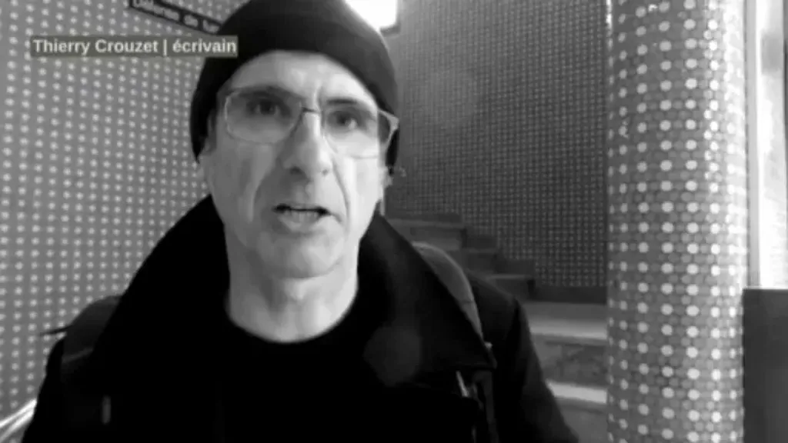

# Internet nous coûte collectivement

[Dominique-Emmanuel Blanchard](http://www.deb33.com/) m’attrape au vol à Bordeaux, sac à dos, avec bonnet et contre-jour. Twittérature, réseaux sociaux, l’avenir du Net et son échec, l’hypercentralisation sous le prétexte de la décentralisation, la mise en vente de mon compte Twitter.

#netculture #twitterature #podcasts #y2013 #2013-5-16-9h1
