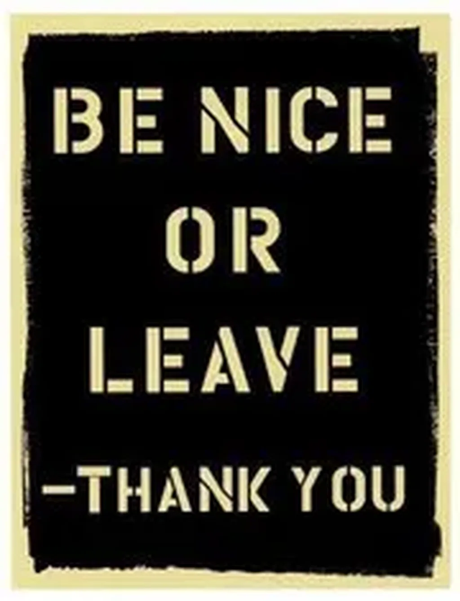

# Le blog sans conversation

Qu’est-ce que cet objet ? Je parle bien de conversation. Pas de simples commentaires qui s’enchaînent en s’ignorant les uns les autres à la mode des like, une mode peu glorieuse à laquelle je m’accroche, faute de feedback constructif.

Non, je ne blogue pas pour faire ma promo. Non, je ne blogue pas pour donner mon avis comme un professeur pontifiant. Non, je ne blogue pas pour exister. Non, je ne blogue pas pour diffuser mes textes. Non, je ne blogue pas pour gagner de l’argent ou attirer des sirènes. Non, je ne blogue pas pour défendre un statut social. Non, je ne blogue pas pour me faire mousser devant une quelconque hiérarchie. Non, je ne blogue pas pour me construire un CV ou une carte de visite. Non, je ne blogue pas pour décrocher un contrat ou une embauche. Non, je ne blogue pas pour la beauté, pour l’art pour l’art, pour la littérature. Non, je ne blogue pas pour briguer un poste dans un parti politique, une mairie, une assemblée. Non, je ne blogue pas pour générer du trafic, afficher des pubs et attirer des sponsors. Je blogue pour échanger.

Si je vendais mes textes, vous me donneriez quelques euros en échange de mes mots, ce serait le degré zéro de l’interaction sociale, mais mieux que le néant du blog sans conversation. Et peut-être qu’un blog payant est mieux qu’un blog gratuit, même correctement lu, mais où ça ne discute pas.

Un blog sans conversation, c’est un journal ou un livre, rien d’autre. Pour beaucoup de gens, ce sera déjà pas mal, mais pas pour qui a pratiqué le blog durant des années, c’est-à-dire la conversation. Écrire pour être lu n’est pas glorieux, ce n’est pas neuf, c’est même le nom d’un stage auquel tous les rédacteurs en chef envoient leurs journalistes (et je n’ai pas dérogé à la tradition quand j’étais rédacteur-en-chef).

George Orwell nous a parlé de « common decency ».

> Cette honnêteté ordinaire, [écrit Bruce Bégout](http://www.lefigaro.fr/livres/2008/10/02/03005-20081002ARTFIG00447-la-banalite-du-bien-.php), s’exprime sous la forme d’un penchant naturel au bien et sert de critère du juste et de l’injuste, du décent et de l’indécent. Elle suppose donc, avant toute éducation éthique et pratique, une forme de moralité naturelle qui s’exprime spontanément sans faire appel à des principes moraux, religieux ou pratiques. L’homme ordinaire n’a pas besoin de se tourner vers certaines autorités pour agir moralement. Il possède en lui-même une faculté sensible d’évaluation morale qui précède toute norme conventionnelle.

J’ai l’impression que beaucoup d’internautes oublient cette common decency. Tout leur est dû. Ils ne font plus la différence entre un article de presse, financé par la publicité, et un billet de blog, simplement offert. Ils oublient que le don n’a que pour but d’ouvrir un échange sur un plan non monétaire, donc en l’occurrence social. Et ils ont l’indécence de revenir, de lire un autre billet, de prendre l’habitude de recevoir sans donner… ce mal gangrène la blogosphère tout entière.

On pourrait envisager une espèce de marché du don. Je donne d’un côté, un autre donne ailleurs, au final un équilibre s’installe. C’est la théorie. Je ne vois plus ce marché. Au contraire, l’engagement diminue. « Je me sers parce que tu veux bien me donner. Si tu ne veux pas que je te pille sans réciprocité, t’as qu’à pas publier. »

Quand je dis, « Non, je ne blogue pas pour ça. », c’est parce que beaucoup de blogueurs le font pour toutes ces raisons. Chacun ses motivations. Moi, j’ai blogué pour construire un cinquième pouvoir, une force décentralisée qui, née d’une multitude de sources, irriguerait la société (cette force pouvant être politique, esthétique, énergétique…). Mais que font la plupart des blogueurs ? Faute de provoquer chez eux des conversations, ils deviennent les commentateurs des grands médias. Ils sont devenus leurs valets. On les remercie à coup de citations, d’invitations sur les plateaux ou dans les studios. La conversation s’est déplacée. Elle s’est recentrée sur des pôles médiatiques institutionnels. Ils ont gagné la bataille du Net. Le blogueur n’est plus un nœud turgescent dans un réseau décentralisé, il est un électron en orbite autour d’un conglomérat médiatique dont l’attraction est devenue trop puissante pour qu’il espère s’en échapper.

Pas de panique. Une bataille a été perdue, mais la guerre continue. Quelques irréductibles Gaulois persévèrent. Se pose alors la question de la forme. Comment faire renaître l’engagement ? Comment refaire communauté ? Le blog n’est peut-être plus la forme adéquate. Par sa visibilité au grand jour, il se place à côté des grands médias, tout petit nain servile en bas de l’escalier, qui vocifère et qu’on amène au sommet pour amuser quelques instants le roi et sa cour. La communauté a besoin de l’intime, de la chaleur humaine, de la confiance. Elle est inconciliable avec le grand déballage permanent.

[Mieux vaut donc un blog peu lu et payant](http://www.montpellier-journal.fr/) qu’un blog ouvert à tous les vents avec l’illusion de rivaliser avec les médias. Ou imaginer autre chose. Des ebooks, des apps… des choses qui permettraient de publier avec l’*hubris* propre au blog mais sur un terrain qui serait interdit aux grands médias, centralisés par nature.

*PS 1 : Billet écrit après quelques échanges mails avec un grand blogueur qui ne blogue plus.*
*PS 2 : Une des vertus du blog reste de pouvoir publier vite quelque chose tout en le formalisant un minimum, parce quelque lecteurs le liront. C’est une façon d’avancer dans le processus créatif, par étapes mises au propre. Mais vous voyez bien l’intérêt à ce moment d’un retour.*

#blogosphere #blog #netlitterature #dialogue #y2013 #2013-5-15-11h24
