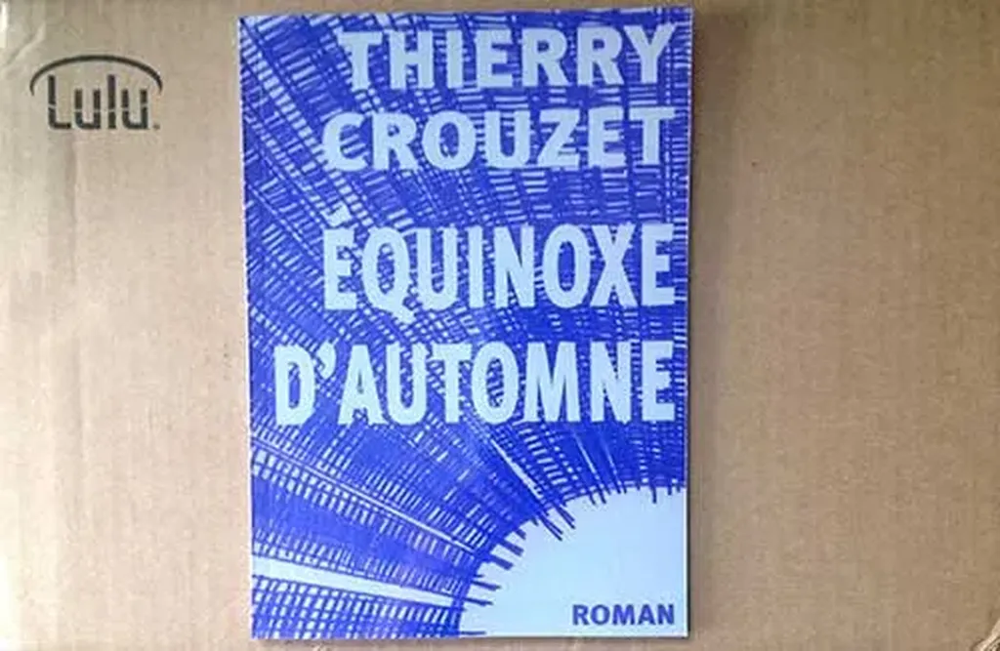

# POD chez lulu, trop cher

[Près de 11 euros, même port compris](http://www.lulu.com/shop/thierry-crouzet/%C3%A9quinoxe-dautomne/paperback/product-21011567.html), c’est excessif pour un livre de 70 pages imprimé via lulu.com. Je me demande pourquoi je continue à rendre certains de mes textes disponibles via cette technique (en plus, je dois acheter un exemplaire à chacune de mes modifications, racket des auteurs très 2.0). [Lisez plutôt sur tablette ou liseuse.](../../page/equinoxe-automne)

#edition #breves #y2013 #2013-5-16-15h5
