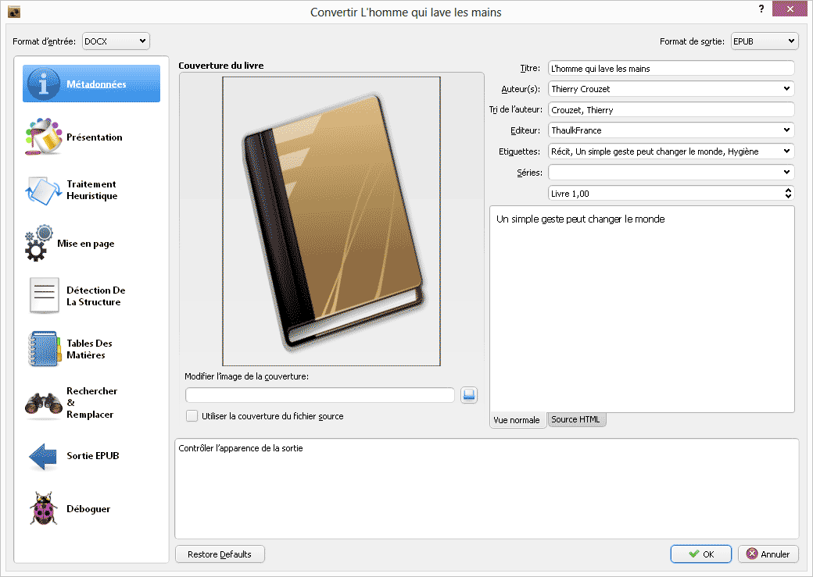

# Comment créer des ePub avec Word

J’ai toujours créé mes ebooks avec Word, via l’enregistrement HTML et [une petite application Web de nettoyage](http://lab.tcrouzet.com/epub/). Beaucoup de ceux qui ont tenté d’utiliser ma technique l’on trouvée trop compliquée, préférant [la solution de Jean-Claude Dunyach](http://jean-claude.dunyach.pagesperso-orange.fr/Ebooks.html). Une nouvelle possibilité arrive. Elle s’appuie sur [Calibre](http://calibre-ebook.com/), le gestionnaire de bibliothèque d’ebooks.

1. Commencez par créer un document Word impeccable, non pas par sa mise en page, mais en veillant à utiliser des styles homogènes.

- Dans la fenêtre *Fichier/Propriétés*, indiquez le titre du livre, l’éditeur, l’auteur, la quatrième de couverture… Vous précisez ainsi les métas données associées à l’eBook.
- Ouvrez Calibre, glissez dessus le fichier Word DOCX. Il rejoint votre bibliothèque. Vous pouvez l’envoyer vers la liseuse de votre choix, ou le convertir dans un autre format, entre autres ePub ou Mobi.
- La fenêtre de conversion vous aide à régler différents paramètres de la mise en page, notamment à ajouter une couverture. Et c’est parti.
- Une fois la conversion achevée, ouvrez le dossier contenant les fichiers Calibre associés.
- Vous y trouvez le document source et les documents convertis. Ouvrez l’ePub depuis [ePub Validator](http://validator.idpf.org/) pour vérifier que tout est OK.
- Avec [Sigil](https://code.google.com/p/sigil/) ajoutez d’autres métas données (langue, ISBN…), ajustez la mise en page ou même changez la feuille de style. Vous découvrirez toutefois que le code généré est très crade, mais beaucoup de grands éditeurs de font pas mieux.

Dans le convertisseur vous trouverez de nombreuses options pour optimiser la conversion. Je suis sûr qu’on peut obtenir de très bons résultats. Pour ma part, je reste fidèle à ma moulinette qui donne des fichiers plus légers et plus agréables à l’œil du codeur que je suis.

*PS : Étonné de lire que [l’intérêt d’écrire en Markdown serait de pouvoir générer simplement des ePub](http://tiaaft.com/2013/06/08/genial-maj-de-calibre-support-du-docx/). Je ne vois pas le rapport. Je crée mes ePub avec Word depuis des années, aussi bien que mes billets de blog ou que mes livres. J’utilise DropBox quand je change de machine. Et quand je n’ai pas Word sur une machine, je me contente d’écrire en texte brut, avec Markdown, texte brut parfaitement compatible avec Word. Pas prêt de changer de machine à écrire, même si je vois des tonnes de choses qui pourraient être ajoutées pour les auteurs.*

#cuisine #ebook #netlitterature #dialogue #y2013 #2013-6-11-9h29
