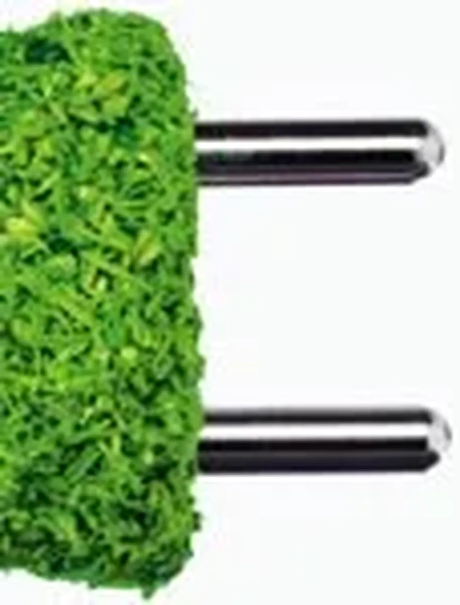

# De mauvaises habitudes numériques

Je commence par un point sur ma situation avant ma déconnexion en avril 2011.

1. J’utilisais une messagerie qui me signalait sur la barre des tâches les nouveaux mails. Distraction inutile.

- La nuit, quand je me réveillais pour pisser ou boire, je vérifiais si je n’avais pas été pingué (mail, blog, réseaux sociaux, articles sur le Web…). Si oui, je ne répondais pas nécessairement tout de suite, mais je commençais à gamberger. Nuit fichue.

- À table, j’avais toujours mon téléphone avec moi. Je m’esquivais très souvent de la situation IRL.

- En randonnée, en promenade avec les enfants, en déplacement, j’éprouvais toujours le besoin de raconter ce que je faisais. Comme si déranger les autres était une nécessité.

- J’avais besoin de recevoir des signes d’amour numériques. Quand personne ne réagissait à mes messages, j’étais mal. Quand beaucoup de gens réagissaient, j’éprouvais un vif plaisir qui me poussait à envoyer de nouveaux messages. Un vrai chien de Pavlov.

- Je ne cessais de dire que Facebook et Twitter étaient géniaux. J’étais devenu un commercial non rémunéré, et non pas d’un auteur que j’aime par exemple, mais de multinationales inhumaines.

- « Publier, publier, publier… » Je n’avais que ça en tête, c’était devenu ma façon d’exister, de m’insérer dans le temps numérique, un temps qui n’a rien de biologique, un temps des machines et nom des humains, un temps dont le rythme m’a conduit au burnout. J’avais oublié que certaines choses doivent se construire tranquillement dans le recoin des alcôves.

- Quand j’étais pas devant mon écran, je ressentais comme un appel… La curiosité de ce qui se disait en ligne me dévorait.

Voilà un portait rapide du Crouzet d’avant, du Crouzet au bord du burnout. Où j’en suis deux ans plus tard.

1. Plus aucune alerte. Pour voir mes mails, je dois faire l’effort d’ouvrir la messagerie. Je ne me sens plus obligé de répondre tout de suite. Parfois je le fais, souvent pas. La dictature du temps réel est une monstruosité, un dogme imposé par ceux-là mêmes qui profitent de cette frénésie ridicule.

- Je pisse et bois toujours la nuit, mais je touche plus à une tablette ou un téléphone. Quand je n’arrive pas à me rendormir, je bouquine avec mon Kindle. Je plonge dans des textes longs déconnectés de la temporalité numérique.

- Plus de technologie à table.

- J’aime prendre quelques photos. Je les publie en temps réel, sinon je les laisse mourir sur un disque dur. Une façon de documenter ma vie, et celle de ma famille. J’ai encore cette faiblesse. Isa me la reproche. Maintenant que Flickr offre un téraoctet, j’envoie les photos de famille dans un espace fermé.

- Je ne suis plus proactif sur les réseaux sociaux. Je me fiche de ce qui s’y passe. Des mails me préviennent de l’activité me concernant. Je n’attends plus aucun petit plaisir de ce côté.

- Je suis beaucoup plus critique sur nos outils…

- Je bloque toujours, parce que j’aime cette écriture et qu’elle me paraît centrale… mais en ayant réduit les autres nuisances, j’arrive à retrouver du temps pour les textes plus longs. J’ai enfin réussi à boucler mon *[Ératosthène](../../page/eratosthene)*.

- L’appel de l’écran est moins violent, mais toujours là… Quelque chose naît dont j’aime voir l’évolution.

#jai_debranche #netculture #dialogue #y2013 #2013-6-11-12h35
