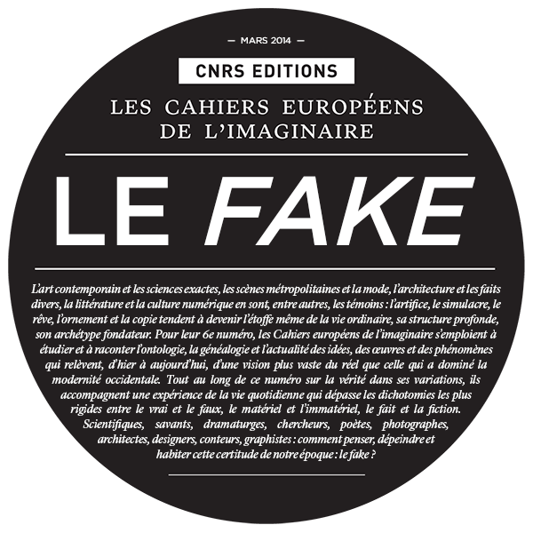

# Le fake : la vérité en ses variations

Pour son numéro de mars 2014, [*Les Cahiers européens de l’imaginaire*](http://www.lescahiers.eu/blog/appel-a-contribution-cei6-le-fake.html#cei6en) a lancé un appel à texte. Le sujet m’a amusé, plutôt que de soumettre un projet, j’aurais bien aimé envoyer une bafouille finalisée. Je me suis arrêté à l’introduction.

---

1. S’interroger sur ce qu’est la réalité, c’est douter. Pour qui ne doute pas, la réalité est sans question.

- Le mensonge est devenu médiatique. À la médiation de nos sens, nous avons ajouté la méditation des médiateurs.

- Le texte aura été la première imposture médiatique. La possibilité d’entrer dans l’esprit d’un mort et d’exploser l’étendue du champ existentiel.

- La réalité pourrait n’être qu’un consensus. Un état auto-organisé critiquement dans l’étendue du chaos, comme la tache rouge dans l’atmosphère jovienne.

- Pour que la réalité consensuelle émerge ne faut-il pas un substrat, un espace de lois invariantes ? Le substrat peut-il lui-même émerger ? Si oui, alors la réalité est chaos.

- Aucun système formel n’est complet. Il existe toujours des propositions indécidables. Théorème de Gödel. Si la réalité est formalisable, elle est incomplète. Et l’imagination peut en investir les brèches. Si la réalité est complète, elle n’est pas formalisable. Seule l’extase mystique peut nous en donner une idée, nécessairement erronée. Nous sommes prisonniers de l’imaginaire plus que de la réalité.

- Pour se débarrasser de l’imaginaire, le scientifique utilise des instruments d’observation. Il interface entre lui et la réalité des médiateurs.

- Quoi que ces médiateurs nous révèlent, nous avons la possibilité de reconstruire une vision cohérente du monde. Le réel n’est qu’une illusion de réel. Le réel, c’est la cohérence de notre système formel, avant qu’il n’explose.

- La réalité est provisoire, l’imaginaire éternel.

- Si la réalité existe, elle est soit cohérente, soit incohérente. Si elle est cohérente, nous ne pouvons pas la formaliser avec cohérence, donc elle nous apparaît incohérente. Pour nous, la réalité est donc inévitablement incohérente.

- La question de savoir ce qu’est la réalité est un piège tautologique. Taisons les questions, cessons de douter et la réalité nous apparaît dans toute sa pureté.

\*

Il avait effectué un nombre incalculable de fois ce raisonnement. Chaque fois il aboutissait à la même conclusion. « C’est stupide, lui lançait sa femme. Viens plutôt faire la vaisselle. Il n’y a qu’une réalité : les tâches nécessaires. »

---

Je pensais alors écrire un dialogue entre une pragmatique et un illuminé qui perds son temps avec des questions inutiles. Une sorte de parodie de ma propre vie de famille. J’ai raté l’occasion.

#netlitterature #dialogue #y2013 #2013-6-15-9h20
