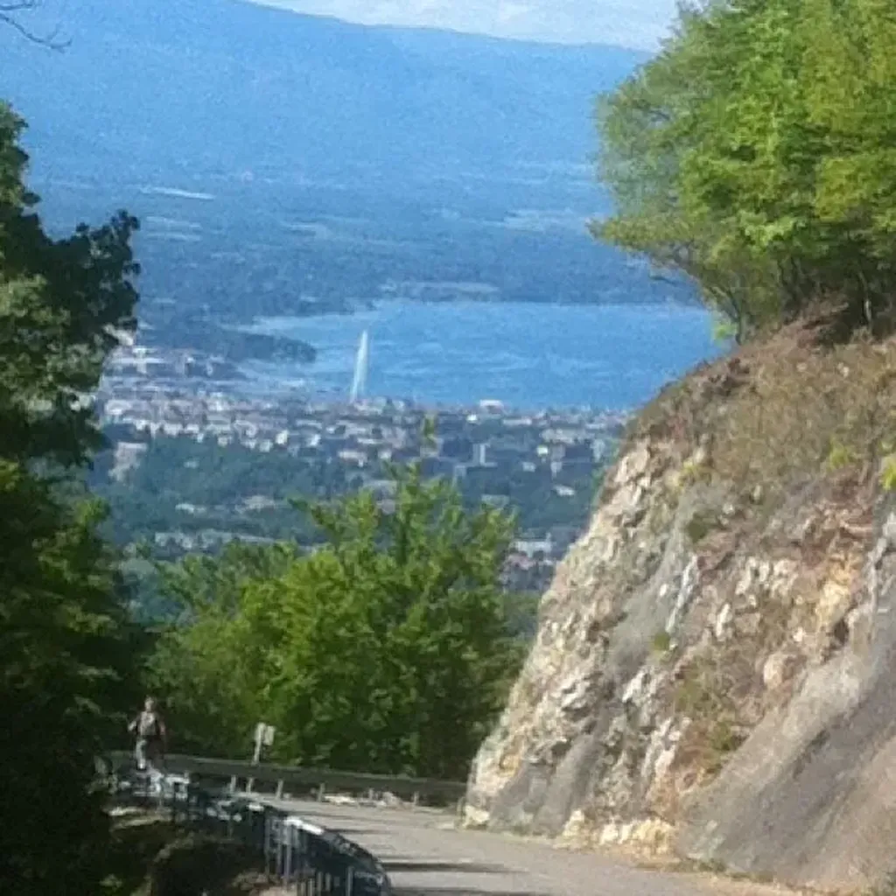

# Road book pour l’utopie

Je tombe sur une liste jamais achevée. Commencée il y a trop longtemps pour l’être. C’est une sorte de canevas politique de ce qui pourrait être le point de départ d’une fiction prospectiviste.

1/ La liberté s’accroît avec la complexité de la société (démonstration dans *[L’alternative nomade](../../books/alternative-nomade.md)*).

2/ C’est une liberté pour tous… ce qui n’implique pas l’égalité, sinon dans le potentiel d’usage de cette liberté (je ne crois pas à l’égalité, je ne crois même pas qu’elle soit souhaitable… ce qui n’empêche pas de lutter contre les inégalités).

3/ L’utopie doit donc nous maintenir sur la courbe de la complexification tracée dès les années 1940 par Teilhard de Chardin.

4/ Si l’utopie survient après une catastrophe (moins d’humains, d’échanges, de technologies…), elle débute dans un monde soudain simplifié.

5/ La simplification conduit inévitablement au totalitarisme (exemple Espagne 1936 qui signe la fin du rêve anarchiste).

6/ Les utopistes doivent donc s’efforcer de rétablir la complexité et de la démultiplier, sinon ils risquent de tomber dans le totalitarisme, et de se prendre au jeu des pouvoirs.

7/ La complexité implique l’impossibilité du contrôle coercitif. La seule méthode de gouvernement est l’auto-organisation (ne surtout pas parler du bottom-up qui souvent se résume à faire remonter les idées du bas et de les soumettre aux petits chefs).

8/ Comme l’a montré Herbert Simon en 1962, la complexification s’accompagne d’une fragilisation (état de l’économie contemporaine).

9/ Pour éviter la catastrophe, la seule solution est la transition. Exemple dans l’histoire du vivant. Le passage des êtres monocellulaires aux multicellulaires il y a en gros 0,9 milliard d’années. Une partie de la complexité globale de l’écosystème a été internalisée. Cela revient à imbriquer les complexités de manière fractale. Pour survivre, la société utopique doit réussir une telle métamorphose.

10/ Cela revient à casser les structures de managements, à internaliser la complexité dans des communautés, tout en liant entre elles massivement ces communautés.

11/ L’utopie est nécessairement technologique. La gestion de la complexité implique un réseau de communication hyper développé.

12/ L’utopie est nécessairement mystique car nous restons des créatures mortelles, emprises avec le néant.

#netculture #dialogue #y2013 #2013-6-9-10h29
