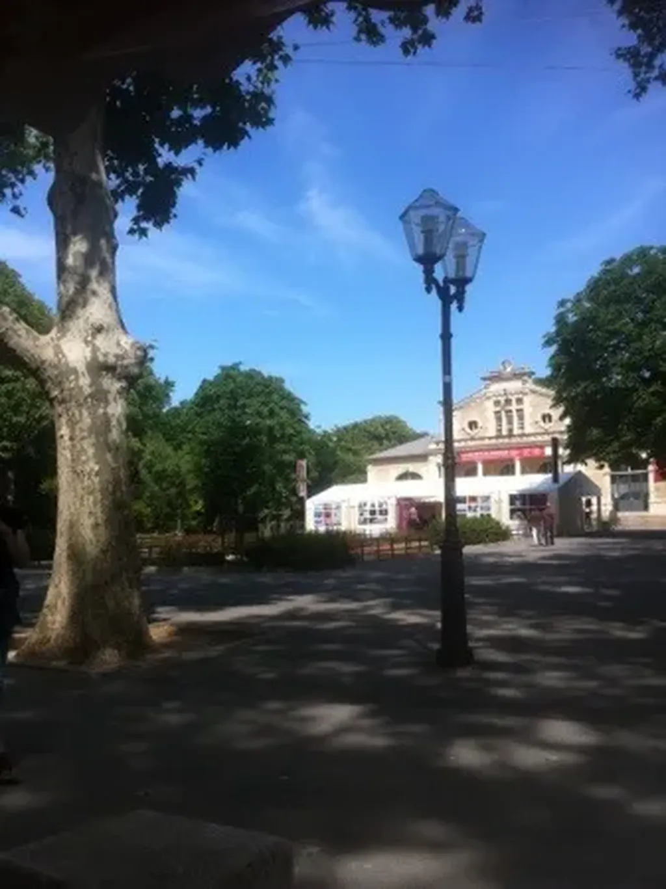

# Un coin de ciel bleu

Tête lourde en attendant un malheureux lecteur improbable, place de la Comédie, Montpellier. Qu’une envie : dormir à l’ombre d’un des grands platanes. Dans ce coin de ciel passe parfois un avion, envie de voyage.

  

#autobiographie #breves #y2013 #2013-6-7-16h21
