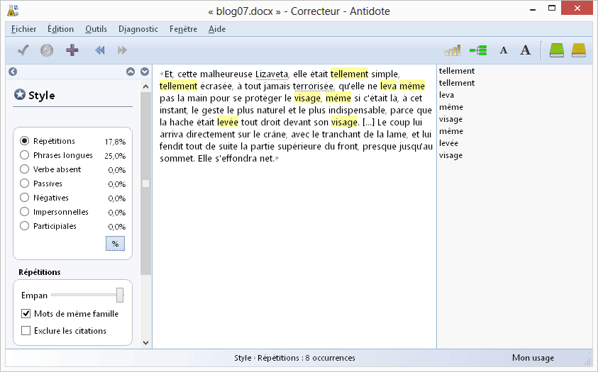

# Hacker les traductions de Dostoïevski

[Un article sur deux traductions comparées de Dostoïevski](http://www.lapresse.ca/arts/livres/201305/27/01-4654830-dostoievski-traduire-a-la-francaise-ou-a-lallemande.php) m’a fait comprendre qu’il était possible de les remixer pour produire une traduction originale, bien sûr sans parler le moindre mot de russe, et d’autant que ni l’une ni l’autre ne me satisfait.

### Version de Pierre Pascal, traduction à la française

« Cette pauvre Élisabeth était à ce point simple, abattue et épouvantée une fois pour toutes que l’idée ne lui vint même pas de lever les bras pour défendre son visage, bien que ce fût le geste le plus naturel à cet instant, puisque la hache était levée droit sur sa tête. [...] Le coup tomba droit sur le crâne, du côté du tranchant, et coupa en deux toute la partie supérieure du front presque jusqu’au sommet du crâne. Elle s’écroula. »

### Version d’André Markowicz, traduction à l’allemande

« Et, cette malheureuse Lizaveta, elle était tellement simple, tellement écrasée, à tout jamais terrorisée, qu’elle ne leva même pas la main pour se protéger le visage, même si c’était là, à cet instant, le geste le plus naturel et le plus indispensable, parce que la hache était levée tout droit devant son visage. [...] Le coup lui arriva directement sur le crâne, avec le tranchant de la lame, et lui fendit tout de suite la partie supérieure du front, presque jusqu’au sommet. Elle s’effondra net. »

### Version Crouzet, à la Crouzet

« Et, cette malheureuse Lizaveta, si simple, si écrasée, définitivement terrorisée, ne leva même pas la main pour se protéger le visage, geste pourtant naturel à cet instant : la hache se dressait tout droit devant elle. [...] Le coup lui arriva directement sur le crâne. Le tranchant de la lame l’ouvrit en deux à partir du haut du front presque jusqu’au sommet. Elle s’effondra, net. »

Question : puis-je diffuser en Creative Commons cette nouvelle traduction ?

#netlitterature #dialogue #y2013 #2013-7-26-12h42
