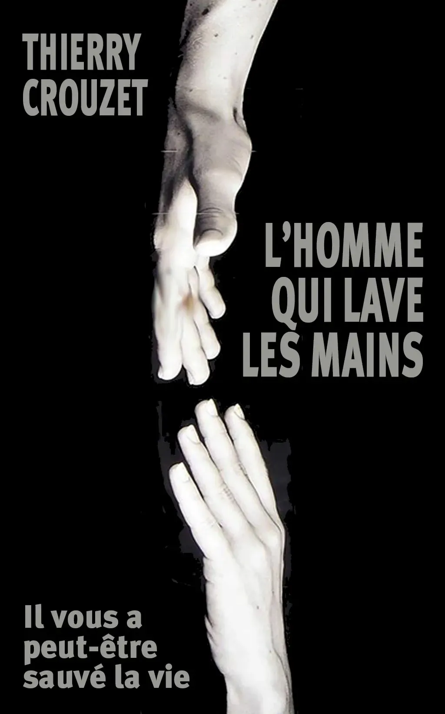
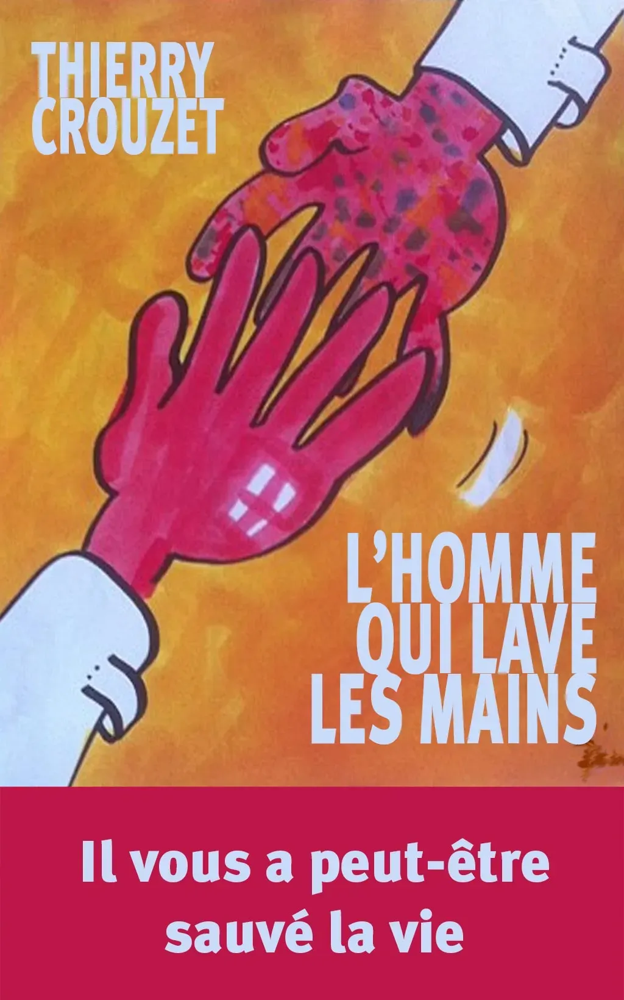

# Il vous a peut-être sauvé la vie

[Offre légale et partage non-marchand doivent coexister](http://scinfolex.wordpress.com/2013/07/18/offre-legale-et-partage-non-marchand-doivent-coexister/) ou [Reconnaître le Domaine Public Volontaire](http://scinfolex.wordpress.com/2013/07/17/reconnaitre-le-domaine-public-volontaire-sans-fragiliser-lauteur-dans-les-contrats-dedition-reponse-a-la-sgdl/), ces deux billets de Calimaq m’incitent à préciser ma volonté de distribuer sous licence Créative Commons BY-SA mon prochain livre : [*L’homme qui lave les mains*](#lhomme-qui-lave-les-mains).

### Brouillon de quatrième de couverture

Pour être moins souvent malade, il suffit de se laver les mains. Didier Pittet l’a démontré. À Genève, il a inventé le gel désinfectant utilisé dans presque tous les hôpitaux du monde. Résultat : deux fois moins d’infections, deux fois moins de décès ! La reine d’Angleterre l’a anobli pour cette prouesse. On évoque son nom pour un prix Nobel de la Paix. Mais Didier Pittet n’a pas terminé son travail. Au sein de l’OMS, il lui reste à mettre au point le protocole hygiénique ultime, celui que nous pourrions tous répéter au quotidien. En suivant Didier Pittet dans sa lutte contre les préjugés médicaux comme contre les laboratoires pharmaceutiques, découvrez comment un geste simple est en train de changer nos vies.

### Un brouillon de couverture

D’après un des nombreux posters que [Pécub](http://www.pecub.ch/) a dessinés pour illustrer la campagne de promotion de l’hygiène des mains au CHU de Genève.

### Un second brouillon

D’après une photographie de [Jean-Baptiste Huyn](http://www.jeanbaptistehuynh.com/) utilisée par les HUG pour sa campagne de de promotion. J’aimerais bien que Jean-Baptiste participe au projet (contact en cours).

### Pourquoi Creative Commons

J’ai déjà diffusé des contenus gratuitement, cette fois j’irai au-delà, je libérerai les droits sur le code source, c’est-à-dire sur le texte. Ce choix éthique s’impose puisque dans ce livre je fais l’éloge du don à travers l’histoire de Didier qui a versé dans le domaine public la formulation de la solution hydro-alcoolique pour l’hygiène des mains.

Effet immédiat de ce geste : même les hôpitaux les plus pauvres peuvent réduire leur taux de maladies nosocomiales. À l’échelle planétaire, nous sommes en train de passer de 20 millions de morts annuellement à 10 millions. Ce dernier chiffre est encore effrayant, mais nous progressons à pas de géants (et surtout sans la moindre entrave commerciale).

Implications pour le livre…

1. C’est un projet ouvert. Pécub a décidé de l’illustrer. Une éditrice professionnelle a proposé de relire et d’effectuer les corrections ortho-typo.

- Le livre sera disponible gratuitement en téléchargement depuis mon blog et depuis tous les sites qui voudront bien le diffuser (objectif lancer le livre au moment de l’annonce du prix Nobel de la paix 2013, mi-octobre).

- Je me contenterai de pointer vers une page de don.

- Un éditeur pourra s’il le désire publier une version papier ou même une version électronique payante. Il n’aura pas l’obligation de me verser des droits. J’espère qu’il choisira un format économique. Éditeurs manifestez-vous (épreuve disponible).

- Le texte pourra être traduit ou modifié en toute liberté pour engendrer de nouvelles versions.

#lhomme_qui_lave_les_mains #le_geste_qui_sauve #netlitterature #politique #dialogue #y2013 #2013-7-20-14h1
