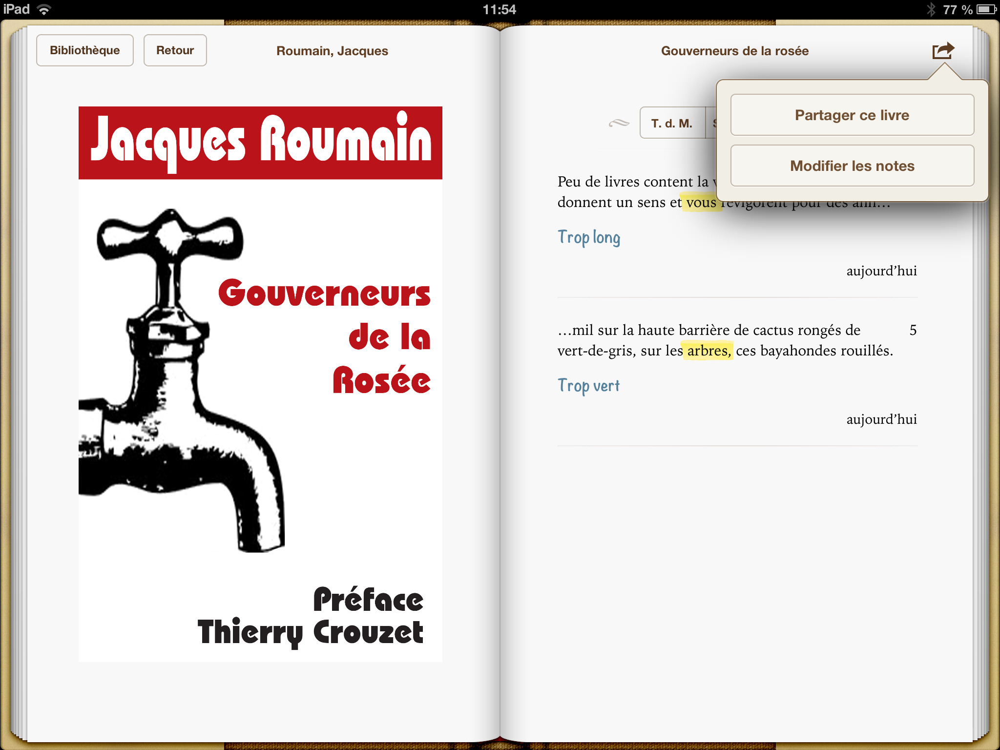
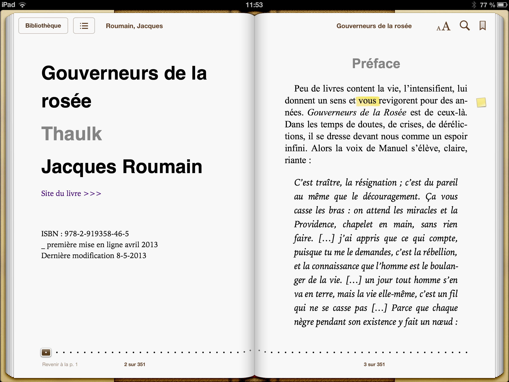
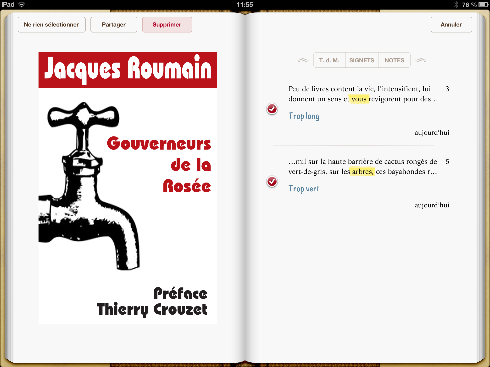
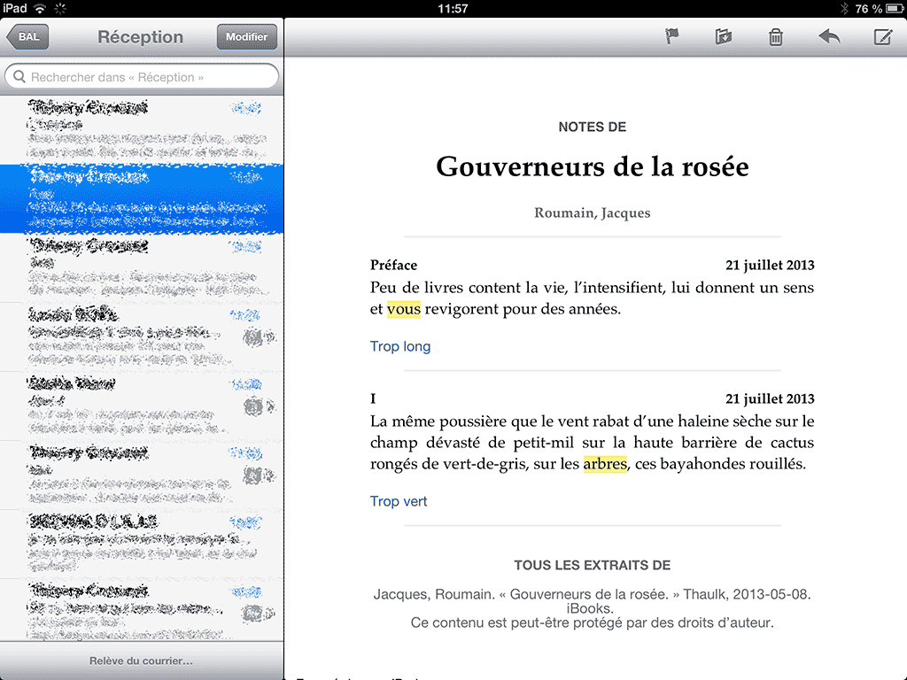

# Partager ses notes de lecture sur iPad/iPhone

Chaque fois que j’envoie un epub à mes amis pour relecture, corrections, critiques, le problème du retour des notes se pose. Sous Word, on a le mode correction pour ça. Il nous manque cruellement sur les applis de lecture. Je viens de constater qu’on peut s’en tirer tant bien que mal depuis l’application iBooks d’Apple.

1. Une fois vos annotations achevées, cliquez sur le bouton sommaire, en haut à gauche.
3. Affichez le sommaire des notes.
5. Cliquez en haut à droite sur le bouton faire suivre et choisissez « Modifier les notes ».
7. En haut à gauche, cliquez sur « Tout sélec. ».
8. Cliquez sur « Partager » et envoyez par mail.
10. Attention, le mail n’est réellement lisible que sur une messagerie Apple. Sur Gmail, les surbrillances n’apparaissent pas.
12. Pour envoyer un doc lisible hors du monde iOS, convertissez-le en PDF. Directement depuis un iPad/iPhone avec une appli comme [PDF printer for iPad](https://itunes.apple.com/fr/app/pdf-printer-for-ipad/id427075690?mt=8).

#cuisine #ebook #netlitterature #breves #y2013 #2013-7-21-14h1
